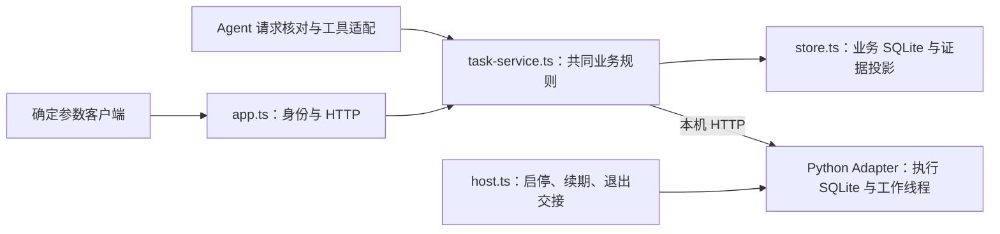

# Backend 独立执行入口

2026-09-21 D4 开发中：独立 `runtime/` 已接入业务工具、上下文、轮次中断、后台澄清及显式 `--runtime` 入口；正式 Python 回放与模型替身已联调，真实模型样例尚未执行。操作、活动契约和验证范围见 [D4 Runtime](../docs/engineering/d4-runtime.md)；默认无模型 MVP 和 legacy 入口继续使用下述行为。

2026-09-21 D3：默认启动改为 MVP 共同业务入口，提供会话、三种目标、方案展示与确认、任务结果、停止后调整和资料版本管理。使用及字段见 [D3 业务契约](../docs/engineering/d3-backend.md)，资料来源见 [快照说明](data/README.md)。正式 Adapter 的离线 HTTP／双库联调及固定 MuMu 业务链路已核对，实机范围与后续确认来源修复的验证边界见 D3 业务契约；真实模型与完整页面仍由后续阶段落实。

原确定参数入口须显式加 `--engineering`；旧 Web／Agent 须加 `--legacy-demo`，根目录 Demo 启动器已显式选择 Demo。下面保留原模式的使用说明；MVP 禁止裸创建任务，沿用查询、停止和退出入口。

2026-09-21 D2 补充：原任务 HTTP 与独立 CLI 新增 v2 扫描、次数和材料操作，`submit-file` 接收含稳定 ID 的 JSON；契约、MuMu 配置及证据边界见 [D2 执行契约](../docs/engineering/d2-adapter.md)。固定 MuMu 上已通过扫描→次数→材料→停止的 Backend 实机链路，详见[验证交付说明](../docs/engineering/d2-verification.md)；新能力未接入模型工具或完整方案确认。

Backend 提供明确参数的提交、查询、停止和结果读取；确定参数入口不依赖 Web 或模型，`--agent` 与 `--web` 可装配自然语言 Agent。TS 管理 Python 子进程，通过本机 HTTP 协作，各自保存 SQLite。默认使用脱敏回调回放，启动不会自动提交任务。完整网页使用从 [Demo 运行入口](../docs/engineering/demo.md)开始，显式选择配置。

## 执行协调的事务边界

`TaskService.reserve` 与 `reserveStop` 分别同步保存执行预留和停止意图，可加入调用方的本地事务，返回的 dispatch 只在事务提交后送达 Adapter。回滚不留下执行或停止副作用；重建执行记录不重发任务。直接停止在存储失败时仍尝试送达，事务型调整则整体失败。`onSynchronized` 通知具体任务，观察者故障单独记录，不冒充执行证据存储失败或阻断已持久化停止的送达。独立回归见 `tests/task-reservation.test.ts`。

## 浏览器入口

日常从根目录 `.\start-demo.ps1` 启动，首次准备和可选参数见 [Demo 运行入口](../docs/engineering/demo.md#日常启动一条命令)。它进入同一 Backend，仅增加启动前配置／窗口检查及终端操作；真实执行仍经网页明确指令。下面是保留的底层入口。

`npm --prefix backend start -- --legacy-demo --web` 装配旧 Demo 的浏览器接口；页面构建产物须放在 `web/dist`。终端输出的 `web_ready.url` 含本次启动的浏览器令牌，只在本机打开，不分享或写入公共记录。缺少模型配置时仍可查询和停止已有任务。此模式不使用控制台自然语言输入，也不因标准输入关闭而退出；通过 Ctrl+C 或原 CLI `shutdown` 收尾。

浏览器接口使用 `x-web-token`，检查本机 Host 和同源 Origin。原 `x-app-token` 入口继续拒绝浏览器 Origin；两种令牌不能互换。`--web-dev` 额外允许固定的 `http://127.0.0.1:5173` 开发来源，须与 `--web` 同用；开发代理保留 Origin。生产运行不添加该参数。

| 接口 | 行为 |
|---|---|
| `GET /api/status` | 模式、模型可用性、请求忙碌及冲突任务 ID |
| `POST /api/requests` | 接收 `requestId`、`original`、可选 `targetId`，立即返回可查询请求；相同 ID 只读，内容冲突返回 409 |
| `GET /api/requests/:id` | 请求记录、事件、关联任务及当前摘要回执标识 |
| `POST /api/requests/:id/summary-displayed` | 校验 `operationId` 与 `receiptId`，释放当前摘要展示等待；不创建授权 |
| `GET /api/tasks/:id` | 独立读取当前执行事实 |
| `POST /api/tasks/:id/stop` | 独立请求停止；是否停止以随后任务证据为准 |

`browser/requests.ts` 保持一个常驻 Agent 实例及一个活动模型请求。未收到有效摘要回执不执行；超时、关闭服务或迟到回执不恢复请求。退出时先取消模型并等待已发出的有界任务调用结束，排空直接 HTTP 请求，再交给既有宿主停止执行端和保存证据，最后关闭业务库。浏览器没有原始任务参数提交或宿主关闭接口。新增 `POST /api/takeovers` 接收人工接管确认、核对 ID 和完整阻塞范围（任务 ID／证据序号）；`GET /api/status` 的 `device` 返回阻塞分类与核对状态。接口继续使用浏览器身份和来源检查，不通过模型调用。静态服务只提供构建目录，私人资料和配置不在服务范围内。

2026-09-19 浏览器入口离线检查：正式回放、摘要顺序、防重、超时、独立停止、来源隔离与退出检查通过。缺少模型时禁止新请求，但保留历史请求读取；浏览器运行与验证见 [Web 说明](../web/README.md)，一次真实 DeepSeek 网页回放已通过，不代表真实游戏验收。

<a id="live-verification"></a>

## 历史实机验证：本地向导

以下保留 2026-09-18 阶段 1 的本地向导流程及证据范围；它不经过网页与模型，不用于完整 Demo 验收。当前可随仓库使用的入口见 [Demo 运行说明](../docs/engineering/demo.md)。**两个独立 1-7 任务各一次的正常实机流程已通过**，包含前后识别及最终交接；不表示已完成真实网页整链验收。

1. **准备游戏与范围。** Windows 官方客户端已登录，1-7 可代理、理智足够，停在主界面或关卡入口；停止其他 MAA／自动化。本入口固定验证两个独立任务，各 1 次、不吃药不碎石，总计最多开战 2 次，含每次执行前后识别。先明确本轮允许此范围；其他范围另行安排。
2. **运行一条命令。** 在仓库根目录打开 PowerShell；需要管理员捕获权限时以管理员身份打开。正式依赖按下节一次性准备后，执行：

   ```powershell
   .\.artifacts\live-wizard\start.ps1
   ```

   首次输入完整 MAA `v6.17.5` 安装目录，以后可回车沿用；有多个窗口时选择目标进程。无需手填窗口句柄、编辑 JSON、复制配置到第二个终端或记住任务 ID。
3. **按提示确认。** 输入 `START` 开始第一个任务。向导自动显示进度并检查结果；通过后，现场核对关卡、次数、资源消耗和界面，输入 `YES`。再次输入 `START` 才开始第二个独立任务；两次之间不手工导航或重启服务。第二次结束后同样现场确认。
4. **交接结果。** 向导自动请求服务退出，核对证据交接、执行端及宿主退出，打印 `report.md` 路径。用户最后核对游戏可接管；停止自动化不等于游戏战斗已经结束。

报告优先使用 Backend 退出时提供的最终快照，并区分作战完成量、战后识别和设备就绪。战后识别失败不撤销已确认完成量，也不放行下一任务。正常退出后同步不可用是预期状态，只有交接确认且保留最后成功同步依据时才按正常收尾解释；最终快照缺失会明确标注。

**异常时停止本轮推进。** 运行中输入 `s` 并回车，或按 `Ctrl+C` 请求收尾，不直接关窗。向导不自动补刷或重试，旧状态和报告保留。服务退出未确认时，重开只查询并收尾原任务；确认执行端和宿主已退出后，即使旧验证未通过，也允许准备游戏并通过 `START` 开始新一轮独立测试。服务退出与验证通过分别显示，无需先把旧失败记录改成成功。

默认向导每轮使用独立数据目录，同轮两个任务仍使用同一个 Backend 和同一套记录，第二任务的验收要求不变。正式 Backend 的历史任务约束不变；显式使用原数据目录排查时，已停止但环境待核对的旧任务仍可走 `RECHECK`，不自动重跑旧任务。

### 入口负责什么

- **自动准备：** 检查 Node／npm、正式 Backend 依赖、Python 环境、MAA DLL 与资源；识别窗口、生成本地配置并检查服务及历史任务状态。只读预检不操作游戏，不自动安装依赖或提权。
- **执行与验收：** 经 npm 启动正式 Backend，调用其现有 HTTP 提交／查询／停止接口；提交前保存稳定 ID。依据当前 Adapter 的 `before-check`、`after-check` 记录及 Backend 结果，检查识别、准确完成量、停止、设备就绪、同步完整性，再放行第二个独立任务。识别动作由正式任务执行，向导不另跑探针。
- **自动留证：** `.artifacts/live-wizard/run-*/` 保存配置、任务 ID、结果快照、前后识别摘要、服务日志和报告；新轮次的数据库与原始执行证据放在该目录的 `data/`。旧版 `.artifacts/live/` 记录原样保留。配置与会话含凭据，仅保留本地。

入口沿用旧实验“一条命令、明确范围、自动检查和日志交接”的操作方式；不调用旧原型代码、实验 grant 或独立识别脚本，也不沿用“第二局开战后停止”的旧验收条件。

此向导按本地使用约定放在 Git 忽略目录，**不会随 clone 提供**；上面的命令适用于已配置该入口的工作区。若入口缺失，使用本页[手动排查参考](#live-troubleshooting)，不要改跑历史实验脚本。正式 Backend 的安装和独立命令不依赖向导。

## 准备与离线使用

环境基线为 Windows，Node 支持范围为 `>=24.18.0 <25`；精确 Node／Python 基线为 24.19.0／3.12.14，分别见根目录 [.node-version](../.node-version)、[.python-version](../.python-version)，npm 使用对应 Node 官方发行版随附版本。历史 Python 3.13.15 CI 结果不代表新基线验证，当前检查见 [CI 说明](../docs/engineering/ci-plan.md)。正式 Backend 使用 `package-lock.json` 锁定依赖，无需额外安装包管理器。在仓库根目录准备依赖；已有版本正确的 venv 可复用，否则将下方 Python 路径替换为本机 3.12.14 x64 的绝对路径：

```powershell
& 'C:/Python312/python.exe' -m venv adapter/maa/.venv
.\adapter\maa\.venv\Scripts\python.exe -c "import pathlib,platform; assert platform.python_version()==pathlib.Path('.python-version').read_text().strip(), 'Python 版本与基线不一致'"
$pipVersion = (Get-Content .pip-version -Raw).Trim()
.\adapter\maa\.venv\Scripts\python.exe -m pip install "pip==$pipVersion"
.\adapter\maa\.venv\Scripts\python.exe -m pip install -r adapter/maa/requirements.lock
npm --prefix backend ci
npm --prefix backend start -- --engineering
```

不要依赖 `py` 默认选择其他版本。默认 Python 位置为 `adapter/maa/.venv/Scripts/python.exe`，无需安装真实 MAA。上述默认离线示例要求没有本地 live 配置；已有配置时先按 [Demo 入口](../docs/engineering/demo.md#回放入口)显式指定回放配置。连接信息保存于配置的 `dataDir/connection.json`（默认 `.artifacts/replay/connection.json`）。在另一个终端使用相同 `CHATMAA_CONFIG` 独立操作：

```powershell
npm --prefix backend run client -- submit 10 demo-normal
npm --prefix backend run client -- get demo-normal
# 上一任务正常结束后，提交另一个明确请求；运行中不排队
npm --prefix backend run client -- submit 100 demo-stop
npm --prefix backend run client -- stop demo-stop
npm --prefix backend run client -- get demo-stop
npm --prefix backend run client -- shutdown
```

`submit` 先显示关卡、次数、资源限制和模式，再发送请求；操作 ID 可省略并生成，但响应不明时须查询已打印／保存在 `requests/` 的 ID，不能另建 ID 重试。每次命令行调用可独立退出，不影响任务。重复相同 ID 和参数返回原操作；不同参数冲突。上例的 100 次只用于离线保留可操作的停止窗口，不构成实机额度或测试授权。

## 配置与 live 边界

默认无需配置文件。需调整时复制 `config.example.json` 为 `config.local.json`，或用 `CHATMAA_CONFIG` 指向本地 JSON；相对路径按配置文件位置解释。保留相同配置环境调用客户端。配置不会经任务 API 交给模型修改。

| 配置 | 含义 |
|---|---|
| `mode` | 默认 `maa-replay`；只有显式 `maa-live` 才接真实路径 |
| `python` | 装有锁定依赖的正式 Python 环境 |
| `port` | 0 表示选择本机高端口；监听固定为 `127.0.0.1` |
| `pollMs`、`httpTimeoutMs` | 默认 200／2000 ms，分别控制查询／续期频率与单次 HTTP 等待 |
| `leaseMs`、`stopDeadlineMs` | 默认 10000／20000 ms；失联后停止与退出交接使用有限窗口。这些值承接原型经验，不是性能或完整故障保证 |
| `dataDir` | 离线可选专用目录；live 默认 `.artifacts/live/`，本地向导可使用 `.artifacts/live-wizard/run-*/data/`；各实机目录仍共用设备锁 |
| `installation`、`hwnd` | live 必填：固定 MaaCore 安装目录与已准备的官方客户端窗口句柄；代码检查已核对的 DLL 哈希及 `v6.17.5` |

live 的参数请求、记录与受理流程已建立；固定范围正常实机结果见[工程说明](../docs/engineering/architecture.md#已验证范围)。先单独确定环境和操作范围，再由用户准备登录、权限与窗口；不要执行历史实验脚本来启动正式工程。正常再次执行的识别依据、单设备锁和异常接管见 [Adapter 说明](../adapter/maa/README.md)。启动本身不连接游戏；识别在显式任务内进行。

## 请求经过哪里



`task-contract.ts` 定义输入与结果；`task-service.ts` 在发出执行前保存稳定 ID 和意图。超时只查询原 ID，未确认状态阻止冲突；停止不等待模型或进度事件。`store.ts` 在一个事务内保存证据、读取位置及结果，重复事件不重复计数，缺口保留下界。`host.ts` 管理自有 Python，关闭后端时交接最终证据；客户端退出不走此流程。

2026-09-21：历史接管后的周期同步与统一准入汇总已调整，规则及 `/device` 的 `admission` 字段见 [D2 执行契约](../docs/engineering/d2-adapter.md#代码与检查入口)。任务已结束不再单独构成停止同步的条件。

`app.ts` 只做调用方身份与协议映射，业务检查仍在共同任务服务。Agent 从已启动的宿主取得 `host.tasks`，使用同样的方法，例如：

```typescript
await host.tasks.submit({ id: applicationOperationId,
  params: { stage: '1-7', count: 10, medicine: 0, premium: 0 } });
const task = host.tasks.get(applicationOperationId);
await host.tasks.stop(applicationOperationId);
```

`applicationOperationId` 由可信应用在明确执行请求中确定，重试复用它；`agent/requests.ts` 把原指令、核对结论和操作 ID 关联起来。身份令牌不是执行授权，模型不得自行声明授权或切换 live 模式。

## Agent 调试与接入

2026-09-18：在 `be62348` 基础上增加 Agent 实现，当前验证为模型替身与正式回放 Adapter；真实 DeepSeek 四个固定样例的回放调用及回复审阅已通过，该证据限于真实模型与正式回放执行端，不代表真实游戏闭环。

在本地环境设置 `DEEPSEEK_API_KEY` 后，执行 `npm --prefix backend start -- --legacy-demo --agent`。普通 Backend 启动不需要模型凭据；密钥不写入业务库，也不传给 Python 子进程。模型固定为 DeepSeek `deepseek-flash`，通过 `@ai-sdk/openai` 的 Responses 接口请求 `https://api.deepseek.com/responses`。没有自动重试或备用模型。

该终端是常驻 Backend 控制台：输入一条完整指令后，依次看到原文、核对结论、模型工具参数、应用摘要、工具返回和回复。模型返回后 Backend 继续执行与同步任务；关闭该终端、输入 `/exit` 或输入流结束会关闭宿主并执行既有退出交接。第二个终端中的独立 `client get/stop` 仍可使用，退出客户端不影响任务。

| 调试输入 | 行为 |
|---|---|
| `帮我刷 1-7 十次`、`请刷1-7 10次，不吃药不碎石` | 完整匹配后允许模型提交相同参数；模型不调用则不会自动补执行 |
| `/target TASK_ID` | 显式选定自然语言查询／停止的目标 |
| `查询当前任务`、`停止当前任务` | 模型只能操作已选定任务，不能提供其他 ID |
| `/get TASK_ID`、`/stop TASK_ID` | 绕过模型等待，直接查询／请求停止 |
| `/read REQUEST_ID` | 读取原请求、工具记录和关联任务的当前事实，不重新执行模型 |
| `/cancel` | 取消本轮模型及输出等待；已经受理的任务继续，停止须用独立入口 |
| `/exit` | 关闭 Backend 并交接执行证据 |

当前本地规则完整匹配少量直接命令，支持有效范围内的阿拉伯数字和一至九十九的规范中文数字（含“两”）。未覆盖的中文数字可改用阿拉伯数字重新给出完整指令；这不是执行次数上限。疑问、否定、引用、条件、多目标或未理解的附加要求均不执行，不删除条件后执行。模型参数还须逐项等于核对结果。

主要代码入口：

- `agent/policy.ts`：原指令允许什么；扩展表达时须同时增加误执行反例。
- `agent/requests.ts`、`records.ts`：请求 ID、唯一操作 ID、原文、最小追踪、取消；记录使用原业务 SQLite。重放只读取，崩溃后不自动补做。
- `agent/runtime.ts`、`provider.ts`：AI SDK 两步循环，一轮工具与一轮解释，第二轮禁用工具；默认总等待 60 秒、重试 0。固定规则使用 `system`，每轮携带完整当前输入与工具结果，禁用服务端存储。
- `agent/tools.ts`：模型参数核对、一次变更预留、等待摘要展示完成，然后调用 `TaskService`。摘要或前置记录失败不提交；提交后的追踪失败不抹掉任务事实。
- `agent/debug.ts`：终端适配；Web 使用 `browser/requests.ts`，两者复用共同 Agent 请求入口。

下一阶段可直接创建 `new AgentRequests(host.tasks, model)`，调用 `handle({requestId, original, targetId?}, async event => ...)` 和 `read(requestId)`。同一次传输重试复用 `requestId`；独立新指令使用新 ID。事件为项目结构，不暴露 SDK 消息类型。`summary` 回调必须等展示完成才 resolve；浏览器接入需要实现这个顺序，不能把执行后的最终 HTTP 响应当作执行前摘要。模型与事件输出等待共同受取消和总超时约束，控制台最终结果输出也在同一等待期限内；取消等待不保证底层输出已经停止，但迟到的摘要完成不会触发执行。执行事实来自返回的 `task` 和独立任务接口，不能以模型回复代替；`task: null` 表示没有关联任务记录。

真实模型验收是单独入口：`node backend/src/agent/verify.ts`。它需要本地密钥，会发送四条固定测试指令及工具结果，使用正式 `maa-replay`，不读取 live 配置、不操作游戏。结果写入忽略目录 `.artifacts/agent-verification/run-*/`；默认测试与 CI 不运行它。需逐条复查原文、工具参数、返回和解释；离线通过不替代该验收。

可在仓库根目录的 `.env` 中本地配置 `DEEPSEEK_API_KEY`，从根目录执行 `node --env-file=.env backend/src/agent/verify.ts`；程序不会自动加载 `.env`，该文件已被 Git 忽略。新记录用 `automaticChecksPassed` 表示样例断言和退出交接检查结果，`replyReview: pending` 表示回复尚待逐条审阅，不能以自动检查成功替代整体验收。`verification.json` 附带语义审阅清单；旧记录中的 `passed` 同样只代表当时的自动断言。

## 结果怎样理解

HTTP 提供 `POST /tasks`、`GET /tasks/:id`、`POST /tasks/:id/stop`，并提供本地调试用的列表、健康和关闭入口。调用需要 `x-app-token`；拒绝带浏览器 `Origin` 的请求，Web 使用上文独立的 `/api` 与浏览器令牌。没有实验故障注入或自动核对解锁 API。

显式 `POST /tasks/:id/recheck` 接收 `{ "id": "稳定检查ID" }`，只在历史自动化均已结束且停止确认、记录同步完整时受理环境重新识别。随后仍用 `GET /tasks/:id` 查询 `recheck.state`、`recheck.ready` 和 `recheck.automation_stopped`，用原停止入口取消识别。请求超时只查询，不生成新检查 ID 重试。旧任务的 `environment` 仍描述旧现场，重新识别依据另存于 `recheck.environment`；它不修改旧任务成功与否。当前仅验证离线及替身路径，未宣称实机有效。

| 结果 | 含义 |
|---|---|
| `state`、`reason` | 受理／运行／停止中／结束／未知／拒绝及原因；受理不等于已经操作游戏 |
| `confirmed`、`certainty` | 已确认完成量；`exact` 与 `lower_bound` 分开，不按计划次数补足 |
| `automation_stopped`、`device`、`environment` | 自动化停止、设备可用性及环境观测分开；停止不撤销消耗或保证游戏战斗结束 |
| `updated_at`、`sync` | 执行证据时间与最近成功同步时间分开；通信失败仍返回最后已知结果并标记不可同步 |
| `cursor`、`gap`、`evidence_source` | 证据读取位置、缺口和来源；原始证据对应执行目录及双库，不向上游暴露控制令牌或安装路径 |

周期轮询跳过已确认停止、证据完整且已同步的稳定终态记录；`sync.last_success_at` 保留其最后核对时间，不代表持续探测连接。启动后核对已有记录，退出交接时再统一核对一次。未结束任务、未确认同步及尚未完成的环境复核继续查询；复核请求响应丢失时也保留查询，不自动重发识别请求。

验证错误为 422，参数冲突／设备占用为 409，找不到任务为 404，服务不可用为 503。停止请求的返回不是执行端停止确认，随后查询结果；重复停止已结束任务不会退回 `stopping`。

## 本地检查

```powershell
npm --prefix backend run check
npm --prefix backend test
.\adapter\maa\.venv\Scripts\python.exe -m unittest discover -s adapter/maa/tests -v
```

检查针对正式入口、真实控制层和两库，只替换游戏动作／native 边界。集成运行记录保留在 `.artifacts/checks/`；失败返回非零，停止并核对本次自有进程。测试独立使用离线配置，不读取用户的 live 配置。不要求 CI、模型凭据、真实 MAA 或管理员故障实验。

Backend 的记录投影、Python 运行时定位及宿主交接选择性承接 `273055d` 的原型实现，应用入口和共同服务独立组织；迁入后的行为以本目录检查为准，不能用原型结果替代。

<a id="live-troubleshooting"></a>

## 实机验证：手动排查参考

最近核对：2026-09-18，代码以本分支能力提交为准。正常实机流程已通过上述固定范围验证；以下手动步骤是排查参考，不宣称每种排查场景均已实测。操作说明在本章维护，模块职责和实现状态见[工程说明](../docs/engineering/architecture.md)，识别与锁的机制见 [Adapter 说明](../adapter/maa/README.md)。

本流程验证的是：正式 Backend 能完成一次真实任务，确认自动化停止和当前界面可用，然后接受另一次独立任务。下面以 **1-7 两个独立任务、各 1 次、不吃药不碎石**为操作示例；只有本轮明确批准了该范围（含执行前后只识别及人工交接）才能提交。总开战上限为 2 次，异常不补刷、不换 ID 重试。不包含故障注入、异常恢复或长时间运行验证，也不应放入 CI。

<details>
<summary>展开手动命令、结果字段、异常处理和证据目录</summary>

### 1. 准备环境与两个终端

先完成本页“准备与离线使用”中的依赖准备及“本地检查”，确认正式离线入口可用。实机还需要：

- Windows 官方桌面客户端已登录，1-7 已解锁且可代理作战，理智足够；人工将游戏置于主界面或关卡入口，处理遮挡和弹窗。
- 完整的固定 MAA `v6.17.5` 安装目录，包含 `MaaCore.dll` 及资源。当前代码还校验 DLL 哈希，仅版本名称相同并不保证通过。
- 官方 MAA、旧实验入口及其他控制游戏的自动化已经停止。验证中不同时操作游戏；设备锁无法阻止其他软件或人工点击。
- 准备两个 PowerShell 终端，均进入**同一仓库根目录**。终端 A 常驻运行 Backend，终端 B 负责提交、查询与停止。需要管理员权限的游戏捕获环境，应在启动前以管理员身份打开终端；遇到权限错误即结束本轮排查，不反复提交试探。

以下命令按小节执行，**不要把整章合并成脚本一次运行**。终端 A 启动后会占用前台；后续命令在终端 B 执行。

### 2. 手动准备窗口句柄与配置

在终端 A 枚举窗口；有多个结果时人工确认目标：

```powershell
Get-Process | Where-Object { $_.MainWindowTitle -eq '明日方舟' } |
  Select-Object Id, ProcessName, @{Name='hwnd'; Expression={$_.MainWindowHandle.ToInt64()}}
```

在仓库 `.artifacts/live-verification/` 下用编辑器新建本地 JSON（UTF-8 无 BOM），例如 `config.json`，已有文件则保留并核对。把以下安装目录和数值句柄替换为实际值：

```json
{
  "mode": "maa-live",
  "installation": "D:/path/to/MAA-v6.17.5-win-x64",
  "hwnd": 123456
}
```

默认 Python 为 `adapter/maa/.venv/Scripts/python.exe`；实际位置不同时增加 `python` 绝对路径。手动入口默认使用 `.artifacts/live/`，无需设置 `dataDir`；向导自动配置每轮目录。游戏重启后需在旧服务退出、新一轮启动前重新取得句柄。以下为手动排查操作，不依赖额外辅助脚本。

### 3. 启动 Backend，核对模式和历史状态

终端 A：

```powershell
$env:CHATMAA_CONFIG = (Resolve-Path .artifacts/live-verification/config.json).Path
npm --prefix backend start -- --engineering
```

等待输出 `kind: "ready"`，核对 `mode: "maa-live"`，且 `connection` 位于当前仓库 `.artifacts/live/connection.json`。此时只建立服务、记录与锁，尚未连接游戏。若启动报安装目录、DLL 哈希或设备占用错误，先处理该原因，不跳过校验或删除锁来强行启动。

终端 B 也必须设置同一个配置路径；环境变量不会自动从终端 A 传过来：

```powershell
$env:CHATMAA_CONFIG = (Resolve-Path .artifacts/live-verification/config.json).Path
(Get-Content .artifacts/live/connection.json -Raw | ConvertFrom-Json).mode
npm --prefix backend run client -- list
```

确认模式为 `maa-live`。首次运行列表应为空；已有记录时，核对其均已 `ended`、`automation_stopped: true`、`device: "ready"`。任何仍在运行、停止未确认或 `needs_check` 的记录都意味着不能开始本次任务，转到第 6 节。不要删除数据库、换 ID 或重启来绕过旧状态。

### 4. 提交第一个任务并判断结果

在终端 B 为本轮固定两个不同的 ID，先记下它们，再只提交第一个任务：

```powershell
$liveRun = Get-Date -Format 'yyyyMMdd-HHmmss'
$firstId = "live-$liveRun-a"
$secondId = "live-$liveRun-b"
Write-Output "第一个：$firstId；第二个：$secondId"
npm --prefix backend run client -- submit 1 $firstId
```

**`submit` 显示摘要后立即发送请求，没有二次确认。** 它会执行前置识别；识别成立才启动 Fight，正常完成后再做收尾识别。返回“受理”只说明请求进入系统，不表示已经开战或完成。

保持终端 A 运行，用终端 B 查询同一个 ID，直到结束或出现异常；查询不增加任务次数：

```powershell
npm --prefix backend run client -- get $firstId
```

正常通过本步骤，需要下面的结果同时成立，并由现场人员核对实际游戏表现：

| 检查点 | 预期结果 |
|---|---|
| 操作及参数 | `id` 为第一个 ID；`params` 为 `stage: "1-7"`、`count: 1`、`medicine: 0`、`premium: 0` |
| 实际证据来源 | `evidence_source: "MaaCore_v6.17.5"`；不能用 `offline_callback_replay` 作为实机结果 |
| 结束及数量 | `state: "ended"`、`reason: "target_reached"`、`confirmed: 1`、`certainty: "exact"`；`started_cycles: 1`、`unsettled_cycles: 0` |
| 停止及界面 | `automation_stopped: true`、`device: "ready"`、`environment.ready: true`；`environment.basis` 为 `ChatMAAReadyHome` 或 `ChatMAAReadyStage`，并保留 `observed_at` |
| 同步完整性 | `sync.available: true`、`gap: false`，没有证据冲突 |
| 人工核对 | 实际关卡和次数符合范围，没有用药／碎石、异常弹窗或仍在进行的自动操作；记录当前界面与可接管情况 |

`confirmed: 1` 或 `target_reached` 单独成立都不足以通过：收尾识别失败时，计数可以准确而设备仍为 `needs_check`。`environment` 是某一时刻的观测，不能视作长期有效许可，下一任务仍会重新识别。

若提交响应超时或终端意外关闭，先查原 ID；ID 也保存在 `.artifacts/live/requests/` 内的 JSON 中。不能因没有收到响应就判断未执行，再用新 ID 提交。

### 5. 验证正常再次执行

只有第 4 节的检查全部通过，且本轮范围允许第二次开战，才在终端 B 执行：

```powershell
npm --prefix backend run client -- submit 1 $secondId
npm --prefix backend run client -- get $secondId
```

继续查询第二个 ID，按相同表格验收。两次任务之间不重启 Backend、不手工导航或清空记录；本步骤要验证的正是正常收尾之后，正式入口能否重新识别并执行独立请求。若必须人工干预界面才能继续，应记录此缺口并结束本轮，不能记作“正常再次执行通过”。

### 6. 异常停止与正常退出

发现识别失败、异常界面、状态未知或证据不完整时，不再提交下一任务。任务可能仍在操作游戏时，向**实际已提交的 ID**发停止请求，例如第一个任务：

```powershell
npm --prefix backend run client -- stop $firstId
npm --prefix backend run client -- get $firstId
```

若当前执行的是第二个任务，上面两行都改用 `$secondId`。停止请求返回不等于停止已确认，继续查看 `automation_stopped`；停止不会撤销理智消耗，也不保证游戏战斗已经结束。普通停止后出现 `needs_check`，可在准备好当前环境后显式重新识别；不允许据此绕过停止未确认或证据冲突，也没有通用自动解锁入口。

无论两次任务均正常完成，还是决定结束异常排查，都用终端 B 关闭后端：

```powershell
npm --prefix backend run client -- shutdown
```

客户端的 `shutting_down` 响应只表示已请求退出。到终端 A 等待 `kind: "shutdown"`，核对 **`handoffComplete: true` 与 `childExited: true`**，以及进程返回终端提示符。这说明证据交接和自有执行端退出已确认；游戏当前状态仍由人工现场核对。

| 异常表现 | 本轮处理 |
|---|---|
| 配置、DLL、窗口句柄或捕获权限错误 | 保存报错并核对实际环境；已提交过任务时先查原 ID，不通过连续新请求试错 |
| `environment_unconfirmed`、`needs_check`、`unknown`、下界计数或同步失败 | 不提交第二次；对可能运行的操作请求停止，保留记录并交接，不能视作正常通过 |
| 客户端无法连接，无法发出停止／退出请求 | 在终端 A 用 `Ctrl+C` 请求宿主退出并观察交接输出；不要只关闭终端窗口 |
| 无最终退出输出，或任一退出确认不是 `true` | 不宣称已停止或已完整交接；保留终端和证据，核对本次自有进程及游戏现场，另行处理。不要结束不明进程或删除记录来恢复提交 |

确认退出后，才在两个终端各自执行 `Remove-Item Env:CHATMAA_CONFIG -ErrorAction SilentlyContinue`。以后启动离线前还需核对 `backend/config.local.json` 是否存在、是否设置了 live；移除环境变量并不会覆盖默认配置文件。

### 7. 保存结果与交接

运行记录自动保留于 `.artifacts/live/`。不要为了下一轮方便清空它：

| 位置 | 用途 |
|---|---|
| `requests/*.json` | 客户端提交前保存的 ID 和参数；响应不明时据此查询 |
| `operations/<ID 的 SHA-256>/request.json`、`result.json` | 用 `request.json` 的原 ID 找到任务目录；`result.json` 在工作线程取得结果后生成，缺失本身不能证明没有执行 |
| 任务目录的 `before-check/`、`battle/`、`after-check/` | 实际走到的阶段及其原始回调／结果；未走到的阶段可以没有目录 |
| `business.sqlite`、`executor.sqlite`、`executor-trace.jsonl` | Backend 与执行端记录及执行追踪，用于核对结果差异 |
| `worker-audit.jsonl` | 工作线程进入记录，不等于开战次数；开战计数应结合任务结果与回调核对 |

本地交接记录应写明：日期、代码提交、运行环境与 MAA 版本、本轮批准范围、两个 ID、逐项结果、人工观察、停止／退出确认，以及未通过项。两次执行分别报告，不用一次成功抵消另一任务的未知状态。只有两次任务、收尾识别和最终交接均符合预期，才能将**此固定环境下的正常执行与再次执行**记为通过；不能据此宣称异常恢复或其他环境已经验证。

配置、原始日志和数据库保留本地；`connection.json` 含控制令牌，不能直接分享。需要对外报告时只摘取脱敏后的必要事实，不上传整份运行目录。记录新增实机结论时，再更新工程说明和交接中的验证状态。


</details>

## 历史阻塞与人工接管（2026-09-19）

基于 `8ec496e` 增补。`TaskService.takeover` 先同步原记录，缺口、冲突或连接失败时拒绝放行；Adapter 再核对租约、活动执行和确切阻塞范围。Python 持久保存核对意图与结果，成功时将接管凭据作为独立执行证据同步回业务库。`takeover.released` 只解除准入阻塞，不能解释为旧任务已完成或已确认停止。退出交接可接受完整同步的接管凭据，但不重写旧结果。

`agent/requests.ts` 对实际工具返回的 `device_busy_or_uncertain` 使用确定性回复，说明当前未受理并引导处理阻塞，不采用模型建议的改次数或重复发送。页面操作见 [Demo 说明](../docs/engineering/demo.md#处理历史阻塞)。
