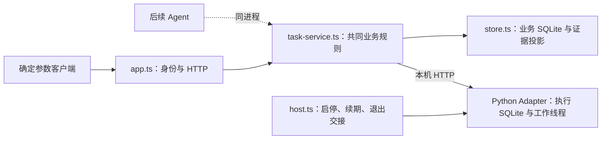

# Backend 独立执行入口

Backend 提供明确参数的提交、查询、停止和结果读取；不解析自然语言，不依赖 Web 或模型。TS 管理 Python 子进程，通过本机 HTTP 协作，各自保存 SQLite。默认使用脱敏回调回放，启动不会自动提交任务。

## 准备与离线使用

环境基线为 Windows、Node `>=24.18.0 <25`、随 Node 安装的 npm、Python `3.12`。在仓库根目录准备正式工程自己的依赖：

```powershell
py -3.12 -m venv adapter/maa/.venv
.\adapter\maa\.venv\Scripts\python.exe -m pip install -r adapter/maa/requirements.lock
npm --prefix backend ci
npm --prefix backend start
```

没有 `py` 启动器时，用可用 Python 3.12 的绝对路径替代创建环境命令。默认 Python 位置为 `adapter/maa/.venv/Scripts/python.exe`，无需安装真实 MAA。后端打印就绪地址，连接信息保存于被忽略的 `.artifacts/replay/connection.json`。在另一个终端独立操作：

```powershell
npm --prefix backend run client -- submit 10 demo-normal
npm --prefix backend run client -- get demo-normal
# 上一任务正常结束后，提交另一个明确请求；运行中不排队
npm --prefix backend run client -- submit 100 demo-stop
npm --prefix backend run client -- stop demo-stop
npm --prefix backend run client -- get demo-stop
npm --prefix backend run client -- shutdown
```

`submit` 先显示关卡、次数、资源限制和模式，再发送请求；操作 ID 可省略并生成，但响应不明时须查询已打印／保存在 `requests/` 的 ID，不能另建 ID 重试。每次命令行调用可独立退出，不影响任务。重复相同 ID 和参数返回原操作；不同参数冲突。上例的 100 次只用于离线保留可操作的停止窗口，不构成实机额度或测试授权。

## 配置与 live 边界

默认无需配置文件。需调整时复制 `config.example.json` 为 `config.local.json`，或用 `CHATMAA_CONFIG` 指向本地 JSON；相对路径按配置文件位置解释。保留相同配置环境调用客户端。配置不会经任务 API 交给模型修改。

| 配置 | 含义 |
|---|---|
| `mode` | 默认 `maa-replay`；只有显式 `maa-live` 才接真实路径 |
| `python` | 装有锁定依赖的正式 Python 环境 |
| `port` | 0 表示选择本机高端口；监听固定为 `127.0.0.1` |
| `pollMs`、`httpTimeoutMs` | 默认 200／2000 ms，分别控制查询／续期频率与单次 HTTP 等待 |
| `leaseMs`、`stopDeadlineMs` | 默认 10000／20000 ms；失联后停止与退出交接使用有限窗口。这些值承接原型经验，不是性能或完整故障保证 |
| `dataDir` | 只供离线选择专用目录；live 固定使用 `.artifacts/live/` |
| `installation`、`hwnd` | live 必填：固定 MaaCore 安装目录与已准备的官方客户端窗口句柄；代码检查已核对的 DLL 哈希及 `v6.17.5` |

live 的参数请求、记录与受理流程已建立；**新工程实机效果尚未验证**。先单独确定环境和操作范围，再由用户准备登录、权限与窗口；不要执行历史实验脚本来启动正式工程。正常再次执行的识别依据、单设备锁和异常接管见 [Adapter 说明](../adapter/maa/README.md)。启动本身不连接游戏；识别在显式任务内进行。

## 请求经过哪里



`task-contract.ts` 定义输入与结果；`task-service.ts` 在发出执行前保存稳定 ID 和意图。超时只查询原 ID，未确认状态阻止冲突；停止不等待模型或进度事件。`store.ts` 在一个事务内保存证据、读取位置及结果，重复事件不重复计数，缺口保留下界。`host.ts` 管理自有 Python，关闭后端时交接最终证据；客户端退出不走此流程。

`app.ts` 只做调用方身份与协议映射，业务检查仍在共同任务服务。后续 Agent 从已启动的宿主取得 `host.tasks`，使用同样的方法，例如：

```typescript
await host.tasks.submit({ id: applicationOperationId,
  params: { stage: '1-7', count: 10, medicine: 0, premium: 0 } });
const task = host.tasks.get(applicationOperationId);
await host.tasks.stop(applicationOperationId);
```

`applicationOperationId` 由可信应用在明确执行请求中确定，重试复用它；#9 负责把用户请求、参数和操作 ID 关联起来。身份令牌不是执行授权，模型不得自行声明授权或切换 live 模式。

## 结果怎样理解

HTTP 提供 `POST /tasks`、`GET /tasks/:id`、`POST /tasks/:id/stop`，并提供本地调试用的列表、健康和关闭入口。调用需要 `x-app-token`；拒绝带浏览器 `Origin` 的请求，Web 接入尚未实现。没有实验故障注入或自动核对解锁 API。

| 结果 | 含义 |
|---|---|
| `state`、`reason` | 受理／运行／停止中／结束／未知／拒绝及原因；受理不等于已经操作游戏 |
| `confirmed`、`certainty` | 已确认完成量；`exact` 与 `lower_bound` 分开，不按计划次数补足 |
| `automation_stopped`、`device`、`environment` | 自动化停止、设备可用性及环境观测分开；停止不撤销消耗或保证游戏战斗结束 |
| `updated_at`、`sync` | 执行证据时间与最近成功同步时间分开；通信失败仍返回最后已知结果并标记不可同步 |
| `cursor`、`gap`、`evidence_source` | 证据读取位置、缺口和来源；原始证据对应执行目录及双库，不向上游暴露控制令牌或安装路径 |

验证错误为 422，参数冲突／设备占用为 409，找不到任务为 404，服务不可用为 503。停止请求的返回不是执行端停止确认，随后查询结果；重复停止已结束任务不会退回 `stopping`。

## 本地检查

```powershell
npm --prefix backend run check
npm --prefix backend test
.\adapter\maa\.venv\Scripts\python.exe -m unittest discover -s adapter/maa/tests -v
```

检查针对正式入口、真实控制层和两库，只替换游戏动作／native 边界。集成运行记录保留在 `.artifacts/checks/`；失败返回非零，停止并核对本次自有进程。测试独立使用离线配置，不读取用户的 live 配置。不要求 CI、模型凭据、真实 MAA 或管理员故障实验。

Backend 的记录投影、Python 运行时定位及宿主交接选择性承接 `273055d` 的原型实现，应用入口和共同服务独立组织；迁入后的行为以本目录检查为准，不能用原型结果替代。

正常退出提供最终任务快照，区分服务退出与任务成功。停止未知任务仍发送停止请求，但不覆盖已有未知原因。

## 已停止任务的环境复核

显式 `POST /tasks/:id/recheck` 接收 `{ "id": "稳定检查ID" }`，只在历史自动化均已结束且停止确认、记录同步完整时受理环境重新识别。随后仍用 `GET /tasks/:id` 查询 `recheck.state`、`recheck.ready` 和 `recheck.automation_stopped`，用原停止入口取消识别。请求超时只查询，不生成新检查 ID 重试。旧任务的 `environment` 仍描述旧现场，重新识别依据另存于 `recheck.environment`；它不修改旧任务成功与否。当前仅验证离线及替身路径，未宣称实机有效。
