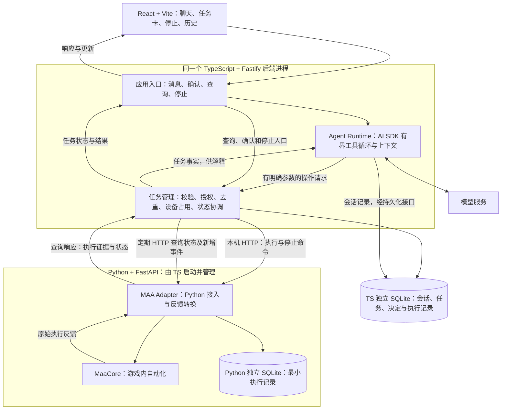

# ChatMAA MVP 系统设计草案

状态：Q1–Q12 的方向及审阅项 R2–R4 已接受。已启动仅使用替身的原型 B，验证真实进程、HTTP 和两端 SQLite；结果见 [原型报告](../prototypes/lifecycle/REPORT.md)。真实 MAA 原型 A 与合并验证必须等待产品负责人下一步指令，尚无实机证据或完整应用。

集中审阅见 [MVP 设计审阅与最小原型方案](design-review.md)。原型保留现有技术组合，并验证跨重启防重、设备占用、状态判定与证据接收；监督覆盖存在已复现的组合故障缺口，真实 MAA 语义仍待验证。原型实现不等同于 MVP 验收。

## 依据与阅读方式

- [MVP Spec：单设备指定关卡执行 #1](https://github.com/Fyrefly-4/ChatMAA/issues/1) 是产品范围、行为和验收条件的唯一来源。
- [项目定义](ProjectDefinition.md) 说明项目方向。
- 产品负责人参与架构、模块、运行方式和关键技术取舍；设计说明需要使其能理解执行链路、解释选择理由和判断变更影响。
- 沟通按主题批量呈现可独立决定的方案，集中说明主要取舍与推荐；避免把常规实现细节逐项变成问答。未回复的建议仍保持待定，影响已接受架构的变化需明确讨论。
- 文中“已有约束”引用现有规格；“建议”供讨论；“待验证”需要技术证据。讨论确认与实机验证是两个不同状态。

## 已有约束

已选组合为 React + Vite、TypeScript + Fastify、Python + FastAPI 接入 MaaCore、AI SDK 有界工具调用循环与自有任务管理。TS 业务库、Python 最小执行记录各采用独立 SQLite 文件。产品行为见 #1，尤其是网页关闭不停止任务、模型故障不影响已启动任务、重复提交不重复执行，以及结果不明时先核对。

已接受的运行结构与生命周期方向见 [ADR-0001](adr/0001-runtime-structure.md)：TypeScript 后端采用同进程的独立模块，Python 执行端由应用统一管理启停。正常关闭后端时先拒绝新执行、请求停止、确认并保存已知结果后退出；Python 判定后端失联后主动请求停止 MAA，保留能够保留的执行信息供恢复后核对。退出或失联期间停止超时，允许尝试强制终止本应用拥有的执行端，保留未知部分并在恢复后核对；具体监督机制与期限仍待设计和验证。

TS 直接启动 Python 子进程，使用本机 HTTP 通信，以定期查询获取状态和新增关键事件，见 [ADR-0002](adr/0002-local-http-adapter.md)。Python 持久保存最小执行记录用于核对，TS 管理会话与业务任务历史，见 [ADR-0003](adr/0003-execution-evidence.md)。失联监督机制、模型服务、UI 组件、库版本和具体测试工具尚未确定。

## 职责草图

下图体现已确认的进程边界、本机 HTTP 和轮询反馈方向；模块内部职责仍可在后续讨论中细化。TS 负责启动 Python；失联检测方式仍待讨论。

已选择将 Agent Runtime、任务管理与应用入口作为同一 TypeScript 进程内的独立模块。Agent Runtime 处理对话和模型交互；任务管理执行确定性的规则与状态协调。模块隔离不等于进程故障隔离。

两端分别写自己的 SQLite 文件，通过接口传递执行证据，不共写业务表。图中“响应与更新”指网页与 TS 的连接，其传输方式仍是下文的设计建议；Python 到 TS 的反馈已经选择轮询。

### 首个场景的建议流程

1. 网页提交“帮我刷 1-7 十次”，应用记录本次执行请求。
2. Agent Runtime 结合必要上下文理解请求；缺少信息时先澄清。
3. 任务管理检查支持范围、次数、资源限制、授权、重复请求和设备占用。模型建议不能直接绕过这些检查调用 MAA。
4. 展示操作摘要并协调任务记录与实际提交。记录、占用和提交的顺序，以及提交结果不明时的处理，需另行设计。
5. Python 接入 MaaCore 执行，并将反馈转成带来源和时间的执行证据。成功完成量的映射待实机验证。
6. 任务管理更新状态和已确认结果；网页直接读取这些事实。模型可以解释结果，任务控制与结果展示不依赖模型可用。
7. 用户点击停止时，经应用入口和任务管理直接控制执行端；停止确认条件待验证。

## 设计讨论树

按依赖推进；已确认的产品规则沿用 #1。出现不兼容的技术事实时明确指出差异，再讨论如何处理。

| 分支 | 需要决定什么 | 依赖与验证 |
|---|---|---|
| 运行结构（已选方向） | TS 同进程独立模块；Python 由应用统一管理启停 | [ADR-0001](adr/0001-runtime-structure.md)；具体生命周期行为待设计与验证 |
| 生命周期与通信（当前） | 正常退出、后端失联、命令、反馈、健康检查和重新接入 | 已选运行结构；Python 绑定与 MaaCore 反馈调查 |
| 任务与数据 | 身份关联、状态转换、事实归属、去重、持久化和核对 | 运行结构、执行端可观测性与通信契约 |
| Agent 流程 | AI SDK 承担的范围、工具边界、上下文和有界调用 | 任务接口；所选 SDK 与模型服务的版本验证 |
| 页面协作 | 聊天与任务视图、断线恢复、确认与停止交互 | 任务模型与应用接口 |
| 工程组合（主要方向已选） | Fastify、FastAPI、独立 SQLite 文件、AI SDK 循环、React + Vite；组件、模型和测试工具待定 | Q9–Q12；版本与兼容性待验证 |
| 实施拆分 | 各任务的模块范围、依赖和验收场景 | 关键设计收敛；引用 #1 的 T01–T26 |

### 第一轮：运行结构（已确认）

**Q1：TypeScript 后端内部采用什么运行结构？**

- A：Agent Runtime、任务管理、应用入口作为同一个后端进程内的独立模块。
- B：将这些职责中的一部分拆成独立进程或服务。
- 建议 A：在当前单设备范围内，先明确模块接口，集中启动与调试；进程拆分需要具体收益支持。
- 产品负责人已选择 A。A 仍须保证模型请求等待期间能够处理进度和停止；同进程也意味着共享进程故障，不能把模块划分当作故障隔离。

**Q2：Python 执行端是否需要在 TypeScript 后端退出后继续独立工作？**

- A：由应用统一管理启停，首版不承诺后端退出后执行端继续工作。需要定义正常退出、异常残留、重新启动与核对方式。
- B：作为独立执行服务，明确支持后端重启期间继续执行，并在后端恢复后重新接入原任务。
- 建议先选 A：符合当前规格中异常后先核对的边界，减少独立执行服务的管理负担；若开发期间后端重启而不中断任务是明确需求，则考虑 B。
- 产品负责人已选择 A。A 不表示父进程退出就能保证 Python 同步退出；B 也不意味着机器重启或 MaaCore 崩溃后能够续跑。具体故障行为与设备占用仍需验证。

### 第二轮：生命周期策略（已确认）

以下问题区分“主动关闭后端”与“后端意外失联”，不改变 #1 已确认的关闭网页不停止任务。

**Q3：有任务运行时，正常关闭或重启后端应该怎样处理？**

- A：进入退出流程，拒绝新执行，主动请求停止当前自动化，等待停止确认并保存已知结果，再退出。
- B：进入退出流程，拒绝新执行，让当前任务按原参数运行到自然结束后再退出。
- 建议 A：退出流程的等待不取决于剩余刷图次数，也便于开发时重启；代价是本轮可能只完成部分目标。B 优先保留本轮执行，但可能等待较长时间。
- 产品负责人已选择 A。正常流程等待停止确认；停止超时的异常兜底见 Q5，不能未经确认就标记已停止。

**Q4：Python 仍在运行，但判定 TS 后端失联后，应该采取什么策略？**

- A：Python 停止接受新的执行指令，主动请求停止当前自动化，并保留能够保留的已知结果，供后续核对。
- B：Python 停止接受新的执行指令，但允许当前已启动任务按确定参数运行到自然结束。
- 建议 A：与统一启停方向一致，减少任务在失去应用控制后继续执行的时间。B 对短暂的后端故障更宽容，但需要明确无人接管期间的结果保留与故障处理责任。
- 产品负责人已选择 A。此处已选择响应策略；失联检测机制与等待期限随后确定，短暂延迟不直接等同于失联。Python、MaaCore 或机器自身崩溃时，不能承诺此策略一定执行成功。
- 后端恢复后沿用 #1 的规则：先核对旧执行，不盲目重发；只有可靠证据才允许显示已停止或解除设备占用。

### 第三轮：停止兜底与启动通信方案（已确认）

**Q5：在应用退出或后端失联的处理过程中，停止请求超过等待期限仍无法确认，是否自动强制终止自有执行端？**

- A：允许在有界等待后尝试强制终止本应用拥有的 Python 执行端，并核对实际进程退出情况；保留已知结果及未知部分，恢复后继续核对环境。
- B：不自动强制终止，保留未确认状态与设备占用，提示用户处理；正常退出流程不能伪装成已成功清理。
- 建议 A：为退出与失联处理提供结束失控执行端的兜底，代价是可能丢失最后的反馈和正常清理机会。具体期限须依据原型结果确定。
- 产品负责人已选择 A。本题只讨论退出或失联期间的兜底，不自动将同一策略扩展到普通的页面停止按钮。A 不授权关闭模拟器、游戏或其他 MAA 实例；不得按进程名称批量结束，也不能仅凭“已发送终止请求”解除设备占用。
- 能否在 TS 已退出或 Python 卡死时实施此兜底，取决于仍存活的监督机制，需要与启动方案联合验证。进程终止不证明战斗结束、目标完成或结果完整。

**Q6：首版采用哪一种启动与通信组合？**

- A：TS 直接启动一个长期运行的 Python 子进程；通过 stdin/stdout 管道交换带编号的命令、响应和执行反馈，日志使用 stderr 或独立文件。
- B：TS 直接启动 Python 子进程；Python 提供仅本机访问的 HTTP 接口，执行反馈另约定查询或推送方式。
- C：独立启动器统一管理 TS 与 Python；两者通过本机 HTTP 通信，启动器承担额外的进程管理责任。
- 建议 A：贴合当前同机、统一启停的范围，免去 Python HTTP 监听与端口管理；代价是维护消息分帧、关联、缓冲与协议调试工具。B 便于按 HTTP 接口独立调试；C 可把监督职责放到 TS 之外，但新增一个需要维护的运行组件。
- 产品负责人已选择 B，未采用推荐的管道方案；记录见 [ADR-0002](adr/0002-local-http-adapter.md)。执行期间必须仍可处理停止命令；本机 HTTP 不自动保证清理进程树，需验证运行环境、控制响应和故障行为。未来远程执行不属于当前组合的验收范围。

### 第四轮：长任务反馈与执行证据（已确认）

以下问题仅涉及 TS 与 Python 的内部 HTTP 接口；浏览器与 TS 的反馈方式之后单独讨论。

**Q7：Python 如何把长任务进度交给 TS？**

本轮选项共同采用的接口基线已随 Q7=A 接受：提交接口返回受理信息及可查询标识，执行独立推进；TS 通过单独入口查询和停止。受理不代表成功完成，响应超时不能当作未执行，也不引入自动任务排队。具体状态码和字段尚未定案。

- A：TS 定期查询当前状态与新增关键执行事件。展示可能滞后一个查询周期，消息获取、去重和缺口处理需要明确。
- B：Python 通过 SSE 持续推送事件，TS 仍保留状态查询，用于连接恢复和核对；需要处理事件编号、重连、补读及缺失事件。
- 建议 A：单设备场景先用可查询的状态和增量事件收敛正确性，轮询间隔随原型验证。若优先考虑更及时的反馈与流式事件链路，可选 B。
- 产品负责人已选择 A。停止和失联检测不得依赖收到新的游戏进度事件；轮询间隔、事件编号及缺口处理随原型细化。

**Q8：Python 是否单独持久保存最小执行记录？**

TS 保存会话、授权、业务任务与历史，这是既有职责。本题讨论执行端是否额外保存用于核对的原始事实，而不是把完整业务数据复制成第二套。

- A：Python 保存最小执行记录，例如受理的执行标识、对应参数、关键反馈及停止证据。TS 恢复时读取并关联到原任务；记录中没有证据的部分继续标为未知。
- B：持久化只由 TS 负责；Python 在运行期间提供内存状态与反馈。TS 未保存且 Python 已退出的信息无法恢复，应明确标为未知。
- 建议 A：与失联自停、超时强制终止的选择配合，尽量保留 TS 未收到但 Python 已记录的执行证据。代价是增加执行端落盘与恢复核对工作；后续 Q10 已选择独立 SQLite 文件。
- 产品负责人已选择 A，见 [ADR-0003](adr/0003-execution-evidence.md)。游戏动作发生与证据写入之间仍可能崩溃，因此不能承诺记录永远完整，也不能仅因不存在完成记录就重新执行。记录保留、关联、清理和持久化失败时的策略随后细化。

### 第五轮：技术组合（已确认）

产品负责人已选择 Q9–Q12 全部 A，作为首版实现与原型验证方向。具体版本组合待验证，依赖兼容、MAA 集成与实机行为尚未通过；模块、数据归属与生命周期约束继续沿用既有决定。

| 编号 | A：推荐方向 | B：主要备选及选择理由 |
|---|---|---|
| Q9 服务框架 | TS 使用 Fastify，Python HTTP 层使用 FastAPI；以明确模块接口组织业务 | TS 改用 NestJS，Python 仍用 FastAPI；若优先学习框架规定的模块和依赖注入组织方式，可选此项 |
| Q10 存储工具 | TS 业务库与 Python 最小执行记录各用独立 SQLite 文件，分别由对应端写入，通过 HTTP 核对 | 使用 PostgreSQL 等独立数据库服务；适合有明确数据库服务运维或多客户端写入学习目标的情况，具体方案另行核对 |
| Q11 AI 流程 | 使用 AI SDK 的有界工具调用循环，工具经自有任务管理提交、查询和停止；长任务独立运行 | 仍用 SDK 连接模型，自行编写模型与工具循环；对循环细节控制更直接，但增加实现和维护工作 |
| Q12 前端 | React + Vite，作为独立前端调用 TS 后端 | 若产品负责人已有 Vue 或 Next.js 的明确偏好，可改为对应路线并核对组件与部署适配 |

已接受全部 A。Q11 保留 ChatMAA 自有上下文规则、授权校验、任务状态与执行控制，不把模型循环等同于游戏执行循环；见 [ADR-0004](adr/0004-agent-loop-boundary.md)。Q12 未指定 UI 组件库，也未决定浏览器端任务反馈与聊天流的具体传输方式。

官方资料核对支持候选能力，不代替项目适配验证：[Fastify TypeScript](https://fastify.dev/docs/latest/Reference/TypeScript/)、[FastAPI 功能](https://fastapi.tiangolo.com/features/)、[NestJS](https://docs.nestjs.com/)、[SQLite 适用范围](https://www.sqlite.org/whentouse.html)、[AI SDK 工具调用](https://ai-sdk.dev/docs/ai-sdk-core/tools-and-tool-calling)、[Vite 模板与构建](https://vite.dev/guide/)。SQLite 每个数据库文件同时只有一个写者；各端独立拥有记录是本项目的设计建议。FastAPI 不自动保证阻塞的 MAA 调用与控制入口并行响应；AI SDK 步数限制也不等于游戏执行超时或停止。

本轮后集中呈现接口、任务状态与故障处理草案及原型验证计划，减少对常规实现细节的逐项问答。改变模块边界、运行组件、数据归属或产品承诺的发现仍应明确讨论。

## 后续变更与替换边界（设计建议）

当前选型确定首版方向，不排除后续替换。以下是在已选职责划分上提出的模块约束，尚未由代码或迁移试验验证；只建立所需边界，不提前实现第二套桌面入口或第二套 Agent Loop。

| 将来的变更 | 预期可复用 | 需要新增或重新验证 |
|---|---|---|
| React 网页改为 Electron 桌面应用 | React 页面与任务展示、应用 API、TS 任务管理、Python HTTP 接口、已有执行记录 | Electron 主进程与窗口、后台进程启停、必要的 preload/IPC 桥接、资源和数据路径、Python/MaaCore 分发、安装更新以及关闭窗口/退出应用的语义 |
| SDK 工具循环改为自写 Agent Loop | 任务服务、工具业务契约、授权与参数校验、执行 Adapter、任务结果和验收场景 | 模型消息往返、工具响应关联、上下文裁剪、步数和时间限制、错误与取消处理、循环与聊天流适配；历史对话格式可能需要转换 |
| SQLite 改为其他数据库 | 业务概念和应用接口 | 数据迁移、事务与并发语义、查询实现、备份与部署；不承诺仅替换连接字符串 |

建议把页面依赖收束到应用 API 客户端；系统路径、进程管理和桌面能力由宿主层提供。Electron 的第一步可继续调用现有本机后端，避免同时迁移所有职责；之后再决定是否调整后端承载方式。Electron 窗口关闭与应用退出需要分别映射到既有生命周期规则，不能自动把窗口关闭变成结束刷图。

建议把 SDK 特有的消息、回调和工具执行形式限制在 Agent Runtime 的集成部分。任务管理使用项目自己的任务、授权和结果模型，不接收或持久化 SDK 运行对象作为任务事实。需要保留的模型消息通过可识别版本的会话适配保存；更换循环仍需验证工具消息与历史兼容性。自写循环可以继续复用 AI SDK 的模型调用能力，无需同时替换模型客户端。

迁移前提出影响范围和验证计划；改变既有架构决定时更新或取代对应 ADR。Electron 的主进程、渲染进程与 preload 边界参见 [官方进程模型](https://www.electronjs.org/docs/latest/tutorial/process-model) 与 [Context Isolation](https://www.electronjs.org/docs/latest/tutorial/context-isolation)，分发需注意 [ASAR 限制](https://www.electronjs.org/docs/latest/tutorial/asar-archives)；AI SDK 也提供 [手工循环控制](https://ai-sdk.dev/docs/agents/loop-control#manual-loop-control) 的官方说明。这里的复用范围是项目设计目标，不是官方对本项目的兼容承诺。

## 接口、状态与故障处理（集中审阅草案）

本节是供一次性讨论的实施设计建议，不增加已经确认的产品范围。接口名称、字段和期限会随原型收敛。

### 模块接口与数据归属

| 调用边界 | 建议暴露的能力 | 约束 |
|---|---|---|
| 网页 → TS 应用入口 | 发送消息、提交授权决定、查询会话和任务、请求停止 | 重试携带同一请求标识；页面状态以服务端任务事实为准 |
| Agent Runtime → 任务管理 | 提交具体操作、查询事实、请求停止 | 与页面控制入口共用业务规则；模型不能绕过授权、参数检查与设备占用 |
| TS → Python | 提交受限执行、查询状态及增量事件、请求停止、检查就绪与续期控制权 | 使用本次执行及执行端实例标识；受理、开始、完成分别表达 |
| Python → TS 查询响应 | 已知执行状态、带序号的证据、最后更新时间、记录缺口 | 缺少证据不填成零；事件重读不重复累加完成量 |

建议区分：同一次用户操作的请求标识、业务任务标识、Python 执行标识、执行端实例标识。它们用于关联和防重，不把 HTTP 请求或模型调用等同于游戏任务。

TS 负责用户可见状态、会话和授权；Python 负责执行现场及最小证据。建议 TS 在提交前记录提交意图，Python 在接收后校验、关联并记录执行意图，再调用 MaaCore。两个库与游戏动作不构成一个原子事务，因此提交中崩溃时必须允许未知，不能承诺全链路恰好执行一次或自动补发。

### 状态与设备占用

建议正常路径为：准备执行 → 提交中 → 运行中 → 已结束；运行中可以进入停止中，获得停止证据后结束。提交、执行或停止期间失联时进入待核对；核对前保留设备占用。已结束还需单独表达目标是否完成，以及完成量是最终值还是已知下界。

集中审阅建议将执行状态、完成量可信度与设备可用性分别判定，见 [R3 判定表](design-review.md#r3分别判定执行状态结果可信度与设备可用性)。已确认执行结束但完成量未知，不应等同于旧执行仍活跃；新任务能否开始还取决于环境核对。

“已接受停止请求”“自动化已停止”“执行端进程已退出”分别记录，不能互相代替。继续操作按 #1 创建关联的新任务；原任务记录不被覆写成新一轮执行。

### 故障处理与监督缺口

| 场景 | 建议处理 |
|---|---|
| Python 已接受提交，但 HTTP 响应丢失 | 按原标识查询核对，禁止换新标识重发；查询也无法确认时保留占用与未知 |
| 重复消息、确认或提交 | 对应到原操作/任务，执行端也拒绝重复启动；新独立请求有不同身份 |
| Python 执行反馈中断 | 标记反馈过期，查询快照与缺口；无进度事件不等于后端失联或执行结束 |
| TS 崩溃 | Python 根据独立于游戏进度的控制权续期机制识别失联，请求停止并保存证据；恢复时先核对 |
| Python 卡住或停止超时 | 沿 Q5 的有限范围尝试终止，确认进程状态并保留未知；用户环境仍须核对 |
| TS 与 Python 同时失去响应 | 当前两个进程无法自行保证兜底；必须验证操作系统约束或其他仍存活的监督机制 |
| 任一端写入关键记录失败 | 建议阻止新执行，明确报告持久化故障；运行中行为需在原型中验证，不能继续承诺完整历史 |

**原型后的关键边界**：已用替身验证健康 Python 能在 TS 失联后先请求停止、超时自行退出；健康 TS 能在应用退出且 Python 整体挂起时终止自有执行端。TS 已退出且 Python 整体挂起时仍无内部监督者，实验已复现无法自行清理。若要覆盖该组合故障并保留正常停止窗口，需要回到架构讨论；本次没有增加独立监督组件。

Windows 默认 Node `spawn` 的 libuv Job 会在 TS 退出时直接终止子进程，不能据此宣称已完成正常停止。原型对照后使用 `detached: true` 留出 Python 自停窗口，同时保留子进程引用及显式启停；这不是常驻执行服务。还需绕过 Windows venv 启动器，核对实际 Python PID 与持有的子进程句柄一致。细节与来源见 [原型报告](../prototypes/lifecycle/REPORT.md)。

官方文档核对进一步表明，Job Object kill-on-close 本身没有“TS 崩溃后先留出正常停止窗口”的语义；它不能直接同时实现架构 Q4、Q5 的完整流程。架构 Q5 允许尝试强杀，不代表所有组合故障已有兜底保证。具体故障覆盖与最小实验见 [R1](design-review.md#r1明确谁在故障后仍能监督执行端)。

网页连接建议保持在应用接口之外的传输层：任务卡先查询快照，聊天文字可流式传输；刷新只恢复显示。浏览器任务更新究竟使用轮询还是推送，作为集中审阅项保留；它不改变已选的 TS/Python 轮询。

## 原型验证与实施入口（建议）

实际推进收敛为 [两个最小原型与一次合并验证](design-review.md#最小原型怎样做)：A 验证真实 MAA，B 验证 HTTP、两端记录与故障行为；下表是覆盖视图，不要求额外建立四套独立原型。

| 原型 | 要获得的证据 | 对应规格重点 |
|---|---|---|
| MAA 最小接入 | 固定版本与环境下的受限执行、真实计数、失败终止和停止语义 | T01、T10–T15；替身无法替代这些实机证据 |
| HTTP 与生命周期 | 长任务期间查询/停止/续期可用，提交响应丢失不重复启动，进程退出与卡死后的核对和清理边界 | T08、T09、T15、T18、T19 |
| 两端记录与恢复 | 关联标识、重复事件、记录缺口、落盘失败和强制退出后能恢复哪些事实 | T13、T18–T22、T25 |
| Agent 与页面最小贯通 | 模型输出必须经过业务检查，关闭网页不改变执行，模型失败不影响控制与结果卡 | T02–T07、T16、T17、T23、T24、T26 |

原型先记录通过证据与限制，再锁定适用版本和具体实现方式。若不能满足规格，回到 #1 说明差异；通过后按端到端场景拆 GitHub 实施任务，最终仍需覆盖全部适用验收场景。原型 B 在 [issue #3](https://github.com/Fyrefly-4/ChatMAA/issues/3) 跟踪；真实游戏、模型与页面验收尚未进行。

### 官方资料核对：通信与进程生命周期

以下保留 2026-09-17 设计阶段的文档核对，原型后的修正和实测版本见上文及原型报告。

- Node.js 可通过异步 `spawn()` 启动子进程并建立标准输入、输出和错误流；管道容量有限，输出无人读取可能阻塞子进程。[Node.js 子进程文档](https://nodejs.org/api/child_process.html)
- Python 非交互标准输出通常采用块缓冲；使用管道协议时需明确刷新、编码以及日志隔离方式。[Python 标准流](https://docs.python.org/3/library/sys.html#sys.stdout)
- Windows 操作系统的一般父子关系不保证父进程退出时终止子进程；但 Node 默认启动还会施加 libuv Job 约束，应结合原型对照理解。Node.js 在 Windows 上发送支持的进程终止信号会强制结束目标进程；`killed` 不是已退出证明。[Windows 进程终止](https://learn.microsoft.com/en-us/windows/win32/procthread/terminating-a-process)、[Node.js kill](https://nodejs.org/api/child_process.html#subprocesskillsignal)
- “每行一个 JSON”是候选的应用消息格式，需要自行约定请求编号、消息边界、错误响应和版本；既有子进程 API 不提供 ChatMAA 的任务协议。
- HTTP 与管道都不能单独保证长任务期间的控制响应。Python 控制接收与 MAA 调用需要能分别推进；停止接口的实际阻塞行为必须验证。[Python 阻塞操作说明](https://docs.python.org/3/library/asyncio-dev.html#running-blocking-code)
- 若需要 TS 崩溃后的外部兜底，可进一步评估 Windows Job Object 或独立监督组件；它们都不是当前已选方案，也不能替代 MAA 停止与结果核对。[Windows Job Objects](https://learn.microsoft.com/en-us/windows/win32/procthread/job-objects#managing-job-objects)
- HTTP `202 Accepted` 表示请求被接受处理，不表示处理已完成。非幂等操作在没有幂等保证或未应用证据时不能自动重试；ChatMAA 仍需自己的执行身份和重复提交防护。[RFC 9110：202](https://httpwg.org/specs/rfc9110.html#status.202)、[重试语义](https://httpwg.org/specs/rfc9110.html#idempotent.methods)
- SSE 定义了事件编号与重连相关机制，但没有提供应用层持久化和业务事件必达保证。对 TS 客户端是否自动重连还需核对实际所选客户端实现。[SSE 标准](https://html.spec.whatwg.org/multipage/server-sent-events.html)
- 后端存活检测独立于游戏进度反馈，由 TS 周期性续期控制权；执行端仅收到或发送事件不能证明控制端仍在管理任务。原型已验证无新进度不触发失联；具体阈值仍是实验配置，尚未作为生产参数确定。

## 验证清单

下面是研究问题，不是已确认能力；形成研究或原型任务时在 GitHub Issues 跟踪。

- 固定环境中哪些反馈能够证明成功完成次数，如何保留未知部分？
- MAA 内部失败与重试行为是否支持 #1 的失败后结束规则？
- 哪些证据可以确认停止，哪些仅表示请求已被接收？
- TS、Python 和 MaaCore 各自退出或失联时，哪些执行仍可能存续？
- 请求停止超时后，哪个仍存活的组件能够实施所选兜底；哪些进程能够被准确识别为本应用拥有？
- 管道或 HTTP 的控制接收能否在 MAA 长任务和停止调用期间保持响应；MAA 输出是否会污染协议消息？
- 实际提交前后发生故障时，怎样防止自动重复提交，并核对旧执行？
- 所选 AI SDK 与模型服务能否支持约定的工具调用和上下文流程？

## 文档与实施衔接

已解决的领域术语进入根目录 `CONTEXT.md`；重要且已接受的技术取舍进入 `docs/adr/`，并注明验证状态。本文维护整体视图和当前讨论位置。产品范围和验收要求继续引用 #1。

每轮讨论后更新已确认结论及仍待解决的问题。后续实施任务说明涉及的模块、接口和验收场景；影响架构的实现变化应回到本设计与相关决定记录中说明。
