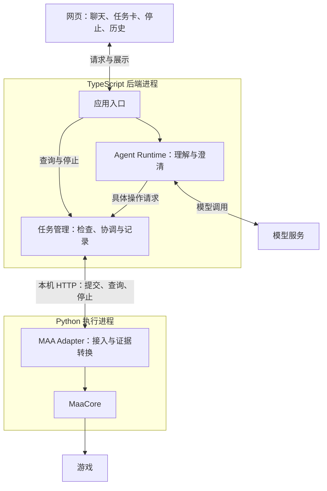

# ChatMAA 当前工程与目标架构

定位：当前工程说明，持续维护。最近核对：2026-09-18；代码基线：`4ca2d56`，与原型收尾提交 `b99b917` 内容一致。实机证据的运行版本仍以报告为准，合并代码不代表重新测试。

目前已有受限执行链路原型，尚无完整聊天应用。本文区分目标职责、已有实现与未决事项，不安排实施阶段或授权执行。已接受的技术决定不等于已完成实现；原型通过也不等于完整 MVP 验收。实验结论见[原型审阅总结](../archive/2026-09-prototype/prototype-review.md)。

产品范围与验收以 [MVP Spec #1](https://github.com/Fyrefly-4/ChatMAA/issues/1) 为准。项目方向见[项目定义](../overview/project-definition.md)，术语见 [CONTEXT.md](../../CONTEXT.md)。已接受的设计与已实现的能力在下文分别说明。

## 1. 系统由哪些部分组成

模型负责理解目标与解释结果，任务管理负责确定性的业务规则，Python 执行端负责调用 MaaCore 并提供事实证据。

这是目标产品的职责图。TS 内部模块同进程运行；Python 是由 TS 直接启动和管理的子进程。模块隔离便于理解和替换，但同进程模块仍共享进程故障。

| 部分 | 职责 | 当前进度 |
|---|---|---|
| 网页，React + Vite | 输入、任务展示、确认与停止入口 | 已选方向，尚未实现 |
| 应用入口，Fastify | 接收消息与操作，交给对应模块 | 原型已有执行控制入口；聊天接口待实现 |
| Agent Runtime，AI SDK | 上下文、目标理解、澄清与工具调用 | 已选有界工具循环，即限制模型与工具往返的步数等；尚未接入模型 |
| 任务管理，TypeScript | 参数与授权检查、防重、设备占用、状态协调 | 执行协调核心契约已有原型证据；完整业务模块待实现 |
| MAA Adapter，Python + FastAPI | 管住执行入口、调用 MaaCore、转换和保存证据 | CLI、HTTP 与受限实机执行已验证 |
| 两份 SQLite | TS 保存业务记录，Python 保存最小执行证据 | 证据存储与交接已验证；完整会话和历史功能待实现 |

Python 原型将 MaaCore 调用放在工作线程，让 HTTP 查询、停止和失联检测继续处理。仍是一个 Python 进程，没有新增独立监督服务。

### 当前代码落点

| 模块或设施 | 实际位置 | 成熟程度与边界 |
|---|---|---|
| 应用入口与任务协调 | [server.ts](../../prototypes/lifecycle/src/server.ts) | API、任务协调和进程管理仍集中于原型；没有完整聊天授权流程 |
| TS 业务记录 | [store.ts](../../prototypes/lifecycle/src/store.ts) | 保存任务与接收的证据；完整会话、授权及历史交互尚未形成 |
| Python HTTP 控制与工作线程 | [http_service.py](../../prototypes/maa/http_service.py)、[http_worker.py](../../prototypes/maa/http_worker.py) | 查询、停止和执行反馈已有受限原型；工作线程仍属同一 Python 进程 |
| MaaCore 适配与结果解释 | [core.py](../../prototypes/maa/core.py)、[run.py](../../prototypes/maa/run.py)、[contract.py](../../prototypes/maa/contract.py) | CLI 与 HTTP 复用真实执行能力；当前为固定环境、关卡及小次数验证 |
| 宿主与生命周期 | [python-runtime.ts](../../prototypes/lifecycle/src/python-runtime.ts)、TS 入口与 Python 控制层 | 跨模块协作，不是独立监督服务 |
| 可控替身与实验驱动 | [替身服务](../../prototypes/lifecycle/adapter/service.py)、[实验目录](../../prototypes/lifecycle/experiments/) | 用于验证和观察，不是用户应用或产品兜底服务 |
| Web 与 Agent Runtime | 尚无对应应用实现 | 已选技术方向不代表已接入模型和页面 |

两个原型目录按验证工作组织，并非最终模块边界：`lifecycle` 的 TS 后端已被真实 HTTP 合并复用，而其 Python 替身仍用于离线验证；`maa` 同时包含真实适配、诊断和证据工具。

固定小次数、一次性实验数据、结束后保留环境待核对、重复的原型协议实现及等待参数，属于当前原型安排。长期参数、共享模块和正式恢复方式尚未确定；不为这些实现补造已接受的决策理由。

## 2. 一次请求怎样执行

以“帮我刷 1-7 十次”为目标产品示例。十次用于说明流程，实机实验使用的是更小的约定次数。

1. **理解目标**：Agent 补齐关卡、次数、资源限制，缺少信息时先澄清。
2. **检查与确认**：任务管理检查范围、参数、授权和设备占用，按规格展示摘要并处理必要确认。模型不能绕过检查直接调用 MAA。
3. **记录并提交**：同一次操作在提交前取得稳定标识。TS 保存提交意图，Python 校验并持久记录受理，再调用 MaaCore。受理后执行独立推进；独立第二任务被拒绝，不自动排队。
4. **更新事实**：Python 保存关键反馈，TS 定期查询状态与新增证据，更新已确认完成量。网页读取任务事实，Agent 可以据此解释。
5. **结束或停止**：自然结束时根据证据记录结果；主动停止经应用入口和任务管理直接到执行端，不必等待模型回复。

提交、查询、停止及证据返回已在原型中贯通。聊天、授权交互和页面仍需实现。关闭网页不停止任务、模型故障不影响已启动任务是已接受的产品要求，完整场景尚待验收。

## 3. 为什么保存两份记录

TS 需要记录用户要求、授权和业务结果；Python 更接近现场，可能保存到 TS 尚未收到的执行事实。两端各写自己的 SQLite，通过 HTTP 核对，不共写业务表。

| 记录 | 拥有者 | 用途 |
|---|---|---|
| 会话、授权、任务和用户可见结果 | TS | 组织产品行为与历史；完整会话等功能待实现 |
| 受理标识、参数、关键反馈、停止证据 | Python | 通信中断或重启后核对旧执行 |
| 已接收证据与读取位置 | TS | 知道哪些反馈已应用，防止重复计数和漏读 |

例如 Python 已启动任务但 HTTP 响应丢失，TS 应按原标识查询，不能换标识重发。同标识、同参数对应原操作；同标识但参数不同必须拒绝。读取旧记录不自动获得新执行权。设备互斥与控制者身份检查还要阻止第二实例或旧控制者同时操作设备。

关键证据带执行标识和递增序号。TS 在一次本地事务中保存证据、更新结果和读取位置；重读不重复计数，序号缺失则保留缺口。上述机制已有原型验证。

游戏动作、HTTP 与两份数据库没有统一事务。动作可能已经发生却来不及留证；没有记录不能解释为没有执行，恢复时必须允许未知。取舍见 [ADR-0003](../adr/0003-execution-evidence.md)。

## 4. 怎样表达进度与停止

| 独立判断 | 回答什么 | 例子 |
|---|---|---|
| 执行状态 | 是否仍执行，停止是否确认？ | 运行中、停止中、已结束、待核对 |
| 完成量可信度 | 是最终次数，还是至少完成这些？ | 已确认一次，另一局缺少结算证据 |
| 设备可用性 | 能否开始新任务？ | 正在占用、环境待核对、可执行 |

真实合并结果是：**已确认成功一次，自动化已停止，第二局缺少结算证据，环境仍待核对。** 用户可以手动接管，但手动结果不自动计入原任务。

已接受停止请求、自动化已停止、执行端进程已退出是不同事实。自动化停止不表示游戏战斗立即结束或消耗被撤销。

确认旧执行结束且环境可执行后，才能解除冲突占用。完成量未知不必永久锁住设备，但不能猜剩余量；继续意味着核对后创建关联的新任务。真实环境的通用核对与解锁尚未实现，原型结束后保留环境待核对。

## 5. 宿主与生命周期边界

TS 统一启动和管理 Python；正常退出时先拒绝新执行、请求停止并交接已知证据。TS 持续续期控制权，Python 据此判断失联；原型的退出交接保留有限期限的最终查询，让 TS 落库后确认退出。

正常工作的 TS 或 Python 各有有限的停止、退出处理；两者同时失去响应时没有独立监督者，不能保证自救。强制终止仅限退出或失联处理中的自有执行端，不扩展到普通停止按钮、游戏或其他 MAA 实例。发出终止请求也不证明已退出。

真实证据覆盖指定阶段的普通停止及停止后的退出交接；运行中关闭、挂起和故障分支主要为离线或替身证据。场景与限制见[原型审阅 R1、R4](../archive/2026-09-prototype/prototype-review.md)，详细时间线见[合并报告](../../prototypes/maa/HTTP-MERGE.md)。等待参数仍为实验配置；扩大监督覆盖需重新讨论 [ADR-0001](../adr/0001-runtime-structure.md)。

## 6. 已选技术及其代价

| 选择 | 获得什么 | 代价与依据 |
|---|---|---|
| TS 模块同进程，直接管理 Python | 集中启动、调试与生命周期管理 | TS 模块共享进程故障；后端退出不承诺继续刷图。[ADR-0001](../adr/0001-runtime-structure.md) |
| Fastify + FastAPI，本机 HTTP，TS 轮询 | 接口可独立检查，状态可查询和补读 | 管理端口、身份、续期与事件缺口；展示可能滞后一个查询周期。[ADR-0002](../adr/0002-local-http-adapter.md) |
| 两份独立 SQLite | 各端拥有记录，恢复时可核对 | 需要证据交接，没有游戏与双库的统一事务。[ADR-0003](../adr/0003-execution-evidence.md) |
| AI SDK 有界工具循环，自有任务管理 | 复用模型调用流程，长任务独立运行 | 仍需适配上下文与工具，循环结束不能代替游戏停止。[ADR-0004](../adr/0004-agent-loop-boundary.md) |
| React + Vite 独立前端 | 页面通过应用 API 与后端协作 | 页面、断线恢复与传输方案尚待实现和验证；选择依据见[架构讨论 Q12](../archive/2026-09-prototype/architecture-discussion.md#第五轮技术组合已确认) |

Fastify、FastAPI、SQLite 和 MaaCore 已有固定版本集成证据，见[合并报告](../../prototypes/maa/HTTP-MERGE.md)与[环境记录](../../prototypes/maa/ENVIRONMENT.md)。AI SDK 的项目适配尚未验证；模型服务、UI 组件库和浏览器更新方式尚待确定。

## 7. 后续替换会影响哪里

以下是应保留的设计边界，尚未做迁移验证。

| 变更 | 预期复用 | 需要调整和重新验证 |
|---|---|---|
| 网页改为 Electron | React 页面、应用 API、任务管理、Python 接口与记录模型 | 桌面进程、窗口、权限桥接、路径、Python/MaaCore 分发、安装更新；分别处理关窗与退出 |
| 自写 Agent Loop | 任务管理、工具业务契约、授权与执行证据 | 模型和工具往返、上下文裁剪、步数与时间限制、错误和取消、历史消息兼容 |
| 更换数据库 | 业务概念与应用接口 | 查询、事务、并发、迁移、备份与部署 |

页面应通过应用 API 访问任务，路径与进程能力集中在宿主适配部分；SDK 特有消息和回调限制在 Agent Runtime 内，任务管理使用项目自己的参数和结果模型。替换循环可以继续使用原模型客户端，无需同时替换所有组件。

## 8. 未决事项与来源差异

这些是尚待决策或落实的事项，不构成全部工作开始前必须完成的清单；具体处理范围由当次委托确定。

| 事项 | 待明确内容 |
|---|---|
| 正式支持环境 | #1 仍以模拟器描述使用方式，实机原型验证官方桌面端；正式支持边界待确认，不能由原型成功自动改写规格 |
| 真实环境核对与解锁 | 由谁检查、依据什么允许新任务、完成量未知时如何交互 |
| 监督边界 | 怎样展示失联与人工处理；若扩大覆盖，再讨论监督组件 |
| Agent 与页面 | 模型服务、上下文和工具适配、确认交互、任务更新方式 |
| 正式工程化 | 接口与存储模型、记录保留策略、等待参数、模块验收；抽取原型共同能力 |

#1 中部分框架、存储和通信“尚未定案”的文字属于规格制定时状态，后续技术选择见 ADR 与架构讨论记录；这不降低 #1 的产品行为要求。

产品负责人参与模块边界、运行方式、数据归属和产品承诺的取舍；常规实现按已接受规则推进。讨论按主题集中说明选择及影响，未回复的建议保持待定。改变既有决定时更新或取代对应 ADR。

实验结论见[设计审阅](../archive/2026-09-prototype/prototype-review.md)。Q1–Q12 选项、原始推荐与资料核对保留在[架构讨论历史](../archive/2026-09-prototype/architecture-discussion.md)，历史措辞不表示当前状态。
