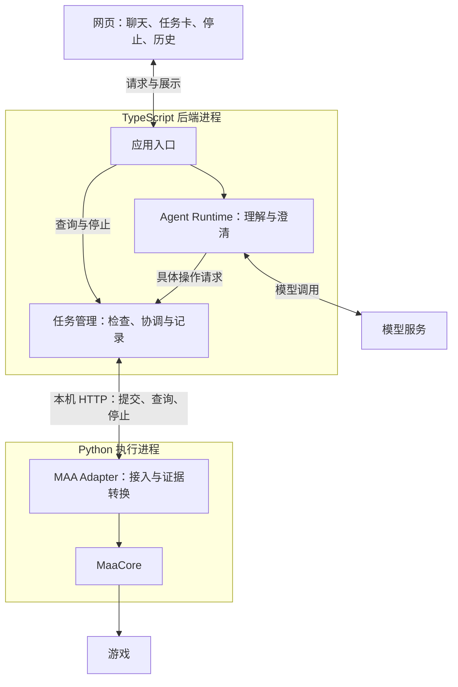

# ChatMAA 当前工程与目标架构

2026-09-21 D5 补充（从 `b9d580de` 建设）：`web/src/mvp/` 已提供连续会话、方案展示与确认、全局任务、独立停止、历史恢复及依据／执行详情。`backend/src/browser/mvp-routes.ts` 与 `mvp-queries.ts` 在原同源身份边界装配既有 Runtime 和业务服务；启动使用 `--runtime --web`，legacy 页面分别加载。数据和进程归属不变，代码职责、运行路径与分层验证见 [D5 Web](d5-web.md)。真实模型＋正式回放网页代表路径已核对，仍有回复表达与阅读体验限制；未调用真实游戏，不代表 D5 已获验收或 D6 已完成。下文有日期的页面缺口与 Demo 描述按原历史基线理解。

2026-09-21 D4 补充（代码 `a46e20d`）：MVP 已新增独立 [Runtime 模块](../../backend/src/runtime/service.ts)，使用有界 AI SDK 业务工具循环、会话轮次代次、上下文来源与后台只读澄清；显式 `--runtime` 经应用令牌 HTTP／回放 CLI 接入。三种目标及代表异常已通过真实模型＋正式 Python 回放核对，进入阶段审阅；完整页面与真实游戏整体验收仍留后续阶段。结构、活动契约、失败修正和检查入口见 [D4 Runtime](d4-runtime.md)。下文原 Agent／Web 描述继续属于 legacy Demo，不代表新 MVP 仍使用完整指令直接授权规则。

2026-09-21 D3 结构：共同业务入口保持不变，请求迁移、依据判断、事实投影和消费者生命周期各有明确模块；执行停止意图统一归 TaskService。同步按受影响任务推进业务，启动仍全量核对；业务投影失败与执行证据存储失败分开表达。具体职责及字段见 [D3 业务契约](d3-backend.md)。进程、双库、确认含义与阶段实机完成条件不变。

2026-09-21 D3 实现补充（开发基于 D2 合并提交 `84fc913`）：新增同进程 `BusinessService`、同库会话与业务记录、版本化方案与确认、三种目标计算、库存依据有效性、异步后续处理、历史关联及资料快照。默认 Backend 使用 MVP 业务入口；旧 Demo 与裸参数工程入口显式隔离。当前接口、状态及检查入口见 [D3 业务契约](d3-backend.md)。正式 Adapter HTTP／双库离线联调和 D2 历史回调转换已检查，固定 MuMu 的 D3 业务链路已核对，现场范围及后续确认来源修复的验证边界见 D3 业务契约，不代表 MVP 整体验收。下文有日期的 Demo 模型与页面说明保留其历史证据范围。

2026-09-21 D2 补充（实现基线 `3679f82`）：Adapter 增加显式 MuMu/ADB 连接、库存扫描与材料目标操作，Backend 复用原任务服务接收 v2 确定参数并保存独立结果投影；进程、HTTP、双库与模型边界不变。固定 MuMu 基本通路已通过，当前交付阶段审阅；离线、实机、异常注入及未覆盖边界见[验证交付说明](d2-verification.md)。代码入口见 [D2 执行契约](d2-adapter.md)。Web 补充新任务兼容展示及接管同步状态，完整方案与对话仍属后续阶段。

定位：当前工程说明，持续维护。最近核对：2026-09-19；Issue #11 基于 `4bcf381` 收敛运行入口与停止展示，当前操作入口见 [Demo 运行说明](demo.md)。正式 Backend／Adapter 原从 `273055d` 建立，原型源码保留。离线、native 边界替身与实机结果分别说明；文档更新不表示重跑历史实验。

目前已有独立的确定参数执行入口、常驻 Backend 内的 Agent 调试链路和最小 Web 执行台。2026-09-18 Agent 实现基于 `be62348`：模型替身与正式回放集成已验证，真实 DeepSeek 四个固定样例的回放调用及回复审阅已通过。运行与检查见[Backend 说明](../../backend/README.md)，真实环境判据与限制见[Adapter 说明](../../adapter/maa/README.md)。本文区分目标职责、已有实现与未验证部分；不安排阶段授权。原型结论继续见[历史审阅总结](../archive/2026-09-prototype/prototype-review.md)。

正式 Backend 使用 npm 和 `backend/package-lock.json` 安装与检查；原型的历史工具与证据不随此调整重写。

2026-09-19 启动体验补充（基于 `084bb43`）：根目录 `start-demo.ps1` 进入 `backend/src/demo-entry.ts`，先检查依赖再加载现有 `main.ts`。`demo.ts` 负责版本／构建检查、本地配置复用、当前窗口发现和浏览器打开；`main.ts` 在同一 Backend 内把 Ctrl+C 输入接到原退出交接。没有新增常驻监督进程、数据库或业务接口。默认真实模式，`-Replay` 显式回放，`-NoModel` 可禁用模型；日常固定数据目录不自动重建，未知任务的受理限制不变。使用与首次准备见 [Demo 入口](demo.md#日常启动一条命令)。

2026-09-18 CI 简化补充：采用单 workflow、单 Windows job，全量执行 Backend 类型检查、Backend 集成测试与 Adapter 单元测试；保留固定环境和锁定依赖，移除按需调度及独立门禁。简化结构的本地完整检查和远端 Windows PR 检查均已通过，未启用强制门禁。Python 3.13.15 的既有离线结论不扩大为实机结论。日常运行、后续检查接入及验证边界见 [CI 使用与接入](ci-plan.md)，实施过程见 [归档方案](../archive/2026-09-ci/ci-plan.md)。

本地验证向导按轮次保存 live 数据，两端配置均允许 `.artifacts/live-wizard/run-*/data/`，默认手动入口仍为 `.artifacts/live/`。各轮次共用仓库设备锁；上一轮服务退出与上一轮验收通过分开判断，历史记录原样保留。配置校验失败会报告“执行端未启动”，不要求对未启动的执行端做收尾。

2026-09-18 当前实现补充：Adapter 分别保留战斗结果与战后识别结果，资源初始化失败不抹掉已确认完成量，但仍阻止再次执行；Backend 的退出交接提供最终任务快照供本地报告使用。见 [Adapter 的记录说明](../../adapter/maa/README.md#记录与设备锁)及 [Backend 实机入口](../../backend/README.md#live-verification)。上述修正已包含在本次固定范围实机运行的工作区代码中；重整后生产源码与该工作区核对一致。职责与两库归属不变。

产品范围与验收以 [MVP Spec #18](https://github.com/Fyrefly-4/ChatMAA/issues/18) 为准，开发路线见 [#19](https://github.com/Fyrefly-4/ChatMAA/issues/19)。项目方向见[项目定义](../overview/project-definition.md)，术语见 [CONTEXT.md](../../CONTEXT.md)。已接受的设计与已实现的能力在下文分别说明。

2026-09-20 规格入口更新：新 MVP 纳入补到库存、再获得材料、按次数刷图，所有刷图先展示方案再确认，主验收环境为 Windows＋MuMu；规划前自动理智读取后延。会话、方案与材料能力按 D1–D6 建设。本文后续有日期的 Demo 实现与验证记录保留原基线；摘要展示后自动推进等旧实现行为不是新规格要求。

2026-09-20 D1 文档交付：[MVP 协作约定与交互结构](mvp-collaboration.md)保存模块协作、对象归属、方案确认、异步完成后的推进及请求有效性、状态与结果含义、代表路径和页面草图，供后续模块设计引用。该文档已完成设计审阅与路径走查，本次没有新增代码或运行验证；当前 Demo 实现不因此具备完整 MVP 行为。实现状态继续由本文维护，阶段进度与验收见路线及阶段 Issue。

## Web 接入补充（2026-09-19）

本次从 `06f8d04` 接入最小 Web，Backend 入口提交为 `2889a95`，后续页面及验证见当前分支提交历史。React + TypeScript + Vite 构建产物由原 Fastify 同源提供；开发模式使用固定本机 Vite 代理。没有新增进程职责、数据库、队列或完整会话系统。运行和代码修改入口见 [Web 说明](../../web/README.md)，HTTP 边界见 [Backend 说明](../../backend/README.md#浏览器入口)。

浏览器协调层复用一个常驻 `AgentRequests`，立即受理并轮询请求记录；仅匹配当前请求／操作的摘要展示回执释放工具调用。页面的可见摘要经历绘制机会后自动回执，不增加第二次用户确认。刷新后的摘要只读，模型结束和网页关闭都不停止已受理任务。直接任务查询与停止不经过模型。退出取消模型并等待已发出的有界任务调用、排空直接 HTTP 请求后，继续既有宿主的执行停止和两库证据交接；关闭后的 SDK 迟到事件不再写请求记录。

浏览器与 CLI 使用独立令牌，浏览器接口检查 Host／Origin，原 CLI 继续拒绝浏览器来源；静态文件只来自构建目录。页面不接触模型凭据、Python 或 SQLite。任务卡独立解释完成量、可信程度、停止证据、环境与两段连接状态，工具详情保留调用时快照。

本地已完成浏览器离线回放和受控故障展示检查，一次真实 DeepSeek 通过网页调用的回放检查通过：摘要展示后仅受理一次 1-7 十次任务，最终确认十次完成并正常退出交接；真实游戏完整链路未验证。本地使用 Edge Chromium，CI 配置使用 Playwright 配套 Chromium；包含收尾修正的 `dccac38` 已通过 [Windows CI](https://github.com/Fyrefly-4/ChatMAA/actions/runs/35370371623)。以下较早验证记录保留其原时间范围，不把历史状态当作当前验收结论。

## 已验证范围

2026-09-19 Issue #11：精确基线同步为 Node 24.19.0／Python 3.12.14；本地 Backend 39、Adapter 25、Edge Chromium 浏览器 12 项及两端类型检查／Web 构建通过。新增检查覆盖停止受理后延迟确认和回执迟到，保留完成量下界与环境待核对。正式 `--web` 在显式回放配置、无模型密钥下启动和 CLI 退出核对通过。未调用真实模型或游戏；`3608547` 的 [Windows CI](https://github.com/Fyrefly-4/ChatMAA/actions/runs/35379585646) 已在相同精确版本下通过全部检查（配套 Chromium）；真实整链演示尚未验证。当前实现图与操作排查见 [Demo 入口](demo.md#模块协作与排查)，无职责、进程、API 或数据库调整。

#10 的最终闭环基线为 `40be2cc`，包含摘要回执重试和同标签页启动令牌切换修正，Windows CI 的 Backend 39、Adapter 25、Web 10 项通过，已合并到 `4bcf381`。见[阶段 3 闭环记录](https://github.com/Fyrefly-4/ChatMAA/issues/10#issuecomment-5733757969)与[最终 CI](https://github.com/Fyrefly-4/ChatMAA/actions/runs/35372689845)。上文 `dccac38` 和下文较早数字均是各轮历史证据。

2026-09-18 Agent 补充（代码基线 `de07573`）：DeepSeek `deepseek-flash` 经 Responses API，在四个固定样例中完成工具调用与回复检查。完整指令仅建立一个正式回放任务并确认十次完成；能力询问、缺次数、不支持资源条件均未执行，提示修正后的回复与参数边界一致。此前离线全量 Backend 29 项、Python 25 项及类型检查通过；提示修正后 Agent 13 项和类型检查通过。当时的该分支远端 Windows CI 尚未运行；后续 #9 闭环与当前 Web 验证另行记录。该证据不覆盖真实 Agent—MAA 游戏闭环或任意自然语言表达。

2026-09-18，正式 Backend 与 Adapter 在同一服务周期内完成两个独立任务，各一次 1-7，不吃药、不碎石。四次执行前后识别通过，完成量均为 exact，设备就绪，最终退出交接完成；负责人确认两次现场结果通过。实机配置、原始日志与详细交接保留在本地，不随仓库发布。

本次重整逐步验证复用契约、单次执行、Adapter 独立 HTTP 服务、Backend 协调、显式复核及验证配置；最终 Python 检查 24 项、Backend 检查 14 项及类型检查通过。临时向导保持 Git 忽略，不计入可随仓库运行的正式检查。上述范围不覆盖长时间运行、任意关卡、全部特殊故障或完整聊天应用。

2026-09-18 PR 审查修正：战斗资源在实例创建前加载失败时保留已停止及环境待检查；周期轮询跳过稳定终态历史，但保留启动核对、复核跟踪和退出交接核对。修正后 Python 25 项、Backend 16 项及类型检查通过，新增检查使用离线／native 边界替身，未重跑实机或扩大实机结论。

## 1. 系统由哪些部分组成

模型负责理解目标与解释结果，任务管理负责确定性的业务规则，Python 执行端负责调用 MaaCore 并提供事实证据。

这是目标产品的职责图。TS 内部模块同进程运行；Python 是由 TS 直接启动和管理的子进程。模块隔离便于理解和替换，但同进程模块仍共享进程故障。

| 部分 | 职责 | 当前进度 |
|---|---|---|
| 网页，React + Vite | 输入、摘要展示、任务事实与停止入口 | 单页已实现；HTTP 轮询与展示回执，离线浏览器回放通过 |
| 应用入口，Fastify | 接收消息与操作，交给对应模块 | 确定参数 CLI 与受控浏览器 API 已建立；浏览器只提交原文，不直接提交执行参数 |
| Agent Runtime，AI SDK | 上下文、目标理解、澄清与工具调用 | 已接入 DeepSeek Responses 配置与两步 SDK 循环；离线验证通过，真实模型四个固定样例的回放调用与回复已验收 |
| 任务管理，TypeScript | 参数与授权检查、防重、设备占用、状态协调 | 共同任务服务已有正式离线验证；Agent 增加原指令完整匹配及参数绑定 |
| MAA Adapter，Python + FastAPI | 管住执行入口、调用 MaaCore、转换和保存证据 | 离线与 native 边界替身已检查；两个独立 1-7 任务各一次的正常实机流程已通过 |
| 两份 SQLite | TS 保存业务记录，Python 保存最小执行证据 | D3 增加会话、需求、方案、确认与历史关联；证据投影和交接沿用，完整页面留 D5 |

Python 正式控制层沿用工作线程执行 MaaCore，让 HTTP 查询、停止和失联检测继续处理。仍是一个 Python 进程，没有新增独立监督服务。

### 当前代码落点

| 模块或设施 | 实际位置 | 成熟程度与边界 |
|---|---|---|
| 应用入口与任务协调 | [app.ts](../../backend/src/app.ts)、[task-service.ts](../../backend/src/task-service.ts)、[cli.ts](../../backend/src/cli.ts) | HTTP 与同进程入口共用参数、防重和占用规则；客户端可独立退出 |
| TS 业务记录 | [store.ts](../../backend/src/store.ts)、[task-contract.ts](../../backend/src/task-contract.ts) | 保存任务、证据及同步信息；缺口和冲突保守表达；尚无完整会话历史 |
| Python HTTP 控制与工作线程 | [service.py](../../adapter/maa/service.py)、[worker.py](../../adapter/maa/worker.py) | 每任务持久记录，正常再次受理与异常阻止分别处理；无实验管理 API |
| MaaCore 适配与结果解释 | [core.py](../../adapter/maa/core.py)、[native.py](../../adapter/maa/native.py)、[contract.py](../../adapter/maa/contract.py)、[readiness.py](../../adapter/maa/readiness.py) | 固定 live 配置、计数和只识别环境判据；固定范围正常实机流程已通过 |
| 宿主与生命周期 | [host.ts](../../backend/src/host.ts)、[config.ts](../../backend/src/config.ts)、Python 控制层 | TS 管理自有执行端，续期和有界退出交接 |
| 可控替身与实验驱动 | [替身服务](../../prototypes/lifecycle/adapter/service.py)、[实验目录](../../prototypes/lifecycle/experiments/) | 用于验证和观察，不是用户应用或产品兜底服务 |
| Agent Runtime 与请求核对 | [requests.ts](../../backend/src/agent/requests.ts)、[policy.ts](../../backend/src/agent/policy.ts)、[runtime.ts](../../backend/src/agent/runtime.ts)、[tools.ts](../../backend/src/agent/tools.ts) | 同进程复用任务服务；最小请求记录进入原 TS SQLite；真实模型四个固定样例的回放调用及回复审阅已通过 |
| Web | [web/src](../../web/src)、[浏览器协调层](../../backend/src/browser/requests.ts) | 输入与工具记录、可见摘要回执、独立任务卡及停止；刷新只读恢复 ID，不重发执行 |

两个原型目录按验证工作组织，并非最终模块边界：`lifecycle` 的 TS 后端已被真实 HTTP 合并复用，而其 Python 替身仍用于离线验证；`maa` 同时包含真实适配、诊断和证据工具。

固定小次数、一次性实验数据和实验等待参数继续属于原型安排。正式工程有自己的配置、源码与回放样例；不调用实验驱动或使用一次性 grant。依赖优先沿用已有固定版本，未统一全部原型实现，也未改变进程和数据归属。

## 2. 一次请求怎样执行

以当前 Demo 的“帮我刷 1-7 十次”为例。网页到真实模型的检查使用十次回放；既有实机实验使用更小的约定次数。完整 MVP 的多轮与历史要求继续保留。

1. **理解目标**：Agent 读取原文，本地规则核对完整支持指令。缺项时请用户重新给出完整指令，不把多轮输入自动拼成授权。
2. **检查与展示**：工具核对参数与原授权，页面显示摘要并自动回执后再进入任务管理的范围与设备占用检查。完整指令即本次授权，不增加第二次点击确认；模型不能绕过检查直接调用 MAA。
3. **记录并提交**：同一次操作在提交前取得稳定标识。TS 保存提交意图，Python 校验并持久记录受理，再调用 MaaCore。受理后执行独立推进；独立第二任务被拒绝，不自动排队。
4. **更新事实**：Python 保存关键反馈，TS 定期查询状态与新增证据，更新已确认完成量。网页读取任务事实，Agent 可以据此解释。
5. **结束或停止**：自然结束时根据证据记录结果；主动停止经应用入口和任务管理直接到执行端，不必等待模型回复。

正式确定参数入口已贯通提交、查询、停止和证据返回；离线验证包含十次目标、正常新请求与客户端退出后查询。当前 Demo 的完整指令核对与页面已接入，一次网页—真实模型—正式回放已验证；网页到真实游戏的完整场景尚未验收。

## 3. 为什么保存两份记录

TS 需要记录用户要求、授权和业务结果；Python 更接近现场，可能保存到 TS 尚未收到的执行事实。两端各写自己的 SQLite，通过 HTTP 核对，不共写业务表。

| 记录 | 拥有者 | 用途 |
|---|---|---|
| 会话、授权、任务和用户可见结果 | TS | 组织产品行为与历史；完整会话等功能待实现 |
| 受理标识、参数、关键反馈、停止证据 | Python | 通信中断或重启后核对旧执行 |
| 已接收证据与读取位置 | TS | 知道哪些反馈已应用，防止重复计数和漏读 |

例如 Python 已启动任务但 HTTP 响应丢失，TS 应按原标识查询，不能换标识重发。同标识、同参数对应原操作；同标识但参数不同必须拒绝。读取旧记录不自动获得新执行权。设备互斥与控制者身份检查还要阻止第二实例或旧控制者同时操作设备。

关键证据带执行标识和递增序号。TS 在一次本地事务中保存证据、更新结果和读取位置；重读不重复计数，序号缺失则保留缺口。上述机制已有原型验证。

游戏动作、HTTP 与两份数据库没有统一事务。动作可能已经发生却来不及留证；没有记录不能解释为没有执行，恢复时必须允许未知。取舍见 [ADR-0003](../adr/0003-execution-evidence.md)。

## 4. 怎样表达进度与停止

| 独立判断 | 回答什么 | 例子 |
|---|---|---|
| 执行状态 | 是否仍执行，停止是否确认？ | 运行中、停止中、已结束、待核对 |
| 完成量可信度 | 是最终次数，还是至少完成这些？ | 已确认一次，另一局缺少结算证据 |
| 设备可用性 | 能否开始新任务？ | 正在占用、环境待核对、可执行 |

历史原型的真实合并结果是：**已确认成功一次，自动化已停止，第二局缺少结算证据，环境仍待核对。** 用户可以手动接管，但手动结果不自动计入原任务。

已接受停止请求、自动化已停止、执行端进程已退出是不同事实。自动化停止不表示游戏战斗立即结束或消耗被撤销。

确认旧执行结束且环境可执行后，才能解除冲突占用。正式正常路径增加只识别的主界面／关卡入口判据，每次 live 操作前刷新依据，正常收尾后另行识别；主界面与关卡入口判据已在本次固定范围正常实机流程中验证。2026-09-18 补充显式环境重新识别：共同任务服务受理 `recheck`，Python 在设备互斥和已确认停止的前提下运行只识别工作线程，事件由原控制线程写入执行库，再同步业务库。旧计数与结束原因不改，设备可用状态与新识别依据单独更新。检查 ID 防重，失败或中断不自动恢复。通用核对解锁和“继续”未实现；完成量未知不等于可以猜剩余量。

## 5. 宿主与生命周期边界

TS 统一启动和管理 Python；正常退出时先拒绝新执行、请求停止并交接已知证据。TS 持续续期控制权，Python 据此判断失联；原型的退出交接保留有限期限的最终查询，让 TS 落库后确认退出。

正常工作的 TS 或 Python 各有有限的停止、退出处理；两者同时失去响应时没有独立监督者，不能保证自救。强制终止仅限退出或失联处理中的自有执行端，不扩展到普通停止按钮、游戏或其他 MAA 实例。发出终止请求也不证明已退出。

真实证据覆盖指定阶段的普通停止及停止后的退出交接；运行中关闭、挂起和故障分支主要为离线或替身证据。场景与限制见[原型审阅 R1、R4](../archive/2026-09-prototype/prototype-review.md)，详细时间线见[合并报告](../../prototypes/maa/HTTP-MERGE.md)。等待参数仍为实验配置；扩大监督覆盖需重新讨论 [ADR-0001](../adr/0001-runtime-structure.md)。

## 6. 已选技术及其代价

| 选择 | 获得什么 | 代价与依据 |
|---|---|---|
| TS 模块同进程，直接管理 Python | 集中启动、调试与生命周期管理 | TS 模块共享进程故障；后端退出不承诺继续刷图。[ADR-0001](../adr/0001-runtime-structure.md) |
| Fastify + FastAPI，本机 HTTP，TS 轮询 | 接口可独立检查，状态可查询和补读 | 管理端口、身份、续期与事件缺口；展示可能滞后一个查询周期。[ADR-0002](../adr/0002-local-http-adapter.md) |
| 两份独立 SQLite | 各端拥有记录，恢复时可核对 | 需要证据交接，没有游戏与双库的统一事务。[ADR-0003](../adr/0003-execution-evidence.md) |
| AI SDK 有界工具循环，自有任务管理 | 复用模型调用流程，长任务独立运行 | 仍需适配上下文与工具，循环结束不能代替游戏停止。[ADR-0004](../adr/0004-agent-loop-boundary.md) |
| React + Vite 独立前端 | 页面通过应用 API 与后端协作 | 单页同源 HTTP 轮询已实现，接受更新延迟；刷新只恢复读取，完整历史和恢复后延。选择依据见[架构讨论 Q12](../archive/2026-09-prototype/architecture-discussion.md#第五轮技术组合已确认) |

Fastify、FastAPI、SQLite 和 MaaCore 已有固定版本集成证据，见[合并报告](../../prototypes/maa/HTTP-MERGE.md)与[环境记录](../../prototypes/maa/ENVIRONMENT.md)。AI SDK 项目适配已有离线工具往返及 Responses 请求检查；模型服务固定为 DeepSeek `deepseek-flash`，真实模型四个固定样例的回放调用与回复已验收。本阶段使用普通 CSS，不引入 UI 组件库；浏览器约 500 ms 串行轮询，网络等待会增加延迟，不提供实时性能保证。

## 7. 后续替换会影响哪里

以下是应保留的设计边界，尚未做迁移验证。

| 变更 | 预期复用 | 需要调整和重新验证 |
|---|---|---|
| 网页改为 Electron | React 页面、应用 API、任务管理、Python 接口与记录模型 | 桌面进程、窗口、权限桥接、路径、Python/MaaCore 分发、安装更新；分别处理关窗与退出 |
| 自写 Agent Loop | 任务管理、工具业务契约、授权与执行证据 | 模型和工具往返、上下文裁剪、步数与时间限制、错误和取消、历史消息兼容 |
| 更换数据库 | 业务概念与应用接口 | 查询、事务、并发、迁移、备份与部署 |

页面应通过应用 API 访问任务，路径与进程能力集中在宿主适配部分；SDK 特有消息和回调限制在 Agent Runtime 内，任务管理使用项目自己的参数和结果模型。替换循环可以继续使用原模型客户端，无需同时替换所有组件。

## 8. 未决事项与来源差异

这些是尚待决策或落实的事项，不构成全部工作开始前必须完成的清单；具体处理范围由当次委托确定。

| 事项 | 待明确内容 |
|---|---|
| 正式支持环境 | #18 已确定 Windows＋MuMu＋单个游戏执行环境为主要支持及完整验收范围；具体版本组合随 D2 落实。官方桌面端保留 Demo 原范围证据，新能力按实际验证说明 |
| 真实环境核对与解锁 | 正常前后识别与第二任务已有固定范围实机证据；显式重新识别已实现并做离线／替身检查，不能以正常路径替代其完整验收；页面已区分停止未确认和未知完成量，通用核对解锁与异常恢复交互未实现 |
| 监督边界 | 怎样展示失联与人工处理；若扩大覆盖，再讨论监督组件 |
| Agent 与页面 | Demo 真实整链已有本文末尾及 #11 闭环证据；新 MVP 的完整上下文、方案与历史等按 #19 路线建设，不能沿用 Demo 证据认定完成 |
| 正式工程验证与后续维护 | 已有正式契约、双库、配置与检查入口；实机验收、长期记录保留和完整恢复仍需按各自范围落实 |

#1 已由 #18 替代，旧规格中框架、存储和通信“尚未定案”等文字保留其历史语境；既有技术决定继续见 ADR。当前行为和验收按 #18，不再以旧规格作为默认逐项补齐清单。

产品负责人参与模块边界、运行方式、数据归属和产品承诺的取舍；常规实现按已接受规则推进。讨论按主题集中说明选择及影响，未回复的建议保持待定。改变既有决定时更新或取代对应 ADR。

实验结论见[设计审阅](../archive/2026-09-prototype/prototype-review.md)。Q1–Q12 选项、原始推荐与资料核对保留在[架构讨论历史](../archive/2026-09-prototype/architecture-discussion.md)，历史措辞不表示当前状态。

## 历史阻塞修复补充（2026-09-19）

基于 `8ec496e` 增补人工接管入口。Web 新增 `RecoveryPanel.tsx`；Backend 通过原身份边界提供设备状态与接管 API，Agent 对设备阻塞使用确定性指引；Adapter 的 `takeover.py` 负责核对意图、防重、活动执行限制与成功事务。复用原工作线程、探针、设备锁及两份数据库，不增加进程或自动恢复机制。

执行库新增 `takeovers` 表保存核对记录；成功接管作为 `manual_takeover` 事件同步到业务库。`takeover.released` 是独立准入依据，旧任务未知结果保持原样。该记录归属遵循 ADR-0003。固定数据目录中的历史未知不再永久封锁整个 Demo；当前执行仍不可绕过。使用和限制见 [Demo 说明](demo.md#处理历史阻塞)。

2026-09-19 历史阻塞修复验证：实现提交 `b4edb2d` 的 [Windows 离线 CI](https://github.com/Fyrefly-4/ChatMAA/actions/runs/35421146264) 全部通过，无跳过检查；Backend 41、Adapter 33、浏览器 17 项以及类型检查、Web 构建通过。本地浏览器使用 Edge，CI 使用配套 Chromium。真实模型、游戏刷取及 live 人工接管核对均未在本轮执行。

## Issue #11 真实整链验证（2026-09-19）

固定 Windows 官方桌面端、MaaCore v6.17.5 下，网页完整指令经真实 DeepSeek 工具调用进入正式执行端，同一服务、同一数据目录完成正常执行 A、中途停止 B 和收尾。A 的 1-7 一次目标精确完成，停止及环境就绪均有执行证据；B 的两次目标在首局完成、第二周期启动后由网页停止，最终确认自动化停止，保留一次完成量下界及一个未结算周期，环境仍待核对。两项均不吃药、不碎石，合计三次开战，无自动补刷。

两项各只有一次受理和一次工作线程进入；两库分别保存一致的 7 条与 8 条执行事件，无同步缺口或冲突，同一执行端正常退出。现场操作者确认整个流程正确。开跑前还验证了历史阻塞的显式环境核对：失败不放行，后续明确核对成功后可在原目录接收新任务，旧未知结果不改写。

实现基线为 `b4edb2d`；核对时 checkout 为仅追加验证文档的 `4efcf50`，运行日志未单独打印 Git SHA。原始日志、两库、请求记录和现场交接仅本地保存；未留存宿主终端最终布尔值打印，故不将其写作已捕获的原始证据。执行端正常退出与两库完整同步有日志，现场收尾另有操作者确认。

该结论补齐本阶段真实正常执行和页面停止证据，不覆盖所有次数、其他关卡、模拟器、长时间运行或全部恢复故障。模块检查仍分别为 Backend 41、Adapter 33、浏览器 17 项及类型检查、构建，见上述 Windows CI；负责人对主要链路的掌握及阶段交接结论单独确认，真实演示通过不等于完整 MVP 完成。
