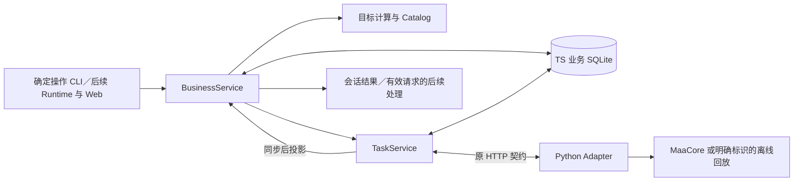

# D3 Backend：业务操作与下游接入

2026-09-21；从 D2 合并基线 `84fc913` 建设。当前实现提供确定操作、业务记录、方案确认、目标结果、异步后续处理和资料快照。正式 Python 进程、HTTP 与双库的离线联调已接通；执行反馈使用合成回调，另有 D2 脱敏历史回调转换检查。固定 MuMu 环境的业务扫描、三种目标与主动停止已通过现场及人工核验，证据范围见第 6 节；不据此认定 MVP 整体完成。

产品规则见 [Spec #18](https://github.com/Fyrefly-4/ChatMAA/issues/18)，完成条件见 [D3 #22](https://github.com/Fyrefly-4/ChatMAA/issues/22)，共同含义见 [MVP 协作约定](mvp-collaboration.md)。本页维护已实现接口和使用边界，不替代规格。

## 1. 结构和记录归属



Backend 保存会话、消息、执行请求、方案、展示、确认、任务关联、观察与依据变化、资料版本和后续处理。Python 仍只保存执行证据。没有新增进程、业务数据库或消息服务。

| 入口 | 职责与排查方式 |
|---|---|
| [service.ts](../../backend/src/business/service.ts) | 业务操作与版本检查、确认事务、扫描及停止后推进；重复开始和旧方案问题从这里查 |
| [records.ts](../../backend/src/business/records.ts) | 同库增量建表与索引；会话归属、历史及迁移 |
| [request-lifecycle.ts](../../backend/src/business/request-lifecycle.ts) | 集中定义请求意图、状态、版本与扫描关联的合法迁移；修订、取消及迟到反馈从这里核对 |
| [basis.ts](../../backend/src/business/basis.ts) | 库存变化、观察适用性、方案依据及关联旧成果的统一判断 |
| [projection.ts](../../backend/src/business/projection.ts) | 保存受影响任务的库存观察和结果事实，返回推进依据；不准备方案、不发消息、不调用消费者 |
| [followups.ts](../../backend/src/business/followups.ts) | 消费者超时、取消、退出排空和处理状态；请求版本与操作接纳规则仍在业务服务 |
| [goals.ts](../../backend/src/business/goals.ts) | 三种目标、精确／下界／未知、结果说明；不混用材料量与次数 |
| [catalog.ts](../../backend/src/business/catalog.ts) | 有来源的候选、适用关系、估算和依据指纹；来源及维护见[资料说明](../../backend/data/README.md) |
| [routes.ts](../../backend/src/business/routes.ts)、[cli.ts](../../backend/src/business/cli.ts) | 确定操作 HTTP 和独立客户端；无模型也可查询、停止和读取结果 |
| [task-service.ts](../../backend/src/task-service.ts)、[store.ts](../../backend/src/store.ts) | 复用 D2 执行预留、HTTP、防重、互斥、证据与同步；不理解自然语言 |

`business_schema` 记录业务表版本；既有任务和 Agent 表不删除、不伪造关联方案。没有业务关联的旧任务标记 `engineering_or_legacy`，仍参与共享环境占用和恢复检查。

新任务的确认、业务关联与执行预留在一次本地事务内完成；事务提交后只有本次持有的临时发送凭据可以调用 Adapter。记录重建或重复确认只读原任务，不自动重发。两库与实际游戏动作之间仍无统一事务，崩溃和响应丢失保留待核对状态。

## 2. 启动和确定操作入口

依赖准备沿用 [CI 说明](ci-plan.md)。默认 Backend 启动使用 MVP 业务装配，不加载模型或 `.env`。必须显式核对配置，以下仅展示离线配置：

```json
{"mode":"maa-replay","dataDir":"."}
```

将其保存在被 Git 忽略的 `.artifacts/d3-replay/config.json` 后，从仓库根目录运行：

```powershell
$env:CHATMAA_CONFIG = (Resolve-Path .artifacts/d3-replay/config.json).Path
node backend/src/main.ts
```

首次启动不提交任务。第二个终端设置相同配置后：

```powershell
node backend/src/business/cli.ts status
node backend/src/business/cli.ts conversation <会话ID>
node backend/src/business/cli.ts task <任务ID>
node backend/src/cli.ts shutdown
```

连接文件含本机控制令牌，仍保存在配置的数据目录，不分享。正常服务退出按既有规则请求停止和交接证据；关闭客户端不会停止 Backend。历史未知不通过删除库或换目录解除。

入口明确分开：

| 启动方式 | 可用范围 |
|---|---|
| `node backend/src/main.ts` | MVP 业务 API；裸 `POST /tasks` 不注册，不装配旧模型工具或旧页面 |
| `node backend/src/main.ts --engineering` | 原 D2 裸参数 CLI／HTTP，用于明确的工程验证 |
| `node backend/src/main.ts --legacy-demo --web` 或 `--legacy-demo --agent` | 旧 Demo 路径及原授权含义，不是 MVP 确认实现 |
| `start-demo.ps1` | 继续显式进入旧 Demo；沿用原实机／回放配置与限制 |

MVP 不在业务失败时回退到裸提交。工程与旧 Demo 不能同时装配，MVP 与旧浏览器协调也不能混装。真实模型、游戏及资料下载不是离线测试的隐式步骤。

## 3. HTTP 契约和操作样例

当前 D3 HTTP 是应用令牌入口：要求 `x-app-token`，拒绝浏览器 Origin。D4 可同进程调用业务服务；D5 需要在已有浏览器身份边界内包装相同业务操作，不向页面暴露应用令牌或另写业务规则。

| 接口 | 返回 |
|---|---|
| `GET /business/status` | 会话列表、全局冲突任务及所属会话、业务准入、执行端设备状态、资料版本，以及独立 `projection` 可用性 |
| `GET /business/conversations/:id` | 消息、执行请求、历史方案、当前指针、任务及必要后续处理状态 |
| `GET /business/tasks/:id` | 业务关联、独立目标结果、原执行事实和同步新鲜度；旧任务也可读取 |
| `GET /business/catalog` | 当前资料与来源；包含适用关系、推荐及统计覆盖 |
| `POST /business/operations` | 下表确定操作的结果；拒绝未知字段与操作，不透传 Core 参数 |

业务成功返回 200，具体对象仍区分等待、执行受理和结果，HTTP 成功不表示游戏已开始或完成。无效字段为 422、状态／版本冲突为 409、不存在为 404、不可用为 503。旧查询、停止、复核、接管及宿主关闭 API 保留；仅裸创建任务在 MVP 下关闭。

| `operation` | 必要输入（除 operation 字段） |
|---|---|
| `create_conversation` | id、title |
| `append_message` | conversationId、id、role、text；同 ID 内容不可变 |
| `create_request` | conversationId、id、sourceMessage、goal |
| `inspect_inventory` | conversationId、id、sourceMessage；表示只查看库存，不要求目标数量 |
| `revise_request` | id、revision、sourceMessage、goal；提交完整的新结构化目标，可保留待补充项 |
| `cancel_request`、`prepare` | id、revision |
| `scan_inventory` | requestId、revision、id、explanation；必须有关联库存意图和先行说明 |
| `present_plan` | planId、id；仅登记已展示，不授权执行 |
| `confirm_plan` | planId、presentationId、id、source；source 为 button 或 message，后者另需 sourceMessage |
| `stop_task` | id；直接停止，不经模型确认 |
| `adjust_task` | taskId、requestId、sourceMessage、goal、semantics；semantics 为 total 或 additional |
| `reuse_plan` | planId、conversationId、requestId、sourceMessage；新请求重查依据、重新确认 |
| `inventory_changed` | id、itemIds（明确集合或 null 表示范围未知）、reason，可选 conversationId |
| `recheck`、`takeover` | 分别使用 taskId＋id，或 id＋confirmed＋targets；含义沿用 D2，不改写旧完成量 |
| `activate_catalog` | snapshot；只维护资料，不提交游戏操作 |

`goal.kind` 为 `count`、`material` 或 `inventory`，对应次数、再获得材料、补到库存；数量为 `quantity`，材料为 `itemId`，关卡为 `stage`。未明确的目标项可以缺失并保留 `waiting`；数量一旦提供须是正整数。单目标、无药无石、不支持字段不静默删除。

例如把以下对象分别保存为 JSON 文件，通过 `node backend/src/business/cli.ts operation <文件>` 依次发送：

```json
{"operation":"create_conversation","id":"example-chat","title":"次数方案"}
```

```json
{"operation":"append_message","conversationId":"example-chat","id":"example-message","role":"user","text":"刷1-7两次"}
```

```json
{"operation":"create_request","conversationId":"example-chat","id":"example-request","sourceMessage":"example-message","goal":{"kind":"count","quantity":2,"stage":"1-7"}}
```

读取会话的 `currentPlan`，再通过专门命令输出方案并登记展示：

```powershell
node backend/src/business/cli.ts present <方案ID> example-presentation
```

用户决定开始后，才发送独立确认：

```json
{"operation":"confirm_plan","planId":"替换为方案ID","presentationId":"example-presentation","id":"example-confirmation","source":"button"}
```

保留返回任务 ID 用于查询和停止。重复确认即使使用另一请求 ID，也只返回同一方案绑定的原任务；独立下一项需求须使用新请求和新确认。示例不是实机操作授权。

## 4. 状态与依据

会话的当前指针决定唯一可开始方案，历史版本仍可回看。方案状态包括 unpresented、presented、stale、superseded、cancelled、started；旧版、失效或未展示方案不能开始。环境忙且未建立任务时不消费为一次执行，也不排队；用户须再次开始。

补库存关联特定扫描观察。识别缺项不按零；已满足目标保存无需执行的说明。正常结果用初始库存与实际掉落推算，标明未复扫。已知相关掉落、手动变化或接管使旧依据需重新核对；临时未知掉落可由同任务后续完整证据澄清。切换会话本身不使依据失效。

任务结果分别保留 `execution`、`process`、`target`；`amount` 是本次成果，`cumulative` 包含明确总目标链的旧成果。`remaining` 只在精确依据下给出，`differenceFromConfirmed` 不能作为自动补刷量。下界足以支持目标时可标 achieved，收获总量仍不精确；`reason=normal` 不被解释为理智不足或完整成功。

调整将旧任务与新请求关联，停止意图与调整记录一起落库。旧自动化／环境未核实就保持等待；总目标减去精确旧成果，再获得目标不扣旧成果。多次继续对旧任务去重。重新扫描库存已经包含旧收获，不能再扣一次。普通停止不会主动生成补刷任务。

停止状态由 `TaskService.reserveStop` 统一写入，BusinessService 只将它加入调整事务，提交后调用返回凭据的 `dispatch`。事务回滚不会留下内存停止意图；提交后崩溃由原任务同步读取停止意图并送达，不重发执行。直接停止仍在存储故障时尽力发送停止信号。

## 5. 异步后续处理与恢复

同步处理分三步：TaskService 先保存执行证据并通知具体任务 ID；业务层先保存受影响的库存观察与结果，再推进相关当前请求、方案及消息；事务提交后才投递后续处理。扫描观察先于依赖它的结果更新。单任务通知不再调用全量任务／会话遍历；关联旧成果的任务、引用该扫描的方案和受到库存变化影响的当前库存请求仍会更新。启动及显式全量核对保留完整历史检查。此处按关联缩小处理范围，不声称已完成大规模历史性能验收。

`projection` 返回 `{available, reason}`。业务投影失败时返回 `business_projection_failed`，停止新的业务变更并保留待补投影范围；已保存的执行证据与执行同步状态不因此变成存储失败。查询读取最新任务事实，直接停止继续送达。后续同步或显式核对可重新计算失败范围，重启进行全量核对；这里只补确定性投影，不重试模型或游戏操作。消费者状态写入失败另标为 `followup_storage_failed`；真正的执行证据写入失败仍沿用原 `storageFailed` 行为。

宿主同步后调用业务投影，扫描结果和任务结果进入所属会话。只查看库存的请求在扫描结束后完成；补库存所需信息齐备时自动形成待展示方案。扫描中明确补充同一库存需求可承接该扫描；取消或替代需求后，旧扫描只更新观察和历史。

`revise_request` 表示转为或修改执行需求：当前查看库存请求在扫描中或完成后都可修订为补库存，意图切换为 execute、版本递增，并复用仍适用的扫描依据。已取消／被替代的请求不能借修订恢复；已经开始刷图的请求仍须通过停止后调整。

需要理解／澄清时生成 `continuations`，D4 可注册 `setFollowupConsumer`。回调取得所属会话、请求版本、任务事实、一次处理 token 和 AbortSignal；调用 `acceptFollowup` 接纳同步业务变更时重新检查当前请求，已取消、替代或版本变化则拒绝。已使用凭据不能再次变更。consumer 必须遵守取消信号，默认 60 秒边界；失败不自动重试。D3 通过受控消费者验证此接口，未接入真实模型理解。

重启先同步全部旧执行，再装配业务服务并进行首次投影，避免把启动时暂未同步的状态持久化为方案失效。依据仍有效的已展示库存方案保留原版本和确认入口；真实同步失败或依据变化仍按原规则限制执行，读取不重发提交。未完成的后续模型处理标 interrupted，不重新调用。退出取消消费者并阻止迟到写入。模型不可用时任务同步、查询、停止和确定性结果独立可用。后台离线时不能保证客户端还能送达停止请求，仍沿既有人工检查边界处理。

## 6. 检查与证据边界

以下是正式 Adapter 合成回放联调中“库存 72，目标 75，本次获得 4”的实际业务结果字段节选；`normal` 仅表示底层结束原因，不能推断为完整过程成功。Runtime 与 Web 应分别读取三种状态，不用 `target` 覆盖 `process`：

```json
{
  "execution": {"state":"ended","automationStopped":true,"reason":"normal"},
  "process":"unknown",
  "target":"achieved",
  "amount":{"value":4,"certainty":"exact"},
  "cumulative":{"value":4,"certainty":"exact"},
  "initialInventory":72,
  "estimatedInventory":{"value":76,"certainty":"exact"},
  "remaining":0,
  "differenceFromConfirmed":0,
  "rescanned":false
}
```

请求的 `waiting` 是下一步所需条件：例如 `["quantity"]` 等待补充数量，`["scan_pending"]` 等待已有扫描，`["inventory_required"]` 需要可靠库存，`["stop_or_environment_unconfirmed"]` 等待停止及环境核对，`["previous_result_uncertain"]` 表示无法精确计算总目标的剩余量。空数组只表示没有待补条件，是否可开始仍须同时检查当前方案、展示、确认及全局准入；不能据此自动执行。

```powershell
npm --prefix backend run check
npm --prefix backend test
./adapter/maa/.venv/Scripts/python.exe -m unittest discover -s adapter/maa/tests -v
```

专项测试位于 `backend/tests/business*.test.ts`：资料导入及目标计算、版本与确认竞态、事务失败、响应丢失、多会话互斥、依据失效、停止调整、扫描中修订、后续处理取消／失败、资料激活恢复、实际 CLI、正式 Adapter HTTP 与同目录重启。

`business-integration.test.ts` 使用正式宿主与双库，明确 `maa-replay`，反馈来源为 `synthetic_d2_callbacks`。`business-capture.test.ts` 让正式 Python 解释器读取 D2 脱敏历史回调，再交给业务结果计算；它不是新的现场验证。完整自然语言在 D4、页面使用在 D5、统一环境的 A1–A6 在 D6 验收。

### 自然语言确认来源

消息追加与其他业务变更使用同一事务和可用性检查。业务投影／消费者存储故障或服务关闭后拒绝新写入，避免消息顺序及确认依据在不可用状态继续变化；正常状态下同 ID、同内容的重复追加仍幂等。

展示回执保存该会话当时最后一条消息的 ID（`lastMessageId`）。自然语言确认只接受展示之后持久保存的用户消息；按消息记录顺序核对，不用可能同毫秒的时间戳排序。同一来源消息不能确认另一个方案；同方案重复确认仍返回原任务。旧展示回执缺少消息边界时，须重新展示并取得新确认消息；按钮确认规则不变。后续 Runtime 负责理解开始意愿，Backend 独立保证来源与方案不能跨版本复用。

### 固定环境实机核对

2026-09-21 在 `cd1a07e` 上完成一次明确授权的 MuMu 联调，沿用 [D2 固定环境](d2-verification.md) 的 MaaCore v6.17.5 与资源摘要。MVP 业务入口依次走通库存扫描、补库存、材料增量、次数和主动停止：补库存按扫描数量加 1 建立目标，下发缺口 1、实际收获 1；材料增量目标 1、实际收获 1；次数目标 1、成功完成 1。关卡为 1-7，series=1，medicine=0，premium=0。库存结果由识别依据加实际收获推算，未自动复扫。

停止用例已开始一个周期、未结算时确认自动化停止，保留成功次数下界、目标不确定与环境待核对；不解释为未开战或无消耗。五个任务的两端证据逐条一致，四个刷图任务各有对应方案及唯一确认记录，正常退出交接和人工现场核验通过。原始截图、配置、数据库和完整报告仅保留本地，不随仓库发布。

后续确认来源修复由离线回归验证，未重跑真实游戏；上述现场证据仍属于修复前代码，不能声称实测了新增拒绝分支。真实模型、完整页面及统一环境 A1–A6 仍属后续阶段。已观察到宿主动态端口可能命中 Node fetch 禁用端口而导致启动通信失败；当前未修复，不能把一次成功运行视为稳定性保证。
