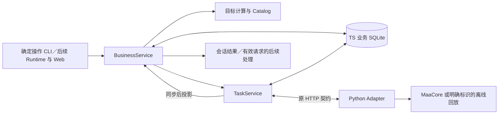

# D3 Backend：同进程业务过程

2026-09-21；基于 D2，提供可由确定操作独立驱动的会话、请求、方案、确认、结果与恢复。当前提交提供同进程 BusinessService；宿主装配和 HTTP／CLI 在后续接入。产品依据为 [Spec #18](https://github.com/Fyrefly-4/ChatMAA/issues/18) 与 [D3 #22](https://github.com/Fyrefly-4/ChatMAA/issues/22)。

## 1. 结构和记录归属

Backend 保存会话、消息、执行请求、方案、展示、确认、任务关联、观察与依据变化、资料版本和后续处理。Python 仍只保存执行证据。没有新增进程、业务数据库或消息服务。

| 入口 | 职责与排查方式 |
|---|---|
| [service.ts](../../backend/src/business/service.ts) | 业务操作与版本检查、确认事务、扫描及停止后推进；重复开始和旧方案问题从这里查 |
| [records.ts](../../backend/src/business/records.ts) | 同库增量建表与索引；会话归属、历史及迁移 |
| [request-lifecycle.ts](../../backend/src/business/request-lifecycle.ts) | 集中定义请求意图、状态、版本与扫描关联的合法迁移；修订、取消及迟到反馈从这里核对 |
| [basis.ts](../../backend/src/business/basis.ts) | 库存变化、观察适用性、方案依据及关联旧成果的统一判断 |
| [projection.ts](../../backend/src/business/projection.ts) | 保存受影响任务的库存观察和结果事实，返回推进依据；不准备方案、不发消息、不调用消费者 |
| [followups.ts](../../backend/src/business/followups.ts) | 消费者超时、取消、退出排空和处理状态；请求版本与操作接纳规则仍在业务服务 |
| [goals.ts](../../backend/src/business/goals.ts) | 三种目标、精确／下界／未知、结果说明；不混用材料量与次数 |
| [catalog.ts](../../backend/src/business/catalog.ts) | 有来源的候选、适用关系、估算和依据指纹；来源及维护见[资料说明](../../backend/data/README.md) |
| [task-service.ts](../../backend/src/task-service.ts)、[store.ts](../../backend/src/store.ts) | 复用 D2 执行预留、HTTP、防重、互斥、证据与同步；不理解自然语言 |

`business_schema` 记录业务表版本；既有任务和 Agent 表不删除、不伪造关联方案。没有业务关联的旧任务标记 `engineering_or_legacy`，仍参与共享环境占用和恢复检查。

新任务的确认、业务关联与执行预留在一次本地事务内完成；事务提交后只有本次持有的临时发送凭据可以调用 Adapter。记录重建或重复确认只读原任务，不自动重发。两库与实际游戏动作之间仍无统一事务，崩溃和响应丢失保留待核对状态。

## 4. 状态与依据

会话的当前指针决定唯一可开始方案，历史版本仍可回看。方案状态包括 unpresented、presented、stale、superseded、cancelled、started；旧版、失效或未展示方案不能开始。环境忙且未建立任务时不消费为一次执行，也不排队；用户须再次开始。

补库存关联特定扫描观察。识别缺项不按零；已满足目标保存无需执行的说明。正常结果用初始库存与实际掉落推算，标明未复扫。已知相关掉落、手动变化或接管使旧依据需重新核对；临时未知掉落可由同任务后续完整证据澄清。切换会话本身不使依据失效。

任务结果分别保留 `execution`、`process`、`target`；`amount` 是本次成果，`cumulative` 包含明确总目标链的旧成果。`remaining` 只在精确依据下给出，`differenceFromConfirmed` 不能作为自动补刷量。下界足以支持目标时可标 achieved，收获总量仍不精确；`reason=normal` 不被解释为理智不足或完整成功。

调整将旧任务与新请求关联，停止意图与调整记录一起落库。旧自动化／环境未核实就保持等待；总目标减去精确旧成果，再获得目标不扣旧成果。多次继续对旧任务去重。重新扫描库存已经包含旧收获，不能再扣一次。普通停止不会主动生成补刷任务。

停止状态由 `TaskService.reserveStop` 统一写入，BusinessService 只将它加入调整事务，提交后调用返回凭据的 `dispatch`。事务回滚不会留下内存停止意图；提交后崩溃由原任务同步读取停止意图并送达，不重发执行。直接停止仍在存储故障时尽力发送停止信号。

## 5. 异步后续处理与恢复

同步处理分三步：TaskService 先保存执行证据并通知具体任务 ID；业务层先保存受影响的库存观察与结果，再推进相关当前请求、方案及消息；事务提交后才投递后续处理。扫描观察先于依赖它的结果更新。单任务通知不再调用全量任务／会话遍历；关联旧成果的任务、引用该扫描的方案和受到库存变化影响的当前库存请求仍会更新。启动及显式全量核对保留完整历史检查。此处按关联缩小处理范围，不声称已完成大规模历史性能验收。

`projection` 返回 `{available, reason}`。业务投影失败时返回 `business_projection_failed`，停止新的业务变更并保留待补投影范围；已保存的执行证据与执行同步状态不因此变成存储失败。查询读取最新任务事实，直接停止继续送达。后续同步或显式核对可重新计算失败范围，重启进行全量核对；这里只补确定性投影，不重试模型或游戏操作。消费者状态写入失败另标为 `followup_storage_failed`；真正的执行证据写入失败仍沿用原 `storageFailed` 行为。

宿主同步后调用业务投影，扫描结果和任务结果进入所属会话。只查看库存的请求在扫描结束后完成；补库存所需信息齐备时自动形成待展示方案。扫描中明确补充同一库存需求可承接该扫描；取消或替代需求后，旧扫描只更新观察和历史。

`revise_request` 表示转为或修改执行需求：当前查看库存请求在扫描中或完成后都可修订为补库存，意图切换为 execute、版本递增，并复用仍适用的扫描依据。已取消／被替代的请求不能借修订恢复；已经开始刷图的请求仍须通过停止后调整。

需要理解／澄清时生成 `continuations`，D4 可注册 `setFollowupConsumer`。回调取得所属会话、请求版本、任务事实、一次处理 token 和 AbortSignal；调用 `acceptFollowup` 接纳同步业务变更时重新检查当前请求，已取消、替代或版本变化则拒绝。已使用凭据不能再次变更。consumer 必须遵守取消信号，默认 60 秒边界；失败不自动重试。D3 通过受控消费者验证此接口，未接入真实模型理解。

重启先核对旧执行，读取不重发提交；未完成的后续模型处理标 interrupted，不重新调用。退出取消消费者并阻止迟到写入。模型不可用时任务同步、查询、停止和确定性结果独立可用。后台离线时不能保证客户端还能送达停止请求，仍沿既有人工检查边界处理。

### 自然语言确认来源

展示回执保存该会话当时最后一条消息的 ID（`lastMessageId`）。自然语言确认只接受展示之后持久保存的用户消息；按消息记录顺序核对，不用可能同毫秒的时间戳排序。同一来源消息不能确认另一个方案；同方案重复确认仍返回原任务。旧展示回执缺少消息边界时，须重新展示并取得新确认消息；按钮确认规则不变。后续 Runtime 负责理解开始意愿，Backend 独立保证来源与方案不能跨版本复用。

验证入口：`node --test backend/tests/business.test.ts`。使用内存执行替身，覆盖确认事务、防重、消息来源、库存失效、调整、恢复和消费者迟到；不代表实机或完整模型／页面验收。
