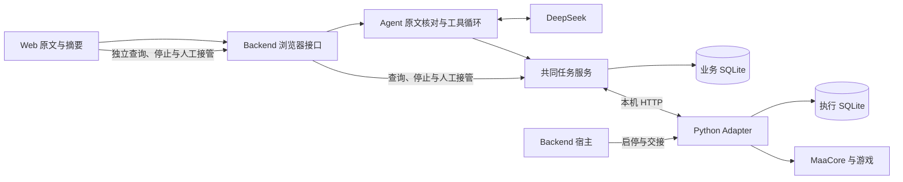

# 完整 Demo 运行入口

最近核对：2026-09-19，Issue #11 在 `4bcf381` 上收敛入口与停止展示。本文描述现有命令和可复用操作流程；固定 Windows 官方桌面端已完成真实网页 → 模型 → 游戏的正常执行、中途停止和收尾验证，见[当前实机结论](architecture.md#issue-11-真实整链验证2026-09-19)。历史模型回放、正式实机和离线检查分别见[工程说明](architecture.md#已验证范围)，不可相互代替。

## 处理历史阻塞

2026-09-19 补充，基于 `8ec496e`：页面启动即读取设备阻塞，区分当前执行与历史待核对记录。阻塞期间禁止发送新指令，任务事实与停止入口仍可使用；输入框内容保留。`device_busy_or_uncertain` 不表示参数缺失，修改次数、换 ID 或重复发送不能解除阻塞。

1. 当前执行尚未结束或停止未确认：先请求停止并查看事实。当前进程持有的未知执行不能人工放行；必要时人工接管游戏并正常退出应用，确认自有执行端退出后再启动。
2. 原执行端已退出的历史阻塞：页面列出任务 ID、已确认完成量及未知部分。先停止其他自动化、接管游戏并准备好受支持的界面，然后勾选确认，点击“核对环境并恢复使用”。此动作只授权环境识别，不调用模型、不运行 Fight。
3. 核对通过且识别自动化确认停止后，原数据目录可接受新的明确指令。旧任务次数、可信程度、停止状态、原因和环境证据保持原样；另存接管凭据。此前未受理的指令不会自动执行，需由用户重新发送。
4. 核对失败仍保持阻塞。环境未就绪时整理界面后可明确发起新核对；核对自身停止未确认时，本次启动不允许再次核对。刷新、重启及重复请求只读取已有结果，不自动重试或补刷。

本入口不是“继续”旧任务，也不推断未结算战斗的结果。离线回放与故障替身检查见[工程说明](architecture.md)；本轮已有历史阻塞核对失败保持封锁、后续显式核对成功放行的实机证据，不覆盖所有故障组合。

## 日常启动：一条命令

完成下面的首次准备后，在仓库根目录的 PowerShell 7 执行：

```powershell
.\start-demo.ps1          # 真实 Demo：先由用户准备并登录游戏
.\start-demo.ps1 -Replay  # 回放执行端；仍可能调用真实模型
```

入口检查 Node／Python 精确版本、x64 Python 依赖、Backend 依赖和前端构建。缺项或源码比构建新时，显示具体修复命令并退出，不自动安装。默认找到工程 venv；首次找不到时询问解释器路径。真实模式首次询问 MAA v6.17.5 安装目录，以后复用；每次重新查找标题为“明日方舟”的窗口，只有多个候选时要求选择，不复用旧窗口句柄。窗口查找是只读过程，不证明游戏现场已准备好。

MAA 安装目录应包含 `MaaCore.dll` 和 `resource/tasks/tasks.json`。2026-09-19 修正了启动预检误写成 `resource/tasks.json` 的问题；无需移动资源文件或重新安装 MAA。路径预检只检查必要文件，实际资源加载与版本校验仍由 Adapter 执行。

配置分别保存在忽略目录 `.artifacts/demo/live.json` 和 `replay.json`。真实数据默认复用 `.artifacts/live/`，回放复用 `.artifacts/replay/`，不自动清记录或建立新轮次。原数据存在未知任务时仍阻止冲突执行，不能为了演示顺利换目录绕过。启动入口不读取 `backend/config.local.json` 或 `CHATMAA_CONFIG` 作为默认配置，避免模式被其他入口意外改变。

根目录 `.env` 自动加载到 Backend；也可沿用当前进程的 `DEEPSEEK_API_KEY`。密钥不会出现在配置提示中。终端显示本次模式、窗口与数据目录，Backend 就绪后自动打开默认浏览器；不自动提交刷图任务。自动打开失败时，可使用终端 `web_ready.url` 手动打开。

保留终端，按 **Ctrl+C** 请求原有停止与证据交接。输入控制在当前 Backend 内处理，Python 仍由原宿主管理；没有额外常驻管理进程。先显示 Python／证据交接结果，再由 PowerShell 显示 Backend 已退出。关闭网页不会退出应用，直接关闭终端也不能证明正常交接。

| 可选参数 | 用途 |
|---|---|
| `-NoModel` | 不加载 `.env`，不装配模型；页面仍可查看与停止已有任务。完全离线入口检查用 `-Replay -NoModel` |
| `-NoBrowser` | 保留启动地址但不自动打开浏览器 |
| `-Config '本地配置路径'` | 使用并保存该份显式配置。模式必须与 `-Replay` 一致；相对配置值仍以文件目录为基准，真实窗口句柄每次更新 |

独立实机验收轮次可显式使用已准备好的 `run-*/data` 配置，通过 `-Config` 交给同一入口；必须先完成旧服务退出及现场准备，不能把新配置当作解锁按钮。日常无需编辑 JSON、复制窗口句柄或手工启动多个服务。

## 首次准备

固定 Windows 官方桌面端，Node **24.19.0**、Python **3.12.14 x64**；精确版本由仓库版本文件维护，Node 支持范围仍为 `>=24.18.0 <25`。使用对应 Node 发行版的 npm，先检查 `node --version`、`npm --version`。若 PATH 没有 npm，补齐 Node 工具链；也可用 `node <npm安装目录>/bin/npm-cli.js` 代替下列 npm 命令。不要因 `py` 可用就默认它指向正确 Python。

在仓库根目录打开 PowerShell 7（下方 `utf8` 写配置不带 BOM）。已有版本正确的 `adapter/maa/.venv` 可直接复用；没有时用已安装 Python 3.12.14 的绝对路径创建（将示例路径换为实际值）：

```powershell
& 'C:/Python312/python.exe' --version
& 'C:/Python312/python.exe' -m venv adapter/maa/.venv
```

依次执行，任一步失败先处理，不继续启动：

```powershell
node scripts/ci/check-node.mjs
& ./adapter/maa/.venv/Scripts/python.exe -c "import pathlib,platform; assert platform.python_version()==pathlib.Path('.python-version').read_text().strip()"
$pipVersion = (Get-Content .pip-version -Raw).Trim()
& ./adapter/maa/.venv/Scripts/python.exe -m pip install "pip==$pipVersion"
& ./adapter/maa/.venv/Scripts/python.exe -m pip install -r adapter/maa/requirements.lock
& ./adapter/maa/.venv/Scripts/python.exe -m pip check
npm --prefix backend ci
npm --prefix web ci
npm --prefix web run build
```

正式运行由 Backend 提供 `web/dist`，不需要 Vite 开发服务器。修改前端后重新构建再刷新。全套离线检查及 CI 命令见[CI 说明](ci-plan.md#本地运行相同检查)。测试使用模型替身和正式回放，既不读取 live 配置，也不调用真实模型。

## 手动排查：显式选择模式

下面保留不经过启动脚本的底层命令，供排查和独立验证；日常使用上面的一条命令即可。直接运行 Backend 时按 `CHATMAA_CONFIG` → `backend/config.local.json` → 默认配置读取。为避免误读已有 live 配置，每次显式指定配置文件；配置中的相对路径以**配置文件所在目录**为基准。以下生成绝对路径，配置与记录均位于 Git 忽略目录。

### 回放入口

```powershell
$repo = (Get-Location).Path
$run = Join-Path $repo ('.artifacts/demo-replay/run-' + (Get-Date -Format 'yyyyMMdd-HHmmss'))
New-Item -ItemType Directory -Path $run -ErrorAction Stop | Out-Null
@{
  mode = 'maa-replay'
  python = Join-Path $repo 'adapter/maa/.venv/Scripts/python.exe'
  dataDir = Join-Path $run 'data'
} | ConvertTo-Json | Set-Content -Encoding utf8 (Join-Path $run 'config.json')
$env:CHATMAA_CONFIG = Join-Path $run 'config.json'
node backend/src/main.ts --web
```

页面来源应是 `offline_callback_replay`，不操作游戏。**回放仅替代执行端**：若配置真实模型密钥，发送页面指令仍会请求真实模型并产生费用。不允许真实模型调用时，仅启动无密钥入口检查连接，或运行上述自动离线测试，不借回放名义调用模型。

### 真实执行入口

只在本次操作范围和现场开跑安排明确后准备。用户先登录固定官方客户端，确保 1-7 可代理、理智足够、停止其他自动化；核对当前窗口、捕获权限和固定 MaaCore `v6.17.5` 安装及资源。不要用历史截图或旧窗口句柄判断当前现场。DLL 哈希与环境限制见[Adapter 说明](../../adapter/maa/README.md)。

先确认前轮 Backend 与其 Python 已退出、游戏由用户接管并准备好。保留旧记录；不能删库、改成 ready，或换目录绕过仍活动／不明的执行。历史失败轮次退出且现场重新准备后，可建立独立验证轮次；同轮多个任务始终使用同一服务及数据库。当前支持目录为 `.artifacts/live/` 或 `.artifacts/live-wizard/run-*/data/`，后者只是既有路径约定，不需要运行旧向导。

在新终端回到仓库根目录，将安装路径和窗口句柄替换为本次核对值：

```powershell
$repo = (Get-Location).Path
$run = Join-Path $repo ('.artifacts/live-wizard/run-demo-' + (Get-Date -Format 'yyyyMMdd-HHmmss'))
$maaInstallation = 'D:/MAA'
$gameHwnd = 123456
New-Item -ItemType Directory -Path $run -ErrorAction Stop | Out-Null
@{
  mode = 'maa-live'
  python = Join-Path $repo 'adapter/maa/.venv/Scripts/python.exe'
  dataDir = Join-Path $run 'data'
  installation = $maaInstallation
  hwnd = $gameHwnd
} | ConvertTo-Json | Set-Content -Encoding utf8 (Join-Path $run 'config.json')
$env:CHATMAA_CONFIG = Join-Path $run 'config.json'
```

窗口句柄可在用户确认游戏进程名后，用 `Get-Process -Name <实际进程名> | Select-Object Id,MainWindowTitle,MainWindowHandle` 辅助核对；有多个窗口时必须对应现场，不默认取第一个。启动校验不等于执行前环境识别，识别在正式任务内完成。

## 打开网页与执行

模型固定为 DeepSeek `deepseek-flash`。Backend 读取 `DEEPSEEK_API_KEY`；根目录 Demo 入口自动加载 `.env`，直接运行底层 `main.ts --web` 则需显式加载。可在当前终端设置环境变量后运行 `node backend/src/main.ts --web`；或将密钥保存在仓库根目录本地 `.env` 中（`DEEPSEEK_API_KEY=实际密钥`），使用：

```powershell
node --env-file=.env backend/src/main.ts --web
```

密钥只供 Backend，不能放入 `VITE_`、前端源码或共享日志。缺少模型配置时仍可查询、停止已有任务。保留宿主终端，打开它打印的 `web_ready.url`；带 token 的启动地址只在本机使用。核对页面模式、模型状态及冲突任务；真实来源应为 `MaaCore_v6.17.5`，模式不符立即停止推进。

输入本次已明确允许的完整指令，例如“帮我刷 1-7 1 次，不吃药不碎石”。完整指令即本次授权；页面先展示关卡、次数和资源摘要，自动回执后才允许工具提交，不要求第二次确认。核对工具参数与摘要一致，任务卡显示对应任务 ID。

任务卡独立轮询执行证据，模型回复只解释当时结果。正常完成应同时核对目标次数、`certainty=exact`、`reason=target_reached`、`automation_stopped=true`、`device=ready`、无证据缺口／冲突及现场结果；受理成功不代表已经完成。

点击“停止当前任务”独立于模型。先显示请求状态，再以任务证据确认停止；“用户请求停止”只是原因，不单独证明停止。停止不撤销消耗，不保证游戏内战斗立即结束。`lower_bound` 表示只知道已确认下界，未结算量保留未知；`needs_check` 交给用户核对，不自动解锁、补刷或继续。若请求超时／响应不明，只查询原 ID，不换 ID 重发；未知状态结束本轮推进。

## 退出与检查

关闭网页或刷新不会停止已受理任务。先记录当前结果，在 Backend 终端按 Ctrl+C 请求收尾；也可在另一终端指定**同一** `CHATMAA_CONFIG`，运行 `node backend/src/cli.ts shutdown`。不要直接关终端代替收尾。

检查宿主退出报告中的 `handoffComplete`、`childExited` 和 `finalTasks`，再确认宿主进程已退出、游戏现场可由用户接管。退出请求成功不等于执行端已退出。正常交接后同步不可用与执行中失联分开判断；报告缺失或任一退出未确认时保留未知，处理原服务，不启动新轮次。

记录位于本轮 `dataDir`：`business.sqlite` 保存请求／任务及证据投影，`executor.sqlite` 保存执行证据，`connection.json` 是本机连接凭据。日志、双库、配置、含玩家信息的截图和启动地址保留本地。不要将模型文字或黑帧截图代替游戏现场确认。

## 模块协作与排查



| 现象 | 入口与判断 |
|---|---|
| 根目录命令失败或需要调整启动行为 | `start-demo.ps1`、`backend/src/demo-entry.ts`、`demo.ts`；分别负责参数传递、导入前依赖检查、配置／窗口／构建预检与终端控制。先处理打印的缺项，不提交任务探测 |
| 页面或配置启动失败 | `backend/src/main.ts`、`config.ts`；检查显式配置、Python 路径、`web/dist`、终端错误，不发送任务探测 |
| 摘要不推进 | Web `OperationSummary.tsx`、`useExecution.ts`；检查页面可见性、同一请求的摘要回执，刷新不恢复执行资格 |
| 指令未执行／参数不符 | Agent `policy.ts`、`tools.ts`；原文完整匹配、范围及参数绑定优先，模型无权放宽业务规则 |
| 停止提示或完成量不符 | Web `task-presentation.ts`、`useExecution.ts`、`TaskCard.tsx`；比较当前任务 API 与工具调用时快照，分别检查完成量、停止、环境和同步 |
| 执行未知／退出异常 | Backend `task-service.ts`、`host.ts` 及 Adapter 执行记录；保留原 ID、两库及现场，不以清空记录恢复 |

Demo 仅覆盖固定官方桌面端、1-7 明确次数、不吃药不碎石、同设备单任务。无多轮补全、完整历史、完整刷新恢复、自动核对解锁与“继续”、自动队列或重试；不承诺其他环境与全部故障兜底。当前完整 MVP 要求见 [Spec #18](https://github.com/Fyrefly-4/ChatMAA/issues/18)，开发路线见 [#19](https://github.com/Fyrefly-4/ChatMAA/issues/19)，整体 Demo 标准见 [#7](https://github.com/Fyrefly-4/ChatMAA/issues/7)。2026-09-20 同步规格入口：#18 已替代旧 #1，本文的 Demo 行为与验证保留原范围，不代表新规格已实现。本说明可复用不表示必须追加游戏操作。
