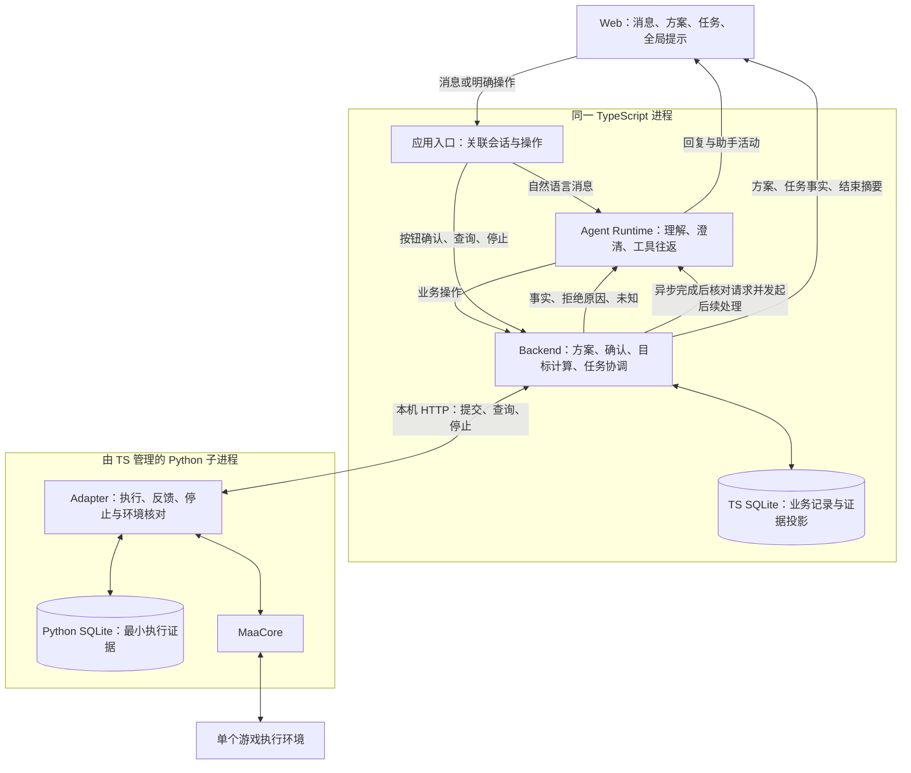
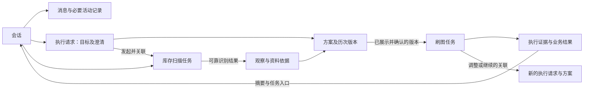

# MVP 协作约定与交互结构

定位：MVP 跨模块协作设计，作为 D1 的完整文档交付和后续模块设计的共同依据。最近核对：2026-09-20；已完成规格、架构边界及代表路径的设计审阅。本文描述目标行为，不表示应用已实现或通过运行验收。

产品依据：[Spec #18](https://github.com/Fyrefly-4/ChatMAA/issues/18)；工程路线：[路线 #19](https://github.com/Fyrefly-4/ChatMAA/issues/19)；交付条件：[D1 #20](https://github.com/Fyrefly-4/ChatMAA/issues/20)。2026-09-20 已核对三项正文和评论。Spec 维护产品要求，本文落实协作含义，阶段进度与完成判断由路线和阶段 Issue 维护。

现状参考[工程说明](architecture.md)，设计核对时的代码基线为 `d326767d807b25e055ba70fed9e3b0ab744b46b1`。文中的数字及状态均为设计样例；路径走查不替代离线、真实模型或实机证据。本次交付仅涉及文档。

阅读顺序：第 1、2 节说明整体结构与对象归属，第 3 节定义操作和异步衔接，第 4 节用路径及草图检查交互，第 5、6 节给出覆盖核对和模块交接。具体接口、字段、表结构、工具数量和页面组件留到所属模块阶段细化。

## 1. 总览：一条主线，三个时间层次

用户在会话中提出需求，助手补齐信息、获取依据并展示方案；用户确认后，Backend 建立关联任务，Adapter 执行。任务事实持续返回，结果进入原会话，用户可以继续提出下一项需求。

**会话保留讨论，方案说明准备怎样执行，任务记录实际发生什么。** 库存扫描也是任务，但它不需要先建立一份刷图方案；明确补库存或查看库存后，助手可先说明再扫描。所有刷图都须先展示方案并等待确认。

### 1.1 模块协作图



图中 Runtime、Backend 到 Web 的箭头表示信息流，实际经过应用 API；不是新增直连通道。TS 定期查询 Adapter 并同步证据，Web 通过 Backend 获取业务状态。按钮和自然语言最终使用同一业务规则，Runtime 不能绕过 Backend 直接调用 MaaCore。

| 时间层次 | 谁推进、保存什么 | 结束的含义 |
|---|---|---|
| 一次回复 | Runtime 组织有界模型与工具往返，Backend 保存本轮消息、操作关联及业务变化 | 等待补充、确认或本轮回应结束；不等于游戏停止 |
| 跨多轮消息 | Backend 保留会话、执行请求、当前方案及关联任务，下一轮 Runtime 读取适用上下文 | 用户可解释、修改、取消或提出新需求；无须让模型调用一直挂起 |
| 实际执行 | Adapter 独立推进并留证，Backend 同步，Web 更新任务信息 | 执行是否结束依据执行证据；不以模型回答、页面关闭或网络超时判断 |

### 1.2 沿用的结构与需要建设的关系

沿用 [ADR-0001](../adr/0001-runtime-structure.md) 的进程与启停、[ADR-0002](../adr/0002-local-http-adapter.md) 的提交／查询／停止及轮询、[ADR-0003](../adr/0003-execution-evidence.md) 的两库归属、[ADR-0004](../adr/0004-agent-loop-boundary.md) 的有界工具循环。无新增服务、数据库、队列或监督进程。

新 MVP 在已有执行基础上建设会话、方案、确认、依据有效性及历史关联。Demo 的“完整指令＋摘要自动回执后执行”不能沿用为新刷图授权；展示仅证明方案已呈现，用户确认才表达开始意愿。已有固定关卡实机证据也不能替代 MuMu、材料目标和连续交互的验证。

## 2. 核心对象、关联与权威归属

术语沿用 [CONTEXT](../../CONTEXT.md)；本文的“需求”指执行请求中的目标语义，不额外引入一个必须独立存表的领域对象。



一段会话可以有多个先后发生的执行请求和任务。图中关联均需可追溯，不规定外键、JSON 字段或表数量。每个刷图任务必须能找到所属会话与已确认方案；扫描任务关联发起会话、扫描目的及产生的观察依据。

| 对象 | 必须保留的业务含义 | 权威归属与其他模块用法 |
|---|---|---|
| 会话与消息 | 当前讨论、历史消息、方案和任务入口；新会话不继承其他会话目标或偏好 | Backend 保存；Runtime 选取上下文，Web 展示 |
| 执行请求 | 目标类型、数量、材料／关卡、必要澄清；“总共”和“再获得”等语义；需求版本、取消／替代状态及与扫描、旧任务的关系 | Backend 保存已明确的业务意图并检查后续处理有效性；Runtime 理解含义，不能仅靠聊天文本充当确认记录 |
| 方案 | 用户将确认的目标、依据、关卡、资源限制、估算及限制、结束条件；当前版本及历史关系 | Backend 管理；Web 展示；Runtime 解释和请求修改 |
| 确认关联 | 用户的开始意愿对应哪个已展示版本，是否已用于建立执行；自然语言确认保留来源消息关联 | Backend 检查并保存；按钮和 Runtime 都不能把历史确认挪给新版本 |
| 任务 | 一次扫描或刷图的提交、执行标识、参数、事实、状态、结果及更新时间 | Backend 保存业务记录；Adapter 保留对应最小执行记录；两者通过标识核对 |
| 观察与资料依据 | 内容、来源、时间／版本、适用条件、可靠程度和已知失效原因 | 扫描／掉落原始事实由 Adapter 留证，Backend 保存投影与业务使用关系；选关资料由 Backend 管理 |
| 助手活动 | 理解中、查询中、扫描已受理、等待补充等处理反馈及所属轮次 | Backend／Runtime 提供实际活动，Web 呈现；持久粒度留 D3／D4，活动不充当执行证据 |

### 2.1 三种目标的依据和计算

| 目标 | 需要什么 | Backend 的业务计算 | Adapter 的执行职责 |
|---|---|---|---|
| 补到指定库存 | 完成且可靠的初始库存 S、目标库存 T、材料和关卡 | 缺口为 max(T−S, 0)；结果为 S＋本次可靠收获；无缺口则无需刷图 | 执行扫描并报告可靠性；刷图按转换后的材料需求执行并反馈 |
| 再获得指定材料数量 | 明确材料、数量 Q、适用关卡；不要求库存扫描 | 用本次可靠累计收获与 Q 比较 | 接收材料目标、推进执行并持续报告掉落与停止证据 |
| 按次数刷图 | 明确关卡与成功次数 N；不要求库存扫描 | 用已确认成功完成次数与 N 比较，有可靠掉落时另行汇总 | 正确映射计数、执行并反馈成功次数及相关证据 |

Backend 负责目标语义和结果核算；Adapter 负责实际参数映射与靠近执行端的停止机制，材料停止不等待模型再次回答。具体 `Fight.drops` 复用、倍率、延迟与超额范围由 D2 验证，不在此承诺零超额。

可靠完成量只有下界时，只能保留有证据的部分。例如至少获得 12 个、另有掉落未知，不能声称“精确还差 16 个”；可以说明“按已确认收获计算缺口为 16，实际缺口待核实”。下界本身已经达到目标时，可说明已有证据足以支持达标，但总收获仍不精确、执行是否停止仍须另行核对。

### 2.2 依据有效性

方案引用特定依据，而不是读取一个没有来源的“最新库存数”。选关资料说明来源与适用范围；缺推荐资料可请用户指定关卡，仍需核对材料与关卡的适用关系。模型记忆不能作为“当前最优”的证据。

开始时 Backend 再查已知变化：其他任务或已知手动操作改变相关库存、原识别不可靠等，均不能继续沿用旧补库存计算。需要重新获取依据、更新并展示方案，再等确认。其他会话也受这一检查约束，但切换会话本身不会使依据失效。

重新扫描时环境必须可用；执行中不能为了查询库存插入冲突扫描。任务结束不自动复扫，用户明确要求核验才扫描。对观察不到的外部操作不保证自动发现；依据变化怎样追踪留 D3 细化，不改成一律按时间重扫或要求用户每次手工填写理智。

## 3. 操作如何生效

以下名称表示业务操作，不是最终 API、工具名或函数签名。Runtime 指 Agent Runtime。

### 3.1 准备与方案操作

| 触发与操作 | 前提及谁检查 | 谁保存、状态怎样变化 | 返回含义与页面反馈 |
|---|---|---|---|
| 用户新建／切换会话 | Web 发起，Backend 识别会话范围 | Backend 保存会话及所属记录；切换不转移任务归属 | 返回该会话记录和全局任务事实；不自动执行 |
| 咨询、补充或澄清 | Backend 接收消息，Runtime 理解；多材料、多关卡或指代不清时先明确 | Backend 保存消息和已明确需求；未明确内容保持待补充 | 回复及活动；咨询不触发游戏操作，超范围不默默删条件执行 |
| 明确查看库存／补库存 | Runtime 先说明扫描，Backend 检查意图与共享环境，Adapter 校验受理 | Backend 建扫描任务并关联原执行请求，Adapter 留执行证据；完成后 Backend 保存识别依据 | 先返回扫描受理及任务入口，结果由 Backend 同步；后续按 3.5 检查请求有效性并推进，不额外要求扫描确认 |
| 形成方案 | Runtime 提交明确需求／选择，Backend 检查数量、单目标、关卡适用性、依据与无药无石限制 | Backend 保存待展示版本；Web 展示后成为可供确认的当前方案 | 目标、依据、关卡、限制、结束条件齐全；不开始刷图 |
| 询问原因／比较候选 | Runtime 查询当前方案及资料；未明确更改则不提交替换 | Backend 保留当前方案；保存对话 | 解释或比较，不自动失效或开始 |
| 修改／改换需求 | Runtime 理解或 Web 明确操作；Backend 检查原版本和新需求 | 旧版本进入历史，不再可开始；新版本重新展示 | 等待新确认；“改成五次并直接开始”也不能跳过展示和确认 |
| 取消待执行方案 | Backend 检查尚未开始且对应当前方案 | Backend 标记取消，保留历史 | 已取消安排；若已进入执行，转而提供任务停止操作，不能假装已撤销执行 |
| 引用历史方案再使用 | Runtime 理解引用，Backend 核对当前事实和适用性 | Backend 形成新的当前方案及历史关联 | 重新展示、重新确认，不复用旧授权 |

完整初始指令只能直接进入准备方案，不省略确认。库存已满足目标时 Backend 保存扫描结果并说明无需刷图，不为了统一流程造一项零目标刷图任务。

### 3.2 确认、执行与干预操作

| 触发与操作 | 前提及谁检查 | 谁保存、状态怎样变化 | 返回含义与页面反馈 |
|---|---|---|---|
| 按钮／自然语言确认 | 按钮带所展示方案关联；Runtime 将明确的开始意愿关联到当前方案，含糊赞同先澄清。Backend 核对已展示、未修改、当前有效且未用该确认建立执行 | Backend 保存确认及任务关联，在提交前保存稳定操作标识和提交意图 | 可拒绝并说明原因；可建立任务并进入提交中；“收到确认”不等于 Adapter 已受理 |
| 准入与提交 | Backend 再查环境、依据、资源约束，Adapter 也检查执行身份、参数、防重及设备互斥 | Backend 预留当前游戏操作，Adapter 持久记录受理再执行 | Adapter 已受理后返回可查询任务；响应丢失则待核对，不能说未执行 |
| 重复确认／传输重试 | Backend 识别同一方案开始操作，Adapter 核对同标识同参数 | 关联到原任务／原操作，不另建执行；同标识不同参数拒绝 | 返回原任务当前状态或冲突说明；不重复开跑 |
| 查看进展／结果 | Web 直接查询 Backend；Runtime 回答进度前获取 Backend 的最新可用事实 | Backend 同步证据及读取位置，保留缺口与更新时间 | 返回任务事实及新鲜度；逐场变化进详情，不逐场刷聊天消息 |
| 明确停止 | 按钮直接到 Backend；自然语言由 Runtime 识别目标后立即调用 Backend，不再询问是否停止 | Backend 留停止请求，Adapter 执行停止并留证；Backend 同步结果 | 先“停止中”，确认后“自动化已停止”；不依赖模型总结 |
| 执行中明确修改目标／关卡 | Runtime 识别调整，Backend 关联原任务；修改内容有歧义也先停。假设咨询不进入此操作 | Backend 保存调整意图、旧任务关联及等待核对状态；旧执行参数不原地修改 | 展示停止及核对进度；核实后才准备新方案，仍需确认 |
| 旧执行和环境待核对 | Backend 汇总 Adapter 证据，保留占用限制；按既有边界查询、停止或引导人工检查 | Adapter 保存新的现场证据，Backend 更新准入事实；原未知结果不被抹掉 | 能否新操作单独说明；缺证据不自动解锁或补刷 |

开始检查与建立提交意图必须作为一个受协调的业务过程，避免两个会话同时通过空闲检查。实现事务与并发控制留 D3，Adapter 的设备锁与防重提供执行边界检查；不声称存在跨游戏与两库的原子事务。

已确认但因占用而未建立执行的操作不进入队列，环境释放后不会自行开始；用户可再次发起开始，由 Backend 重新检查。若已经建立任务或受理结果未知，则只核对同一任务，不换标识再试。“是否消耗了这次确认”的业务含义以是否已绑定一次执行为准，不以 HTTP 请求是否成功到达页面判断。

### 3.3 必须独立表达的状态

| 维度 | 典型含义 | 不能据此推断 |
|---|---|---|
| 助手活动 | 理解中、工具处理中、等待补充／确认、本轮结束／失败 | 本轮结束或失败不能证明执行结束 |
| 方案 | 待展示、当前待确认、已取消、已替代、已关联任务；依据变化时需更新 | 可见历史方案不等于可开始；展示不等于确认 |
| 任务执行 | 提交中、已受理／执行中、停止中、已确认结束、状态待核对 | 已受理不等于完成；超时不等于未执行 |
| 完成量与可信度 | 精确值、已知下界、未知部分及证据缺口 | 尝试次数、队列结束不能替代成功次数 |
| 目标结果 | 已达成、未达成、证据不足待核实 | 执行结束不等于目标达成 |
| 环境准入 | 可用、被任务占用、旧执行／环境待核对 | 自动化已停止不保证游戏界面已可接受新任务 |
| 连接 | 页面—Backend 连接；Backend—执行端连接及执行端—游戏环境情况 | 页面离线不等于游戏停止；执行端在线不等于游戏环境就绪 |

任务的基本变化为“提交中 → 受理后执行 → 有证据的结束”，主动停止增加“停止中”；任何缺失关键证据的环节均可进入待核对，再按新证据更新。结束原因和完成量可在之后核对中补充，但旧记录及未知来源可追溯，不伪造一次完整成功。

### 3.4 结果与错误的共同解释

| 返回类别 | 共同解释 | 后续处理 |
|---|---|---|
| 需要补充／确认 | 业务过程暂未满足推进条件 | 结束本轮回复并保留状态，下一轮承接 |
| 拒绝 | 当前操作不符合条件，例如环境占用、方案过期、参数超范围 | 显示原因；不自动排队、缩减条件或重试执行 |
| 已受理 | 执行端已接收此次操作，可继续查询 | 持续读事实，不以工具成功宣告游戏目标完成 |
| 已确认结束 | 有执行结束证据，仍需分别解释过程结果和目标结果 | 保存结果；自然结束、用户停止、理智不足与异常分别说明 |
| 失败 | 有明确失败证据，失败发生在哪一层需可辨 | 保留已发生的消耗和成果；模型失败不覆盖任务事实 |
| 待核实／未知 | 缺少足以判断受理、停止或完成量的证据 | 展示已知部分和更新时间，继续核对，不猜未执行或精确剩余量 |

结果始终分三问：执行是否结束、过程是否成功或因何结束、用户目标是否达成。理智不足部分完成可正常结束但目标未达成，不必归为执行故障；异常也不自动抹去已确认成果。补库存结果明确标记推算库存及未重新扫描。

### 3.5 异步完成后的推进与请求有效性

Backend 负责识别扫描完成、停止核对完成等异步结果，保存事实并关联原执行请求及其当时的需求版本。继续处理前，Backend 检查该请求是否仍有效、是否仍在等待这项结果，以及相应依据和环境条件是否满足。单纯切换会话或询问原因不会使请求失效；明确取消、修改或替代需求则须反映到请求状态中。

原请求仍有效时，Backend 推进确定性的业务步骤；需要理解、澄清或解释时，由 Backend 发起带明确上下文的 Runtime 后续处理。上下文包含所属会话、原执行请求及需求版本、相关任务、完成事实与当前业务状态。正常的“扫描完成→形成方案”和“停止核对完成→准备调整方案”不要求用户额外发送消息，也不要求上一轮模型调用一直等待。

原请求已取消或被替代时，异步结果只更新原任务、观察依据及历史记录，不再按旧需求生成或替换当前方案，也不自动转接为新需求的授权。Runtime 后续处理期间若需求再次变化，Backend 在接纳其业务操作、写入当前方案前仍须检查请求有效性；迟到的旧处理结果不能覆盖新需求。同一完成结果被重复读取，也不能重复推进或覆盖已经形成的后续状态。

请求失效不等于现场任务已停止：扫描或旧任务的结果、停止及环境状态仍须继续核对，已发出的停止不会因取消调整需求而撤回。新方案仍遵循环境准入和用户确认规则。具体触发方式、接口、并发控制及后续处理的调度与去重由 D3、D4 落实；本节确定共同责任和生效条件。

## 4. 代表路径与页面草图

以下是按约定逐步推演的记录。每条路径检查接收、检查、保存、返回与展示；字母编号仅用于阅读，非接口或数据结构。页面草图表达信息关系，尺寸、视觉、组件与通知形式留 D5。

### P1：咨询、澄清后补库存并完成

场景：用户先咨询，再要求补到 100 个固源岩；可靠扫描为 72，来源资料支持所选关卡，最终可靠收获 29。均为假设数据。

| 步骤 | 谁接收与检查 | 谁保存及流转 | 返回与展示 |
|---|---|---|---|
| 咨询“能帮我补材料吗” | Backend 接收，Runtime 解释能力，不调用扫描或刷图 | Backend 留消息，尚无执行授权 | 助手回复能力与限制 |
| “补到一百个”但材料不明 | Runtime 追问材料，用户补“固源岩”；Backend 保存明确需求 | 同一会话承接，不要求重写整条指令 | 消息及待补充状态，不操作游戏 |
| 说明后扫描 | Backend 检查环境，Adapter 受理扫描 | Backend 留扫描任务，Adapter 留识别证据，Backend 收到可靠 72 | 扫描活动、任务入口与库存来源 |
| 扫描完成后准备方案 | Backend 识别扫描完成并核对原请求仍有效，算缺口 28、核对关卡关系及资料；需要解释时发起 Runtime 后续处理 | Backend 接纳后续操作前重查请求有效性，留方案与依据关联，Web 展示当前版本 | 无须用户额外发消息；待确认；无当前理智不保证足够，产量资料不足就说明无法可靠估算 |
| 用户点击开始 | Backend 核对版本、已展示、依据与环境，Adapter 防重受理 | Backend 保存确认与刷图任务，Adapter 保存受理证据 | 任务卡、全局提示、停止入口；方案转为关联任务的历史记录 |
| 执行中问进度 | Runtime 查询 Backend，Backend 同步 Adapter 事实 | 可靠收获 12；Backend 按当前证据计算推算库存 84 | 回答当前事实与更新时间；若反馈仍可能滞后，说明截至该时刻 |
| 收获 29 后结束 | Adapter 按执行机制停止后续执行并报告，Backend 核对结束及结果；实际停止粒度和超额边界由 D2 验证 | 任务结果为推算 101、达标、未复扫，结束摘要关联原会话 | 会话摘要和任务详情同时可查；模型总结失败仍可读事实 |

分支核对：扫描可靠结果已达 100 时直接说明无需刷图；识别不完整时保留未知，不把缺失项按零补刷。无推荐资料时请用户指定关卡，再核对适用性；不能把推荐覆盖不足写成执行能力不足。

迟到结果分支：扫描未完成时，用户取消补库存或改成按次数刷图，Backend 保存原请求已取消或被替代的状态。旧扫描完成后仅保留扫描结果，不生成旧补库存方案，不覆盖新的次数需求。若旧请求的 Runtime 后续处理已经开始，其迟到操作同样须被有效性检查拦下；新需求仍按自身条件准备和确认。

```text
┌ 会话列表 ───────┬ 当前会话：补充材料 ─────────────────────┐
│ ＋ 新建会话    │ 用户：把固源岩补到 100 个。              │
│ > 补充材料     │ 助手消息：已识别库存 72 个，需补充 28 个。│
│   日常咨询     │ 活动：方案已准备，等待确认               │
│                │ [方案：补到库存 100]                    │
│                │ 固源岩／1-7；库存扫描依据及选关来源入口 │
│                │ 缺口 28；仅现有理智，无药无石           │
│                │ 参考消耗或估算限制；可能部分完成        │
│                │ 达标、理智不足、主动停止或异常时结束    │
│                │ [开始] [修改] [取消方案]                │
│                │ 输入消息……                              │
└────────────────┴─────────────────────────────────────────┘
```

扫描结束后此方案不占用环境。方案中的“开始”是用户操作，助手活动的“等待确认”不会自动触发它。

### P2：三种目标、方案修改与确认竞态

| 步骤或分支 | 谁接收与检查 | 谁保存及流转 | 返回与展示 |
|---|---|---|---|
| “再获得 20 个固源岩” | Runtime 理解增量目标，Backend 核对材料与关卡 | Backend 准备增量方案，不创建库存扫描 | 本次收获达到 20 的结束条件，等确认 |
| “刷 1-7 十次” | Runtime 理解次数，Backend 校验 | Backend 准备次数方案，不扫描 | 展示十次目标和资源限制，完整指令也不自动开始 |
| “为什么这个关卡” | Runtime 获取 Backend 提供的资料和方案 | Backend 留对话，不替换方案 | 有来源解释，当前版本仍可确认 |
| “改成五次，直接开始” | Runtime 提交修改，Backend 检查版本 | Backend 将十次方案转历史，保存五次新版本 | 重新展示五次，仍待确认 |
| “这个解释不错” | Runtime 无法确认是在赞同解释还是要求开始 | Backend 留消息，不绑定执行 | 澄清是否开始，不借机执行 |
| 旧页面确认十次版本 | Backend 对照当前五次版本拒绝 | 不建十次任务，保留操作关联 | 提示方案已更新，请查看当前方案 |
| 两次确认五次版本 | Backend 只建立一次开始关联；Adapter 同标识防重 | 两次返回关联同一任务 | 显示该任务，不重复执行 |
| 取消与确认同时到达 | Backend 协调当前版本操作次序 | 取消先生效则开始被拒；开始先绑定任务则取消方案不能撤销任务 | 返回实际状态；已提交任务给出停止入口，不谎称取消了执行 |

后续独立需求可经新方案确认形成新任务，不因为内容相同而永远去重。多材料或多关卡请求先请用户明确本次对象；要求用药或源石时明确不支持，不能删掉条件继续开跑。

### P3：执行中调整、停止后形成新方案

场景：旧任务原目标十次，用户要求“总共改成五次”。以下精确／下界两支分别讨论，不把尝试次数算成功次数。

| 步骤 | 谁接收与检查 | 谁保存及流转 | 返回与展示 |
|---|---|---|---|
| 假设咨询“如果改五次会怎样” | Runtime 按咨询获取事实 | Backend 仅保存对话，任务继续 | 解释影响，不发停止 |
| 明确修改“改成总共五次” | Runtime 发起调整，Backend 关联运行任务并直接停止 | Backend 保存调整意图与旧任务关联，Adapter 处理停止 | “正在停止旧任务，核对后准备新方案” |
| 停止尚未确认 | Backend 继续查 Adapter | 保留占用和调整等待状态，不能先算最终剩余量 | 停止中／结果未知；不出现可开始的新任务 |
| 停止确认且精确完成 2 次、环境可用 | Backend 识别停止核对完成并检查原调整请求仍有效，保留总共五次的语义；需要理解或解释时发起 Runtime 后续处理 | Backend 计算剩余 3，接纳后续操作前重查请求有效性，形成关联旧任务的新方案 | 无须用户额外发消息；展示“旧任务完成 2，新方案 3，总目标 5”，等待确认 |
| 用户确认新方案 | Backend 重查版本、依据和环境，Adapter 接收新标识 | 新建任务，原任务与证据保留 | 新任务独立进度，旧任务可回看 |

补充分支：

- 用户明确要改，但未说清如何改：先停旧执行，再澄清，不在澄清期间继续刷。
- 等待停止核对期间取消调整或改换需求：Backend 继续核对并保存旧任务停止及成果，但不再按已失效的调整请求生成方案；旧 Runtime 后续处理也不能覆盖当前需求。取消调整不撤回已发出的停止，不恢复旧执行。
- 停止后仅确认至少 2 次、另有未结算周期：Backend 保留下界，不自动决定“再刷 3 次”。先核对能否补齐证据；不能补齐则说明无法精确计算剩余量。用户可明确提出新的独立目标，按新目标形成方案；不能改写旧结果。
- 改为“再刷五次”是新增五次，不减去旧任务成果；“继续完成总共五次”则须核对旧成果。补库存后“再来一次”含义不明，先澄清。
- 旧成果已满足缩小后的目标时，说明无需新增刷取，不创建零次任务。
- 自动化已停止但环境待核对时，继续提供检查指引并阻止开始；环境放行不代表旧完成量变精确。
- 普通停止没有后续调整意图时，只停止并汇总结果，不主动生成补刷方案。补库存跨任务继续时，旧收获也可能改变库存依据，不能机械重复原缺口。

```text
全局提示：当前会话的 1-7 任务运行中    [查看详情] [停止]
当前对话：
  用户：总共改成五次。
  助手活动：正在停止旧任务，等待执行端确认。
  [旧任务] 停止中；已确认 2 次，尚非最终完成量。
  输入仍可使用；新游戏操作暂不可开始。

取得证据后：
  [旧任务] 自动化已停止；精确完成 2 次；环境可用。
  系统结果：停止保留已发生的消耗，不代表撤销战斗。
  [新方案，关联旧任务] 总目标 5，旧成果 2，本次计划 3。
  仅现有理智；可能部分完成；结束条件与依据可展开。
  [开始] [修改] [取消方案]

若证据不足：
  [旧任务] 自动化已停止；至少完成 2 次，另有周期未核实。
  尚不能精确计算剩余次数。保留查询和人工检查指引。
  不把“3 次”展示成可直接开始的精确剩余方案。
```

### P4：切换会话、共享环境与依据变化

| 步骤 | 谁接收与检查 | 谁保存及流转 | 返回与展示 |
|---|---|---|---|
| 会话甲扫描后保留补库存方案 | Backend 保存方案与库存依据，Adapter 扫描已结束且环境可用 | 环境释放，方案不预约设备 | 甲方案待确认 |
| 切到会话乙并咨询 | Backend 返回乙上下文，Runtime 按乙信息回应 | 甲方案仍属于甲，不复制到乙 | 乙可正常对话；不存在任务时无需制造运行提示 |
| 乙确认另一刷图方案 | Backend 和 Adapter 检查并受理 | Backend 保存乙任务，占用共享环境 | 全局显示乙任务与停止入口 |
| 甲同时尝试开始／扫描 | Backend 拒绝冲突操作 | 甲方案保留，未进入队列 | 提示乙正在执行，可查／停，或继续不操作游戏的讨论 |
| 乙结束，已知相关库存改变 | Backend 同步成果并检查甲依据适用性 | 甲的旧依据不可直接用于开始 | 不自动启动甲方案；用户再次开始时说明需更新依据 |
| 甲再次发起开始 | Backend 确认环境可用后获取新依据，更新方案 | 新扫描记录及新版方案替代原可开始版本 | 重新展示并等待确认，原确认不挪用 |

两会话各自拥有方案不构成排队。其他任务是否影响特定依据由 Backend 按已知事实判断，不把任何一次会话切换都当成库存失效。

```text
┌ 全局：会话乙正在刷 1-7；已确认完成 2 次       [去会话乙] [停止] ┐
├ 会话列表 ───────┬ 当前会话甲 ──────────────┬ 任务详情（按需打开）┤
│ > 会话甲       │ 甲的消息与待确认方案     │ 所属：会话乙        │
│   会话乙 ●运行 │ 提示：环境被乙占用       │ 原目标及确认方案    │
│ ＋ 新建会话    │ 仍可解释或修改方案       │ 状态／完成量可信度  │
│                │ 开始请求会重新检查环境   │ 掉落／过程／更新时间│
│                │ 输入消息……              │ 停止与环境证据      │
└────────────────┴──────────────────────────┴─────────────────────┘
页面连接：正常。执行端／游戏环境情况在任务或环境信息中另列。
```

全局入口能明确停止所指任务；当前会话消息不会冒充运行任务所属会话的结果。任务结束摘要写入乙，即使用户正停留在甲；具体通知形式留 D5。停止中或状态待核对时，全局信息仍让用户找到该任务及处理入口。

### P5：部分完成、故障与历史恢复

| 场景及触发 | 谁检查、保存与返回 | 页面及后续行为 |
|---|---|---|
| 理智不足，十次只可靠完成四次 | Adapter 报告真实结束原因与证据，Backend 保存四次及未达成结果；若原因不能证实，不猜理智不足 | 说明执行结束、完成四次、目标未达成；不自动补刷 |
| 需求理解时模型失败 | Runtime 报告本轮失败，Backend 保留消息和已有业务状态 | 不因理解失败开始刷图；可保留已经真实受理的扫描等任务事实 |
| 任务已启动，模型总结失败 | Backend 继续同步 Adapter，结果按事实生成并关联会话 | 任务查询、停止、结果可用，助手失败提示与任务状态分开 |
| 提交响应丢失 | Backend 保留原操作标识，查询 Adapter 核对受理；Adapter 返回已有记录与证据 | 提交状态待核对，禁止换标识“再试一次”造成重复执行 |
| Adapter 反馈序号缺口或掉落未知 | Adapter 留可留证据，Backend 保留缺口与下界，不以计划补齐 | 显示已知成果与未知；材料异常处置及停止延迟由 D2 验证 |
| Web 断线、刷新或重新打开 | Web 重新读取 Backend 的会话和全局任务；Backend 正常时任务独立推进 | 断线时显示最后更新时间；恢复后取最新状态，不重新提交历史确认 |
| 服务退出／重启 | 沿既有生命周期处理停止和交接；Backend 启动后核对 Adapter 的旧执行与记录 | 不承诺退出期间继续，不自动续刷；缺证据时保留历史与操作限制 |
| 停止响应未知 | Backend 保留停止请求并继续核对 Adapter | 显示“停止结果尚未确认”，不能显示“已停止”；提供查询和人工检查指引 |
| 人工核对后环境释放 | Backend 根据新的准入依据更新可用性，Adapter 保存核对证据 | 可开始新方案不等于旧结果被修复；旧未知仍可查 |
| 回看历史后提出下一项需求 | Runtime 区分历史引用和新意图，Backend 根据当前事实形成新方案 | 单纯查看不执行，新需求重新确认，新会话不默认继承旧偏好 |

若 Backend 失联，页面的查询和停止可能暂时无法送达，应如实显示连接问题，不能将“模型故障下可停止”扩大为“后端离线仍保证停止”。停止按钮的请求状态也必须与执行端的停止证据分开。

```text
[任务结果，所属会话乙]
执行：自动化已停止
过程：用户主动停止
成果：已确认完成至少 1 次，另有未结算周期；目标是否达成待核实
环境：待人工检查，暂不能开始新游戏操作
最后更新：以实际记录时间显示
[查看过程与证据] [查询状态]  人工检查指引

连接提示：页面与后台断开时，上述内容标为最后已知状态。
助手消息：若总结失败，仅显示该轮处理失败；任务结果仍独立保留。
```

## 5. 设计覆盖与走查结论

本次检查方法：以第 3 节操作表为规则，逐步推演 P1–P5，检查归属、前置条件、记录和页面含义，再用重复确认、旧方案、未知完成量等反例核对不能推进的分支。以下“覆盖”仅指文档内设计覆盖，不是运行测试或实机通过。

| 核对项 | 对应位置 | 本次结论 |
|---|---|---|
| #20 模块协作图 | 1.1 | 已明确两类输入、业务检查、执行反馈及结果流向，无新进程职责 |
| #20 核心对象关系与归属 | 第 2 节 | 会话、需求、方案、任务、依据及两端记录可以追溯；扫描与刷图关系分别表达 |
| #20 操作、状态及结果含义 | 第 3 节 | 准备、确认、拒绝、防重、停止、调整、未知与结果分别定义 |
| #20 代表路径与简要草图 | P1–P5 | 覆盖主路径、修改、停止后新方案和切换会话；消息／活动、方案／任务和停止进度可辨 |
| Spec A1／A2 | P1、P2 | 三种目标按不同依据计算，咨询与扫描边界、已满足和未知分支成立 |
| Spec A3 | P2、P3 | 修改与假设咨询区分；旧确认失效；调整保留目标语义及旧结果 |
| Spec A4 | P4、P5 | 上下文隔离、全局任务可见、环境互斥、已知依据变化和恢复只读成立 |
| Spec A5 | 2.1、3.3、3.4、P5 | 结束／过程／达成分离，保留下界，模型失败不覆盖任务结果 |
| Spec A6 | P2、P3、P5 | 多目标先明确，超范围不静默删条件，历史不重跑，新需求有新确认 |

走查中特别核对并纳入正文的衔接点：

1. 扫描必须留下任务及依据关联，但不强制先有刷图方案；扫描结束不由待确认方案继续占用设备。
2. 确认与提交不能只靠页面按钮禁用防重；Backend 协调当前方案和共享环境，Adapter 按同一标识核对执行。
3. 停止受理与停止确认之间保留中间状态；修改后的剩余目标使用停止后的事实，不使用提出修改瞬间的暂存进度。
4. 旧结果未知与环境可用是不同问题；人工释放环境不能修订旧完成量，也不能授权自动补刷。
5. 回复结束、页面离线和模型总结失败都不替代任务结果；结果始终回到所属会话，停止入口指向实际任务。
6. 异步结果由 Backend 关联原请求并检查有效性后推进，必要时主动发起 Runtime 后续处理。已补查扫描中取消／改换需求、等待停止期间取消调整，以及 Runtime 处理期间需求再次变化：旧事实保留，旧处理不覆盖当前方案；正常有效路径不需用户额外发消息。

当前未发现必须改变产品范围、模块职责、完成标准或既有 ADR 才能继续的冲突。没有把具体实现未定当作 D1 完成的额外前置条件，也没有将文档走查替代后续验证。若审阅或 D2 真实证据揭示冲突，应说明对应来源和影响，先讨论再调整共同约定。

## 6. 模块交接与维护边界

### 6.1 后续模块可以使用什么

各模块按以下分工承接共同约定；具体实施与验证仍遵循相应阶段安排：

| 阶段 | 可直接承接的内容 | 仍需在该阶段落实与验证 |
|---|---|---|
| D2 Adapter | 三种目标的执行含义、扫描任务、受理／停止／完成量证据、互斥及未知边界 | MuMu 与版本组合，真实扫描可靠性，材料停止与超额、倍率、事件映射、异常停止和实机证据 |
| D3 Backend | 对象归属、方案版本与确认、业务计算、资料管理、调整与恢复关系、异步完成识别及请求有效性检查 | 表结构、接口、原子更新与并发、防重细节、后续处理触发及去重、资料来源覆盖维护、依据变化追踪、真实 Adapter 接入 |
| D4 Runtime | 意图到业务操作的边界、三层循环、咨询／修改／确认／停止的区别、承接 Backend 发起的明确上下文后续处理 | 工具组织、上下文选取、有界循环参数、后续处理接口与调度配合、真实模型验证 |
| D5 Web | 页面区域、信息关系、任务全局可见、状态及操作语义 | 组件、布局、活动通知、连接恢复、展示关联与竞态处理、真实 Backend／Runtime 接入 |
| D6 整体验收 | P1–P5 及 A1–A6 追溯关系 | 统一版本环境下三种目标完整过程，真实模型与 MuMu 证据；受控故障单独标注 |

接口字段、表结构、工具数和完整视觉均未冻结。规划前自动理智读取继续后延；无药无石、参考估算限制、单材料单关卡和所有刷图先确认保持不变。具体停止粒度与资料覆盖是后续必须交付的限制说明，不是删减范围的授权。

### 6.2 如何阅读、如何定位问题

建议先看第 1、2 节理解职责和记录，再沿 P1 查看一次完整过程，随后读 P3、P4 核对调整与多会话，最后对照第 5 节审阅完成条件。第 3 节作为操作含义的查阅表，无须先逐条背读。

审阅时可按问题定位：显示内容与事实不符先查 Web 使用的状态与 Backend 返回事实；意图理解错查 Runtime 如何关联当前需求；确认重复或依据过期查 Backend 的业务检查；执行量、停止证据或游戏状态异常查 Adapter 证据及 Backend 的投影。D1 提供定位边界，代码入口和调试步骤在模块阶段补齐。

本文持续维护跨模块共同含义。后续接口或实现细化若改变操作含义、对象归属或状态关系，应同步更新本文和受影响的模块说明；具体代码落点及已实现、已验证能力由[工程说明](architecture.md)维护。涉及产品范围、完成标准或既有架构决定的变化，先明确与 Spec、路线、ADR 的差异并完成相应讨论，不能仅通过编辑本文改变基线。

本次交付没有新增代码、模型或实机验证证据，不改变 D2–D6 的完成条件，也不自动启动后续阶段。
