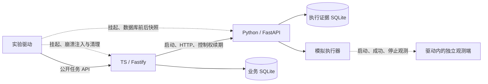

# 本机执行链路原型（仅替身）

> 状态核对：2026-09-18。本文属于受限原型阶段资料，代码收尾基线为 `b99b917`（后合入 `4ca2d56`）；实际运行版本、环境和验证范围以正文及证据为准。本轮原型与约定 HTTP 合并已交付，完整 MVP 未验收。原文中的实验计划按当时时间理解；新增真实 MAA 操作仍须另行交接。当前模块与未决事项见[工程说明](../../docs/engineering/architecture.md)。

对应 [issue #3](https://github.com/Fyrefly-4/ChatMAA/issues/3) 和 [设计审阅](../../docs/archive/2026-09-prototype/prototype-review.md) 的原型 B。原始替身实验验证进程、HTTP、SQLite 和故障行为，不调用真实游戏。本目录的 TS 后端后来被真实 HTTP 合并复用，`live-merge.ts` 属于实机实验驱动；真实 MaaCore 适配位于相邻的 `maa` 目录。聊天页面与模型尚未实现。

先读 [实验报告](REPORT.md)。后续真实 MAA 与约定 HTTP 合并已交付，见[真实原型说明](../maa/README.md)。

## 如何理解这套原型



驱动是实验工具，不是新增的产品监督服务。启动计数来自独立观测端的已落盘记录，不从任务表的行数推断。模拟器在报告动作时等待观测端确认，因此这是可控故障窗口；真实游戏没有这种原子观测保证。

| 模块 | 负责什么 | 可看入口 |
|---|---|---|
| TS 应用与进程管理 | 稳定操作标识、拒绝冲突、HTTP、续期、正常退出及超时清理 | `src/server.ts` |
| TS 业务记录 | 同一事务内保存事件、更新结果和读取位置；保留缺口 | `src/store.ts` |
| Python 执行端 | 跨实例设备锁、持久防重、模拟执行、停止与失联自停 | `adapter/service.py` |
| 运行时定位 | 绕过 Windows venv 启动器，直接持有真实 Python 进程 | `src/python-runtime.ts` |
| 实验驱动 | 故障矩阵、独立观测、快照、时间线和清理 | `experiments/run.ts` |

业务任务与执行标识在原型中使用同一个 `id`，由驱动代表上游已确定的操作生成。正式接入会话、确认卡和 Agent 时仍需把身份贯穿到这些入口；本原型没有验证自然语言授权。

## 安装与重放

本轮验证 Windows x64、Node 24.18.0、Python 3.12.14、pnpm 11.19.0。完整版本在 [环境与结果摘要](evidence/summary.json)。版本锁定用于重放，不代表正式 MVP 的依赖版本已经确定。

在仓库根目录打开 PowerShell，使用本机可用的 Python 3.12 创建环境：

```powershell
Set-Location prototypes/lifecycle
py -3.12 -m venv .venv
.\.venv\Scripts\python.exe -m pip install -r requirements.lock
pnpm install --frozen-lockfile --store-dir .pnpm-store
pnpm check
.\.venv\Scripts\python.exe -m pip check
pnpm experiment
pnpm evidence
```

若未注册 `py -3.12`，用 Python 3.12 的绝对路径替换创建环境命令。驱动默认使用本目录 `.venv/Scripts/python.exe`；也可用 `LAB_PYTHON` 指定装有同一锁文件依赖的环境。执行前切换到本目录。实验中的进程挂起器仅支持 Windows，其他系统尚未验证。

`pnpm experiment` 自动创建临时目录、选择本机端口、生成控制令牌、启动实例、运行实验并清理本次实例。无须启动 MAA 或模拟器。通常一两分钟内结束，实际时长见结果；不要在其他任务中手工复用这些临时端口、设备锁或数据库。

每轮证据写入 `.artifacts/<UTC 时间>/`：

- `results.json`：环境、断言结果、时间线和数据库前后快照。
- 每个实验的 `oracle.jsonl`：独立启动、成功及停止观测。
- `timeline.jsonl` 和 `data/executor-trace.jsonl`：双方的原始生命周期记录。TS 已退出后的 Python 记录在后者中。
- `snapshots.json`：两端 SQLite 的逻辑内容；原始数据库也留在该轮目录中。

这些本地运行产物已被忽略。`pnpm evidence` 导出最近一轮的摘要及四个代表性实验的证据到 `evidence/`，供 Git 提交和审阅；不提交依赖目录、数据库或全部原始日志。实验失败会返回非零退出码，仍保存结果和清理记录。

## 协议与状态如何核对

| 边界 | 操作 | 说明 |
|---|---|---|
| 驱动 → TS | `POST /tasks`、`GET /tasks/:id`、`POST /tasks/:id/stop` | 固定 1-7、次数 1–100、不吃药不碎石；100 是实验输入上限 |
| TS → Python | `POST /executions`、`GET /executions/:id?after=N`、`POST /executions/:id/stop` | 受理返回不等于启动或完成；按同一标识核对 |
| 控制管理 | `/health`、`/lease`、`/prepare-shutdown`、`/shutdown` | 身份校验、续期、停止后的最终结果交接及退出；停止不依赖新进度事件 |
| 恢复核对 | `POST /reconcile` | 只对无外部动作的替身检查环境；不能直接迁移到真实 MAA |
| 故障注入 | `/lab/faults`、`/lab/replay/:id` | 实验专用，未来应用不得直接保留这些入口 |

所有 HTTP 监听限定 `127.0.0.1`，请求使用随机令牌，执行端额外核对实例和控制者标识；带浏览器 `Origin` 的请求拒绝。设备互斥依赖所有实例使用同一个规范化锁路径，原型验证同路径竞争，不覆盖恶意更改路径或其他 MAA 应用。

`state` 表达执行阶段，`confirmed` 是已确认完成量，`certainty` 区分最终可信值与下界，`device` 表达是否可接受新执行。进程退出只产生待核对状态；完成量未知但已确认不再操作、且环境核对通过，可以接受新的明确次数。原型不实现“继续”对话或自动算剩余次数。

关键事件具有执行标识、单调序号、来源实例和快照。TS 在一个本地事务中保存事件、结果和读取位置；重复事件不重复累计，旧快照不覆盖新快照，缺口保留。两端数据库与模拟动作没有全局事务。

`storage_readonly` 用真实 SQLite `query_only` 错误验证写入失败，不等同于已经测过磁盘耗尽、掉电或文件损坏。调用停止绕过写入失败；持久信息仍按未知处理。

## 当前监督范围

TS 保留 Python 子进程句柄，正常退出先进入有期限的停止与结果交接阶段，将最终证据保存到业务库后再通知 Python 退出；交接失败保留未知，超时只终止该句柄对应的自有进程，并等待实际 `exit`。普通任务停止不会自动升级强杀。Python 在交接期间拒绝新执行，TS 消失后也会按期限退出，避免永久等待确认。

Python 在控制权过期后拒绝迟到续期和新命令，先请求停止，超时自行退出。Windows 使用 `detached: true` 给这个流程留出执行机会；TS 仍持有引用、管理正常启停，没有改成独立常驻服务。默认启动方式作为实验 18 保留对照。

两个控制进程都无法执行代码时，仍缺少可运行的监督者。要覆盖这类组合故障并保留正常停止窗口，需要另外讨论监督机制；本次没有增加第三个产品进程。

## 参数与证据边界

本轮采用 150 ms 轮询/续期、1500 ms 控制租约、900 ms 停止等待和 450 ms 单次 HTTP 超时。这些是实验配置，不是通过性能优化得出的生产建议。挂起使用 Windows native API，仅作故障注入；不作为产品 API 依赖。

原型 A 后续已经完成累计三次实机成功及正常收尾，详情见 [MAA 报告](../maa/REPORT.md)。后续 [HTTP 合并验证](../maa/HTTP-MERGE.md)也已交付：通过 `LAB_BACKEND` 选择原替身、离线回调或受限 live 入口，默认仍为原替身。停止意图会在 TS 中保留，避免较早发起的轮询覆盖它。替身和离线回放不能替代真实合并验证或 [MVP Spec #1](https://github.com/Fyrefly-4/ChatMAA/issues/1) 的完整验收。
