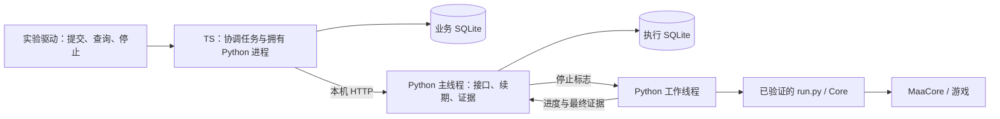

# HTTP 合并验证

> 状态核对：2026-09-18。本文属于受限原型阶段资料，代码收尾基线为 `b99b917`（后合入 `4ca2d56`）；实际运行版本、环境和验证范围以正文及证据为准。本轮原型与约定 HTTP 合并已交付，完整 MVP 未验收。原文中的实验计划按当时时间理解；新增真实 MAA 操作仍须另行交接。当前模块与未决事项见[工程说明](../../docs/engineering/architecture.md)。

关联 [Issue #4](https://github.com/Fyrefly-4/ChatMAA/issues/4)。原型 A 已完成累计三次实机成功；本文是之后的合并准备，不把回放结果计为新增实机成功。

当前结果：2026-09-18 用户恢复测试并手动启动管理员入口，本轮真实 HTTP 合并验证达到预期，现场确认「符合，已确认能手动接管」。第一局成功，第二局启动后经 HTTP 停止自动化；两端记录一致，进程均已退出。见 [脱敏实机证据](evidence/http-merge-first.json)。

用户要求在每次新的真实 MAA 测试前进入阻塞态；此前已照此暂停，直到用户表示已准备好并执行本轮命令。该要求继续适用于未来新增实验，本轮完成不授权追加次数。

## 实机结果与时间线

本轮为 `http-merge-first`，代码基线 `8a93824`，MaaCore `v6.17.5`，官服官方桌面端，`1-7` 最多两次、`series=1`，药品、即将过期药品和源石均为 0。以下为本次观测，不代表性能或稳定性保证。

| 时间（Asia/Shanghai） | 事实 |
|---|---|
| 07:59:44 | 主界面探针通过，匹配分数 0.952344；探针停止并销毁 |
| 07:59:49 | TS 经 HTTP 受理任务，唯一工作线程调用原有 MaaCore 入口 |
| 08:00:09 | 第一次 `StartButton2` 完成，观察到单局开战 |
| 08:01:30 | 第一局 `StageDrops` 为 1-7 三星，已确认完成量更新为 1 |
| 08:01:37 | 第二次开战；TS 经 HTTP 请求停止，MaaCore 接受停止并返回不再运行 |
| 08:01:38 | `AsstDestroy` 返回；两库结果及事件序号一致；退出交接完成，Python 退出码 0，TS 也退出 |

最终状态为：`ended`、`confirmed=1`、`certainty=lower_bound`、`automation_stopped=true`、`device=needs_check`，开战证据 2 次、缺少结算证据 1 次。两端各保存 8 条事件，TS 读取位置为 8、无事件缺口，两库只读完整性检查均为 `ok`；独立线程入口记录只有 1 次。

用户确认首局完成且能手动接管。停止后的保存截图为黑帧，没有用它证明游戏内战斗状态；本轮验证的是第二局启动阶段的停止，不扩展为所有战斗阶段均已验证。原始结果中的现场确认仍为执行时的 `pending`，脱敏证据另列后续用户确认，不回写历史原始记录。

这轮完成了真实「TS → HTTP → Python → MaaCore → 执行证据 → TS 业务库」及普通停止后的退出交接。运行中直接关闭应用、强制终止、战斗失败与理智不足没有新增实机验证；退出中关闭应用的结果交接已由离线实验覆盖。旧阶段三次成功与本轮一次成功分开统计，停止后的第二局不补计、不补刷。

## 设计审阅意见

当前结构符合既有 ADR，建议保留，可以作为下一轮受控验证的基线；尚不足以直接放行整套 MVP 实现。

- **可以接受的分工**：TS 决定请求身份、冲突和用户可见状态；Python 管住设备并提供执行证据；MaaCore 承担具体操作。增加工作线程不改变两进程架构，Electron 或 Agent Loop 仍不需要了解 native 回调。
- **必须保留的判断边界**：成功量、自动化是否停止、设备能否再次执行是三个独立结论。典型提前停止结果为「已确认成功一次；自动化停止；另一次缺少结算证据；环境待核对」。不能用一个 success / failed 字段合并。
- **只是原型限制**：当前每份实验数据只允许一次操作，任何结束都不自行解锁。这便于核对实验，却不是正式应用的完整恢复流程。进入 MVP 前需明确由谁核对界面、依据什么证据解除占用，以及完成量未知时怎样接收新的明确次数；不需要现在实现通用恢复框架。
- **仍缺证据**：真实普通停止及证据返回顺序已在本轮补证；MaaCore 阻塞或卡死时的表现、各等待期限的覆盖范围仍不能由这一轮推定。两个进程同时失去响应的监督缺口仍存在，合并没有增加兜底承诺。
- **后续工程整理**：两个 Python 原型暂时各自保留协议和 SQLite 代码，以免在验证阶段大幅重构替身。正式实现时应抽出共同协议与证据存储，再保留执行器差异；原型代码不宜原样扩建成产品。

本轮没有提出需要推翻既有选型的新架构决策。后续最值得产品负责人参与的是「真实环境怎样核对后解锁」及「已知监督缺口是否可接受」，应结合实测结果讨论，而非以离线检查通过代替决策。

### 补充审阅及修复：正常退出时的结果交接

只读核对发现：`server.ts` 的 `shutdown()` 一开始就停止查询，然后调用 Python `/shutdown` 并等待进程退出；`http_service.py` 可以在这段时间内保存最后的停止证据并退出。因此 Python 执行库可能已有最终结果，TS 业务库却仍保留较早记录，被退出处理标为未知。只有重启并按原标识补读后，业务记录才有机会更新。这是一个明确的实现窗口，不能用「Python 已保存证据」推导「TS 已完成退出前核对」。

审阅时的 8 项检查分别覆盖显式停止、失联停止和重启补读；它们没有断言运行中正常关闭应用后，两端已经完成最后一次结果交接。拟议的实机驱动也是先等到显式停止结果，再关闭应用，因此即使该轮通过，也不能覆盖此项。

后续已用离线实验复现该缺口，并落实既有 ADR-0001 的要求：TS 拒绝新任务后调用 `/prepare-shutdown`；Python 拒绝新的执行并请求停止，在退出期限内保留查询接口；TS 保存最终证据后调用 `/shutdown` 确认交接，Python 才退出。交接阶段不会重新取得执行权，也不靠延长租约无限等待。TS 在此期间消失时，Python 保存能保存的证据并按期限退出；停止仍未完成则继续使用既有超时退出兜底。存储或传输失败不会被标为交接成功。

新增三项离线检查均通过：执行中正常退出后，两库停止结果和读取位置一致；执行库写入失败时不伪造停止确认；TS 在交接期间消失时，Python 有限等待后退出。这解决了应用侧的退出交接缺口；此后真实普通停止及停止后的退出交接也已按上方记录补证，故障分支仍只有离线证据。

## 可以直接理解的模块边界



仍然只有 TS 和它直接管理的 Python 两个应用进程。MaaCore 的阻塞调用放在 Python 工作线程；数据库只由 Python 主线程写。原有 CLI 和 HTTP 共用 `run.py`、参数与计数解释，避免维护两套 native 调用。实验驱动是验证工具，不是产品中新增的监督服务。

| 可审阅入口 | 职责 |
|---|---|
| `../lifecycle/src/server.ts`、`store.ts` | 沿用原型 B 的 HTTP、进程管理和事务投影；选择替身或 MaaCore 接入 |
| `http_service.py` | 受理、防重、同一设备锁、执行证据落库、租约及停止；不直接调用 MaaCore |
| `http_worker.py` | 工作线程桥接；`maa-replay` 重放脱敏回调，`maa-live` 才进入原来的执行入口 |
| `../lifecycle/experiments/merge.ts` | 离线 HTTP、线程与双库实验 |
| `../lifecycle/experiments/live-merge.ts` | 本轮已使用的操作驱动，也可用 `--replay` 离线演练 |
| `verify-http-admin.ps1` | 一次性管理员入口：核对旧任务、识别主界面、启动约定实验 |

## 已做的离线验证

回放使用已保存的真实单局回调；多周期、链完成、停止及故障是合成的。`maa-replay` 不加载 MaaCore、不查找窗口、不调用游戏。参数仍限制 `1-7`、1–3 次、禁止药品和源石；本次交接方案进一步固定为两次上限。

| 检查 | 必须满足的结果 |
|---|---|
| 正常计数、重复提交与重复读取 | 两个合成周期计为两次；两端参数冲突拒绝；独立线程调用记录仅一次 |
| 停止期间的控制响应 | HTTP 仍可查询；停止请求不等于停止确认；未结算周期保留为未知 |
| 提交响应丢失 | 按原标识查询，不重新启动 |
| 无效结算 | 不增加成功量，不进入下一周期 |
| Python SQLite 写入失败 | 停止仍传递；对外保留未知，不能伪造最终记录 |
| TS 消失及重启 | Python 租约到期停止；读取旧任务不会重放 |
| Python 被终止及重启 | 执行、完成量和环境保留待核对，不自行解锁 |
| 停止前的轮询晚到 | 已持久化的停止意图不能被旧“运行中”快照覆盖 |
| 执行中正常退出 | Python 保存停止结果，TS 接收最终证据并提交到业务库，两端再退出 |
| 退出交接时记录失败 | 不伪造停止确认或结果同步完成，保留未知 |
| 退出交接时 TS 消失 | Python 保留证据，有限等待后退出，不永久等待交接确认 |

最后一项来自本轮发现的竞态，并有确定性回归检查。完整运行产物留在 `../lifecycle/.artifacts/merge-<时间>/`，脱敏摘要见 [http-merge-offline.json](evidence/http-merge-offline.json)。原型 B 的 25 项故障实验也需在共享 TS 代码修改后回归。

离线阶段结果：11/11 合并检查通过（10 项 HTTP / 进程实验和 1 项确定性投影回归）；原型 B 25/25 回归通过；交接驱动的离线演练通过。最后一轮各实验均确认自有进程退出。MAA 参数与计数的原有 9 项单元检查、TS 类型检查及管理员入口语法检查通过。这些离线检查本身没有调用游戏，上方另列后续实机证据。

回归过程保留了一轮 23/25 的失败记录：两个崩溃场景在读取 SQLite 快照时返回 `disk I/O error`；稍后对原文件进行只读完整性检查均为 `ok`，I/O 异常根因尚未确定。该轮还暴露实验驱动会在快照失败时跳过进程清理，已修复为分别记录快照错误和清理结果，并清理了遗留的自有 TS 进程。后续通过结果不能抹去这次观察，也不意味着已排除偶发 I/O 问题。

重放命令（在 `prototypes/lifecycle` 内，依赖沿用该目录锁文件）：

```powershell
pnpm check
pnpm experiment:merge
node experiments/live-merge.ts --replay
pnpm evidence:merge
```

## 比替身收紧的地方

- 自动化停止与设备可用分别记录。即使目标成功并确认停止，HTTP 原型也保留 `device=needs_check`，每份数据目录只接收一次操作。没有实现通用的真实环境重新核对流程。
- `/reconcile` 不会用“没有执行协程”或“查不到记录”推断游戏可操作。原型 B 的替身恢复逻辑只用于替身。
- 成功结算通过完整回调链解释；执行期间及提前停止后默认只承诺已确认完成量的下界。`started_cycles`、`unsettled_cycles` 只表示已观察到的开战和缺少结算证据，不能用于猜测剩余次数。
- 只有完整目标证据、无运行/记录错误、没有未结算周期，并且 `AsstRunning=false`、`AsstDestroy` 返回后，才给出最终完整结果。停止返回本身不足以判定。
- live 模式固定与原 CLI 使用同一个设备锁，并校验既有 MaaCore 哈希、一次性操作标识、参数和输出目录。没有自动重试或补刷；故障注入端点禁用。

## 本轮使用的实机方案（已执行）

用户确认准备后手动执行了如下方案：最多开战两次 `1-7`，第一局正常完成，用于核对完成量从 MaaCore 经 HTTP 到业务库的全过程；观察到第二局开战且第一局成功后，经 TS 的 HTTP 停止入口请求停止。全程不吃药、不碎石、不主动制造战斗失败、不强杀游戏。

预期交付是“已确认成功一次、另一局结果未知、自动化停止已确认”，另附两端数据库和原始反馈。第二局可能继续在游戏里战斗，需要用户等待并手动处理结算；这不是停止失败，也不能把它自动算为第二次成功。若停止来不及、开战证据缺失或实际结果不同，如实记为该停止场景未验证，不重跑。

本轮在游戏主界面、官方 MAA 任务已停止时，管理员 PowerShell 使用了以下一次性入口。目录已有记录，不能重复运行或删除记录后重试：

```powershell
& '.\prototypes\maa\verify-http-admin.ps1' -ExecuteApprovedExperiment
```

它先做已有的主界面识别门槛，再执行此方案，自动保存日志。提前停止按 Ctrl+C，并等待自动化及进程退出确认；未确认前不要手动接管或重复运行。应用退出时仍按 ADR-0001 先停止、超时只尝试终止本应用拥有的 Python，不终止游戏。

本轮使用 200 ms 查询与续期、10 s 租约、2 s 单次 HTTP 超时和 20 s 退出停止期限；这些仅是实验设置，一轮普通停止通过不构成性能或故障可靠性保证。

普通战斗失败、理智不足和两个进程同时无响应仍有未覆盖范围；不会以本轮离线回放代替这些实机证据。MVP 也还未进入模型和页面贯通验收。
